<!-- RTL Design Sherpa Documentation Header -->
<table>
<tr>
<td width="80">
  <a href="https://github.com/sean-galloway/RTLDesignSherpa-DV">
    
  </a>
</td>
<td>
  <strong>CocoTB Framework</strong> · <em>Verification Infrastructure for RTL Testing</em><br>
  <sub>
    <a href="https://github.com/sean-galloway/RTLDesignSherpa-DV">GitHub</a> ·
    <a href="https://github.com/sean-galloway/RTLDesignSherpa/blob/main/docs/DOCUMENTATION_INDEX.md">Documentation Index</a> ·
    <a href="https://github.com/sean-galloway/RTLDesignSherpa/blob/main/LICENSE">MIT License</a>
  </sub>
</td>
</tr>
</table>

---

<!-- End Header -->

# AXI4-ACE Components Overview

ACE (AXI Coherency Extensions) is AXI4 extended so multiple caching masters can share memory coherently. The components here model a full ACE-shaped port: the five AXI4 channels plus three snoop channels (AC, CR, CD), with the transaction-type fields that tell a coherency manager what kind of access is being requested.

This family targets the cache-ip ACE-shaped port contract. It implements the onyx D2 research subset and the snoop-channel rules the family uses; it deliberately does not model ACE-Lite masters, barriers, DVM, or multiple shareability domains.

## What This Family Models

ACE = AXI4 + three snoop channels (AC/CR/CD). The front side still looks like AXI4, with two additions:

- `ARSNOOP[3:0]` on the AR channel
- `AWSNOOP[2:0]` on the AW channel

The D2 subset carries only those snoop fields — there is no `ardomain`, `arbar`, `awdomain`, or `awbar` in this family.

The snoop side adds:

| Channel | Direction from cache | Payload |
|---------|----------------------|---------|
| AC — snoop address | in | `ACADDR`, `ACSNOOP[3:0]`, `ACPROT[2:0]` |
| CR — snoop response | out | `CRRESP[4:0]` |
| CD — snoop data | out | `CDDATA`, `CDLAST` |

ACE also defines two acknowledge pulses outside the five channels: RACK (after the last R beat) and WACK (after the B response). The framework's ACE master classes auto-pulse these when the pin exists on the DUT.

## Framework Integration

### GAXI Infrastructure Foundation

Like every other protocol family in the framework, ACE sits on GAXI:

**Unified Field Configuration**: One helper creates all channel field configs; AW/W/B/AR/R delegate to AXI4, while AC/CR/CD are ACE-specific.
**Signal Resolution**: The `axi4ace_*` protocol identifiers register signal maps for all eleven ACE channel/direction pairs.
**Statistics Integration**: Per-channel transaction and performance metrics are collected as the test runs.
**Advanced Debugging**: Multi-level debug with transaction-level logging.

### ACE Specialization on Top of AXI4

What the ACE layer adds:

**Front-Side Snoop Types**: `ARSNOOP` and `AWSNOOP` are appended to the AR and AW field configs.
**Three Snoop Channels**: Dedicated GAXI components for AC, CR, and CD.
**RACK/WACK Auto-Pulse**: The master classes drive the acknowledge pulses when constructed as master and the pins are present.
**Default MESI Responder**: `AXI4ACESnoopSlave` ships with a programmable cache-line state model.
**Snoop-Channel Compliance**: `ACEComplianceChecker` watches ordering and CRRESP validity.

## Core Components Architecture

```mermaid
graph TB
    subgraph Ecosystem["ACE Component Ecosystem"]
        subgraph Components["Core Components"]
            MasterRd["AXI4ACEMasterRead<br/>(AR/R + RACK)"]
            MasterWr["AXI4ACEMasterWrite<br/>(AW/W/B + WACK)"]
            SnoopM["AXI4ACESnoopMaster<br/>(AC out, CR/CD in)"]
            SnoopS["AXI4ACESnoopSlave<br/>(AC in, CR/CD out)"]
        end

        subgraph FieldConfig["ACE Field Configurations"]
            AR["AR + ARSNOOP"]
            AW["AW + AWSNOOP"]
            AC["AC"]
            CR["CR"]
            CD["CD"]
        end

        subgraph Advanced["Advanced ACE Features"]
            Compliance[ACEComplianceChecker]
            Factories[Factories]
            Responder[Default MESI Responder]
        end

        subgraph GAXI["GAXI Infrastructure"]
            SigRes[Signal Resolution]
            Stats[Statistics]
            FieldHandle[Field Handling]
            Debug[Debug Support]
        end
    end

    Components --> FieldConfig
    FieldConfig --> Advanced
    Advanced --> GAXI
```



## Component Capabilities

### AXI4ACEMasterRead - Coherent Read Operations

Extends `AXI4MasterRead` with `ARSNOOP` and an optional RACK auto-pulse.

**Address Request Management**:
- AR channel control with ARSNOOP
- Outstanding transactions
- AXI4 burst, ID, and sideband support inherited from the AXI4 master

**Read Data Reception**:
- R channel monitoring inherited from AXI4
- Burst assembly and error handling unchanged

**Acknowledge**:
- Auto-pulses `{prefix}rack` one cycle after each RLAST handshake when constructed as master and the pin exists; skipped otherwise.

### AXI4ACEMasterWrite - Coherent Write Operations

Extends `AXI4MasterWrite` with `AWSNOOP` and an optional WACK auto-pulse.

**Address and Data Management**:
- AW channel control with AWSNOOP
- W channel coordination
- Address/data phase ordering inherited from AXI4

**Write Response Handling**:
- B channel processing inherited from AXI4

**Acknowledge**:
- Auto-pulses `{prefix}wack` one cycle after each B handshake when constructed as master and the pin exists; skipped otherwise.

### AXI4ACESnoopSlave - Cache-Side Snoop Responder

Receives snoop addresses on AC and drives CR and CD in AC-issue order.

**Snoop Address Processing**:
- Watches AC for incoming snoops
- Decodes `ACSNOOP` into `SnoopType`
- Tracks multiple outstanding snoops in a FIFO

**Response Generation**:
- Default MESI responder matrix based on `CacheState`
- Programmable per-address state via `set_line_behavior`
- Custom handler injection via `set_handler`

**Ordering**:
- CR and CD each return in AC-issue order
- Family convention (stricter than the ACE spec): all CD beats for a snoop are sent before its CR response

### AXI4ACESnoopMaster - CCU-Side Snoop Initiator

Drives snoop addresses on AC and gathers CR/CD responses.

**Snoop Issuance**:
- `issue_snoop(addr, snoop_type)` returns `SnoopResult(crresp, data, latency)`
- By default only one outstanding snoop at a time (`allow_multiple_outstanding=False`)
- Optional address/source exclusion hooks

**Response Collection**:
- Waits for CR, then collects CD beats if `DataTransfer` is set
- `CDLAST` terminates the data phase

## Field Configuration System

### AXI4ACEFieldConfigHelper - Channel-Specific Configuration

The helper builds every channel's field config. AW/W/B/AR/R delegate to AXI4; AR and AW add the snoop field last to match the RTL payload order in `rtl/amba/ace`.

```python
from CocoTBFramework.components.ace.ace_field_configs import AXI4ACEFieldConfigHelper

# Front-side address channels
ar_config = AXI4ACEFieldConfigHelper.create_ar_field_config(
    id_width=8, addr_width=32, user_width=1
)
aw_config = AXI4ACEFieldConfigHelper.create_aw_field_config(
    id_width=8, addr_width=32, user_width=1
)

# Snoop channels
ac_config = AXI4ACEFieldConfigHelper.create_ac_field_config(addr_width=32)
cr_config = AXI4ACEFieldConfigHelper.create_cr_field_config()
cd_config = AXI4ACEFieldConfigHelper.create_cd_field_config(data_width=64)

# All channels at once
configs = AXI4ACEFieldConfigHelper.create_all_field_configs(
    id_width=8, addr_width=32, data_width=64, user_width=1
)
```

**Flexible Parameter Support**:
- Variable data, address, and ID widths
- Zero-width USER handled cleanly
- Snoop fields packed after USER on AR/AW

## Transaction Types and CRRESP

### ACETransactionType

Used for `ARSNOOP` and `AWSNOOP` on front-side read/write transactions.

| Member | Value | Meaning |
|--------|-------|---------|
| `READ_SHARED` | `0x1` | Fetch a line to read; other caches may keep Shared copies |
| `READ_UNIQUE` | `0x7` | Fetch a line to write; all other copies must be invalidated |
| `CLEAN_UNIQUE` | `0xB` | Requester already holds the line; make this copy Unique (no data) |
| `MAKE_UNIQUE` | `0xC` | Like CleanUnique but requester will overwrite the whole line |
| `WRITE_BACK` | `0x3` | Retire a dirty line to memory; manager must merge data into DRAM |
| `EVICT` | `0x5` | Retire a clean line; hint, no data and no DRAM write needed |

The six values above are the onyx D2 research subset. The enum also carries the remaining full-ACE read-side and write-side encodings for completeness.

### SnoopType

Used on the AC channel (`ACSNOOP[3:0]`).

| Member | Value |
|--------|-------|
| `READ_ONCE` | `0x0` |
| `READ_SHARED` | `0x1` |
| `READ_UNIQUE` | `0x7` |
| `CLEAN_SHARED` | `0x8` |
| `CLEAN_INVALID` | `0x9` |
| `MAKE_INVALID` | `0xC` |

### CacheState

Programs the default responder in `AXI4ACESnoopSlave`.

| Member | Letter |
|--------|--------|
| `INVALID` | `I` |
| `SHARED` | `S` |
| `EXCLUSIVE` | `E` |
| `MODIFIED` | `M` |
| `OWNED` | `O` |

### CRRESP

`CRRESP[4:0]` is a bitfield with five named bits, per Arm IHI 0022H:

| Bit | Name | Meaning |
|-----|------|---------|
| [0] | `DataTransfer` | Responder will drive the line's data on CD |
| [1] | `Error` | Lookup error |
| [2] | `PassDirty` | Dirty responsibility moves with the data |
| [3] | `IsShared` | Another master may hold a copy |
| [4] | `WasUnique` | Responder had the line Unique |

`CRRESP.validate_for_snoop` enforces two rules:
- `MAKE_INVALID` forbids `DataTransfer`
- `PassDirty` requires `DataTransfer`

## Default MESI Responder Matrix

`AXI4ACESnoopSlave._default_handler` returns `(CRRESP, data_or_None)` from the cache-line state and snoop type. `data_or_None` may be a single integer or a list of integers for multi-beat data.

| State | Snoop type | CRRESP | Data |
|-------|------------|--------|------|
| INVALID | any | none | none |
| SHARED | READ_SHARED / READ_ONCE | `IsShared` | none |
| SHARED | READ_UNIQUE | none | none |
| SHARED | CLEAN_SHARED / CLEAN_INVALID / MAKE_INVALID | none | none |
| EXCLUSIVE | READ_SHARED / READ_ONCE | `DataTransfer + IsShared + WasUnique` | `0` |
| EXCLUSIVE | READ_UNIQUE | `DataTransfer + WasUnique` | `0` |
| EXCLUSIVE | CLEAN_SHARED | `IsShared + WasUnique` | none |
| EXCLUSIVE | CLEAN_INVALID / MAKE_INVALID | none | none |
| MODIFIED | READ_SHARED | `DataTransfer + PassDirty + IsShared` | `0` |
| MODIFIED | READ_UNIQUE | `DataTransfer + PassDirty` | `0` |
| MODIFIED | CLEAN_SHARED / CLEAN_INVALID | `DataTransfer + PassDirty + IsShared` | `0` |
| MODIFIED | MAKE_INVALID | none | none |
| MODIFIED | READ_ONCE | `DataTransfer + PassDirty` | `0` |
| OWNED | READ_SHARED / READ_ONCE | `DataTransfer + PassDirty + IsShared` | `0` |
| OWNED | READ_UNIQUE | `DataTransfer + PassDirty + IsShared` | `0` |
| OWNED | CLEAN_SHARED / CLEAN_INVALID | `DataTransfer + PassDirty + IsShared` | `0` |
| OWNED | MAKE_INVALID | none | none |

> Note: `MAKE_INVALID` on `MODIFIED` or `OWNED` returns `CRRESP(0)` with no data — an invalidate without supplying data, per IHI 0022.

## Ordering Rules

ACE ordering on the snoop side is stricter in this family than the minimum the spec requires:

- CR and CD only after the AC handshake for that transaction.
- CR responses return in AC-issue order.
- CD beats return in AC-issue order, with `CDLAST` on the final beat.
- Multiple outstanding snoops are allowed.
- **Family convention**: all CD beats for snoop N complete before CR for snoop N is asserted.

This convention is recorded in the cache-ip family reference, `AMBA_ACE_Interface_Definition.md`.

## Signal Naming and Prefix Conventions

The signal-mapping helper registers eleven `axi4ace_*` protocol identifiers:

- `axi4ace_ar_master`, `axi4ace_aw_master`, `axi4ace_w_master`
- `axi4ace_r_slave`, `axi4ace_b_slave`
- `axi4ace_ac_master`, `axi4ace_ac_slave`
- `axi4ace_cr_master`, `axi4ace_cr_slave`
- `axi4ace_cd_master`, `axi4ace_cd_slave`

For the front side, the usual AXI4 prefixes apply: `m_axi_` for a master-facing DUT, `s_axi_` for a slave-facing DUT, `fub_axi_` for a fabric/upstream boundary, etc. For example, with prefix `m_axi_` the master read class drives `m_axi_arvalid`, `m_axi_arsnoop`, and pulses `m_axi_rack`.

For the snoop channels, the framework recognizes several naming styles. With prefix `m_axi_` and multi-signal mode, snoop fields resolve as `m_axi_acaddr`, `m_axi_acsnoop`, `m_axi_acprot`, `m_axi_crresp`, `m_axi_cddata`, and `m_axi_cdlast`. Underscore variants (`m_axi_ac_addr`, `m_axi_ac_snoop`, `m_axi_cr_resp`, `m_axi_cd_data`) and packed-packet forms (`m_axi_ac_pkt`, `fub_axi_ac_pkt`) are also tried. `RACK`/`WACK` are standalone pulses (`m_axi_rack`, `m_axi_wack`) and are bound directly by the ACE BFM classes, not through the signal map.

## Quick Start

### Snoop Master + Responder Slave Loopback

Issue one `READ_SHARED` snoop and check the returned CRRESP and data. This pattern is used in the BFM acceptance test against the ACE snoop transport RTL.

```python
import cocotb
from CocoTBFramework.components.ace import (
    AXI4ACESnoopMaster,
    AXI4ACESnoopSlave,
)
from CocoTBFramework.components.ace.ace_transaction import (
    CRRESP,
    CacheState,
    SnoopType,
)

@cocotb.test()
async def test_snoop_loopback(dut):
    clk = dut.aclk

    snoop_master = AXI4ACESnoopMaster(
        dut=dut, clock=clk, prefix="m_axi_",
        data_width=32, addr_width=32,
    )
    snoop_slave = AXI4ACESnoopSlave(
        dut=dut, clock=clk, prefix="fub_",
        data_width=32, addr_width=32,
    )

    # Program the responder: address 0x1000 is in Shared state
    snoop_slave.set_line_behavior(0x1000, CacheState.SHARED)

    # Issue a READ_SHARED snoop
    result = await snoop_master.issue_snoop(0x1000, SnoopType.READ_SHARED)

    # Shared state returns IsShared with no data
    assert result.crresp == CRRESP.from_bits(is_shared=True)
    assert result.data == []
```

### ACE Front-Side Master Read with Snoop Type

Drive a coherent read and observe the auto-pulsed RACK. This snippet mirrors the stretch test in `tests/sim/bfm_acceptance/test_axi4ace_snoop_transport.py`.

```python
import cocotb
from cocotb.triggers import RisingEdge, Event, with_timeout
from CocoTBFramework.components.ace import AXI4ACEMasterRead
from CocoTBFramework.components.ace.ace_transaction import ACETransactionType

@cocotb.test()
async def test_ace_read_with_rack(dut):
    clk = dut.aclk

    ace_master = AXI4ACEMasterRead(
        dut=dut, clock=clk, prefix="fub_axi_",
        data_width=32, addr_width=32, id_width=8,
    )

    rack_event = Event()
    async def watch_rack():
        await RisingEdge(dut.fub_axi_rack)
        rack_event.set()
    cocotb.start_soon(watch_rack())

    data = await ace_master.read_transaction(
        address=0x4000,
        burst_len=1,
        snoop_type=ACETransactionType.READ_SHARED,
        id=0xAB,
    )

    await with_timeout(rack_event.wait(), 1, 'us')
    # RACK pulsed automatically because the BFM is master and fub_axi_rack exists.
```

## Advanced Features

### Custom Snoop Handler

Replace the default MESI matrix with your own behavior. The handler receives `(addr, snoop_type, state)` and returns `(crresp, data_or_None)`. `data_or_None` may be an `int` for one beat or a `list[int]` for multiple beats.

```python
def my_handler(addr, snoop_type, state):
    if state == CacheState.MODIFIED and snoop_type == SnoopType.READ_SHARED:
        return CRRESP.from_bits(data_transfer=True, pass_dirty=True, is_shared=True), 0xDEADBEEF
    return CRRESP(0), None

snoop_slave.set_handler(my_handler)
```

If the returned `CRRESP` violates the snoop-type rules, `AXI4ACESnoopSlave._handle_snoop` logs an error and continues when a logger is attached; without a logger it raises `RuntimeError`.

### Factory Functions

```python
from CocoTBFramework.components.ace import (
    create_axi4ace_master_rd,
    create_axi4ace_master_wr,
    create_axi4ace_snoop_master,
    create_axi4ace_snoop_slave,
    create_complete_axi4ace_testbench_components,
)

rd = create_axi4ace_master_rd(dut, clk, prefix="m_axi_", data_width=64)
wr = create_axi4ace_master_wr(dut, clk, prefix="m_axi_", data_width=64)
sm = create_axi4ace_snoop_master(dut, clk, prefix="m_axi_", data_width=64)
ss = create_axi4ace_snoop_slave(dut, clk, prefix="fub_", data_width=64)

# Probe-based complete testbench builder
all_components = create_complete_axi4ace_testbench_components(
    dut, clk,
    master_prefix="m_axi_",
    slave_prefix="s_axi_",
)
```

`create_complete_axi4ace_testbench_components` probes the DUT and only creates the components whose control signals are present (e.g., `master_read` if `{master_prefix}arvalid` exists).

### Compliance Checking

```python
from CocoTBFramework.components.ace import ACEComplianceChecker

checker = ACEComplianceChecker(log=log)
checker.check_crresp_validity(result.crresp, snoop_type, addr)
checker.print_compliance_report()
```

See [components_ace_compliance.md](components_ace_compliance.md) for the full checker API.

## cocotb Support

Validated on cocotb 1.9.2 and cocotb 2.x.

## Configuration Examples

### Match Hardware Parameters

```python
ACE master read = AXI4ACEMasterRead(
    dut=dut,
    clock=clk,
    prefix="m_axi_",
    data_width=64,
    addr_width=40,
    id_width=4,
    user_width=0,  # Disabled user signals
)
```

### Disable RACK/WACK Auto-Pulse

```python
master_read = AXI4ACEMasterRead(
    dut=dut, clock=clk, prefix="m_axi_",
    auto_ack=False,
)
```

That's the shape of the ACE support: AXI4 underneath doing the heavy lifting, ACE-specific pieces on top for snoop channels, snoop types, and the acknowledge pulses. If you've driven another BFM in this framework, you already know most of the API.
