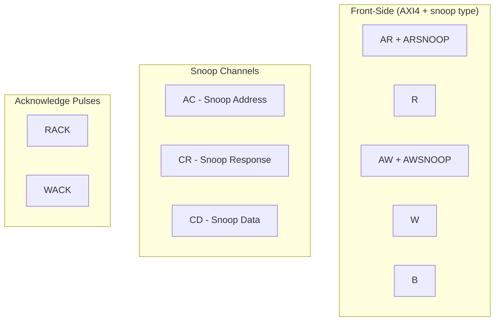

<!-- RTL Design Sherpa Documentation Header -->
<table>
<tr>
<td width="80">
  <a href="https://github.com/sean-galloway/RTLDesignSherpa-DV">
    
  </a>
</td>
<td>
  <strong>CocoTB Framework</strong> · <em>Verification Infrastructure for RTL Testing</em><br>
  <sub>
    <a href="https://github.com/sean-galloway/RTLDesignSherpa-DV">GitHub</a> ·
    <a href="https://github.com/sean-galloway/RTLDesignSherpa/blob/main/docs/DOCUMENTATION_INDEX.md">Documentation Index</a> ·
    <a href="https://github.com/sean-galloway/RTLDesignSherpa/blob/main/LICENSE">MIT License</a>
  </sub>
</td>
</tr>
</table>

---

<!-- End Header -->

**[← Back to Components Index](../components_index.md)** | **[CocoTBFramework Index](../../index.md)**

# AXI4-ACE Components

The AXI4-ACE components extend the framework's AXI4-Full BFMs with the ACE coherency extensions: three snoop channels (AC, CR, CD), snoop-type fields on the front-side AR/AW channels, and the RACK/WACK acknowledge handshakes. They are built on the same GAXI infrastructure as the rest of the framework, so field configuration, signal resolution, and statistics behave the same way.

This family implements the cache-ip ACE-shaped port contract: the six transaction types of the onyx D2 research subset, single shareability domain, no barriers or DVM. ACE-Lite masters are not modeled.

## Component Overview

### Core Interface Components

- **AXI4ACEMasterRead** - Coherent read master (AR/R) with ARSNOOP and RACK
- **AXI4ACEMasterWrite** - Coherent write master (AW/W/B) with AWSNOOP and WACK
- **AXI4ACESnoopSlave** - Cache-side snoop responder (AC in, CR/CD out)
- **AXI4ACESnoopMaster** - CCU-side snoop initiator (AC out, CR/CD in)

### Data Structures and Configuration

- **ACEPacket** - Packet class extending AXI4Packet with AC/CR/CD factory methods
- **SnoopPacket** - Convenience container for a complete snoop transaction result
- **AXI4ACEFieldConfigHelper** - Channel field configurations for ACE
- **ACETransactionType** - Front-side ARSNOOP/AWSNOOP encodings
- **SnoopType** - ACSNOOP encodings for the snoop address channel
- **CRRESP** - Bitfield helper for the snoop response
- **CacheState** - Gem5-style MESI states for the default responder

### Verification

- **ACEComplianceChecker** - Snoop-order and CRRESP validity checker

## Key Features

### ACE Protocol Support
- Complete front-side AR/AW/W/B/R channel reuse from AXI4, plus ARSNOOP[3:0] and AWSNOOP[2:0]
- Three snoop channels: AC (snoop address), CR (snoop response), CD (snoop data)
- RACK/WACK auto-pulse when the BFM is constructed as master and the pin exists
- Default MESI responder matrix in `AXI4ACESnoopSlave`

### GAXI Infrastructure Integration
- One field configuration system across the framework
- Automatic signal resolution across naming conventions
- Multi-level debug and transaction logging
- Statistics collected as tests run

### Verification Features
- Programmable snoop handler via `set_handler`
- Cache-line state programming via `set_line_behavior`
- Lightweight compliance checker for snoop ordering and CRRESP validity

## Getting Started

```python
from CocoTBFramework.components.ace import (
    AXI4ACEMasterRead,
    AXI4ACEMasterWrite,
    AXI4ACESnoopMaster,
    AXI4ACESnoopSlave,
)

# Coherent front-side masters
master_read = AXI4ACEMasterRead(
    dut=dut,
    clock=clk,
    prefix="m_axi_",
    data_width=64,
    id_width=4,
    addr_width=32,
)

master_write = AXI4ACEMasterWrite(
    dut=dut,
    clock=clk,
    prefix="m_axi_",
    data_width=64,
    id_width=4,
    addr_width=32,
)

# Snoop-channel BFMs
snoop_master = AXI4ACESnoopMaster(
    dut=dut,
    clock=clk,
    prefix="m_axi_",
    data_width=64,
    addr_width=32,
)

snoop_slave = AXI4ACESnoopSlave(
    dut=dut,
    clock=clk,
    prefix="fub_",
    data_width=64,
    addr_width=32,
)
```

## Protocol Architecture

ACE reuses AXI4's five channels and adds three snoop channels:



## Documentation Structure

- **[Overview](components_ace_overview.md)** - Architecture, D2 subset, default responder matrix, and quickstart examples
- **[Interfaces](components_ace_interfaces.md)** - API reference for the four BFM classes and factory functions
- **[Packet / Transaction](components_ace_packet.md)** - `ACEPacket`, `SnoopPacket`, enumerations, and CRRESP helper
- **[Compliance](components_ace_compliance.md)** - `ACEComplianceChecker` and violation types

## cocotb Support

Validated on cocotb 1.9.2 and cocotb 2.x.

Everything above is covered in depth in the pages linked from this index — start with the overview if you're new to the component set, or jump straight to the interface references if you just need a signature.
