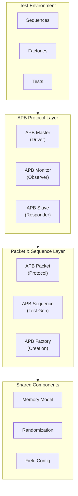

<!-- RTL Design Sherpa Documentation Header -->
<table>
<tr>
<td width="80">
  <a href="https://github.com/sean-galloway/RTLDesignSherpa-DV">
    
  </a>
</td>
<td>
  <strong>CocoTB Framework</strong> · <em>Verification Infrastructure for RTL Testing</em><br>
  <sub>
    <a href="https://github.com/sean-galloway/RTLDesignSherpa-DV">GitHub</a> ·
    <a href="https://github.com/sean-galloway/RTLDesignSherpa/blob/main/docs/DOCUMENTATION_INDEX.md">Documentation Index</a> ·
    <a href="https://github.com/sean-galloway/RTLDesignSherpa/blob/main/LICENSE">MIT License</a>
  </sub>
</td>
</tr>
</table>

---

<!-- End Header -->

# APB Components Overview

APB is the simplest bus in the AMBA family — a two-phase, non-pipelined interface that exists to move register reads and writes, not to win bandwidth contests. This directory has everything you need to verify an APB block: a master, a memory-backed slave, a monitor, and the packet/sequence machinery that feeds them.

## Architecture Overview

The layering matches the rest of the framework: tests and sequences on top, the three protocol BFMs in the middle, packets underneath, shared services at the bottom.



## Component Categories

### Protocol Implementation
The three signal-level components, one per role on the bus:

- **APBMaster**: drives transactions, with randomized PSEL/PENABLE timing
- **APBSlave**: memory-backed responder with tunable ready and error behavior
- **APBMonitor**: passive observer that turns bus activity into `APBPacket` objects

**What matters here:**
- Full APB signal support, with APB4's additions (PSTRB, PSLVERR, PPROT) bound as optional so APB3 DUTs still attach
- Configurable data and address widths
- A real memory model behind the slave, not a hard-coded response
- Error injection and timing randomization built in, not bolted on

### Packet & Transaction Management
The layer above the pins:

- **APBPacket**: one object per transfer, with the APB field set baked in
- **APBTransaction**: constrained-random packet generator
- **APBSequence**: list-driven pattern generation with packet assembly

**What matters here:**
- Direction-aware comparison and compact one-line formatting
- Constrained randomization with a sane default profile
- Ready-made patterns for bursts, alternating traffic, and stress runs
- Read-modify-write flows via sequences

### Factory Functions & Utilities
Boilerplate removers — the fastest route to a working testbench:

- **Component factories**: one-call creation of masters, slaves, and monitors
- **Sequence factories**: pre-built patterns for the common cases
- **Register testing helpers**: systematic register-file verification
- **System integration**: full testbench setup in a few lines

**What matters here:**
- Sensible defaults on everything
- Pre-configured sequences for common scenarios
- Register-map-aware testing utilities
- Automatic component interconnection

## APB Protocol Support

### Protocol Features
- **APB3/APB4 Compatibility**: the optional-signal binding (see `apb_components.py`) is what makes an APB3 DUT and an APB4 DUT equally happy
- **Signal Coverage**: every standard and optional APB signal
- **Error Handling**: PSLVERR generated by the slave, captured by master and monitor
- **Protection**: PPROT driven and observable, for security-sensitive tests
- **Strobes**: PSTRB support for partial-word writes

### Supported Operations
- **Basic Read/Write**: single-register access
- **Burst-Style Patterns**: sequential address sweeps, as fast as APB allows — one transfer at a time
- **Error Injection**: slave errors and out-of-range decode errors
- **Timing Stress**: randomized PREADY delays and PSEL/PENABLE spacing
- **Register Testing**: walking patterns, field access, reset checks

### Signal Mapping

The two ends of the bus, for reference:

| APB Master Signals | Direction | APB Slave Signals | Direction |
|--------------------|-----------|-------------------|-----------|
| PSEL | out | PSEL | in |
| PENABLE | out | PENABLE | in |
| PWRITE | out | PWRITE | in |
| PADDR | out | PADDR | in |
| PWDATA | out | PWDATA | in |
| PSTRB | out | PSTRB | in |
| PPROT | out | PPROT | in |
| PRDATA | in | PRDATA | out |
| PREADY | in | PREADY | out |
| PSLVERR | in | PSLVERR | out |

## Design Principles

### 1. **Ease of Use**
- Factory functions get you from zero to a running testbench in a few lines
- Defaults are chosen so the common case needs no configuration
- Signal mapping and widths follow the DUT

### 2. **Flexibility**
- Data and address widths from 8 bits upward
- Randomization is pluggable — bring your own FlexRandomizer profiles
- Directed and constrained-random styles coexist in the same test

### 3. **Realism**
- The slave is memory-backed, so reads reflect actual prior writes
- Ready delays, wait states, and error rates are all configurable
- Partial writes and protection attributes behave the way the spec says they should

### 4. **Performance**
- Queued transactions keep the bus busy without testbench babysitting
- Low per-transaction overhead — APB's two-phase handshake will limit you long before the BFM does
- Fast packet generation for long stress runs

## Usage Patterns

### Basic Testbench Setup

Four factory calls and a loop — a complete APB smoke test:

```python
import cocotb
from CocoTBFramework.components.apb.apb_factories import (
    create_apb4_master, create_apb4_slave, create_apb4_monitor, create_apb4_sequence
)

@cocotb.test()
async def basic_apb_test(dut):
    # Create components
    master = create_apb4_master(dut, "APB_Master", "apb_", dut.clk)
    slave = create_apb4_slave(dut, "APB_Slave", "apb_", dut.clk, registers=1024)
    monitor = create_apb4_monitor(dut, "APB_Monitor", "apb_", dut.clk)
    
    # Create test sequence
    sequence = create_apb4_sequence(pattern="alternating", num_regs=10)
    
    # Run test
    while sequence.has_more_transactions():
        packet = sequence.next()
        await master.send(packet)
```

### Directed Register Testing

When you know exactly which registers and which values:

```python
from CocoTBFramework.components.apb.apb_sequence import APBSequence

# Build a directed register test sequence
register_sequence = APBSequence(
    name="register_test",
    pwrite_seq=[True, False] * 4,                     # Write, then read back
    addr_seq=[0x1000 + i * 4 for i in range(4)],
    data_seq=[0xA0000000 + i for i in range(4)],
    strb_seq=[0xF] * 4,
)
```

### Stress Testing

When you've learned to trust the block and want to stop:

```python
# Create stress test with randomization
stress_sequence = create_apb4_sequence(
    pattern="stress", 
    num_regs=100,
    randomize_delays=True
)

# Configure timing randomization (bin ranges must be tuples, not lists)
master.set_randomizer(FlexRandomizer({
    'psel': ([(0, 0), (1, 10)], [7, 1]),
    'penable': ([(0, 0), (1, 5)], [8, 1])
}))
```

## Integration with Framework

### Shared Components Integration
- **Memory Model**: backs the slave's storage — NumPy-backed, with byte-level access
- **FlexRandomizer**: supplies every timing and error distribution
- **Field Configuration**: defines packet layouts
- **Statistics & Scoreboards**: plug in the same way they do in every other protocol family

### Protocol Independence
- Built on the shared packet infrastructure, so tooling that works on one protocol works here
- Shares randomization and memory components with the rest of the framework
- Comfortable in mixed-protocol testbenches — APB for config, something faster for data, the usual arrangement

## Key Features

### Transaction Management
- **Automatic Queuing**: `send()` and move on; the driver drains the queue
- **Timing Control**: from zero-delay to randomized wait states
- **Error Injection**: random PSLVERR, or deterministic errors on address overflow
- **Data Patterns**: walking, alternating, and stress sequences

### Memory Integration
- **Memory Model**: NumPy-backed storage with strobe-mask support
- **Register Maps**: hook your register specification in for systematic sweeps
- **Access Tracking**: the memory model records reads and writes for coverage
- **Boundary Behavior**: grow-on-overflow or error-on-overflow, your choice

### Verification Support
- **Protocol Observation**: the monitor sees every completed transfer
- **Error Detection**: PSLVERR lands in the packet, where scoreboards can check it
- **Performance Analysis**: timing stamps on packets make latency math easy

## Testing Capabilities

### Functional Testing
- Basic read/write verification
- Register field access and modification
- Error-condition handling
- Reset and initialization flows

### Stress Testing
- Back-to-back transactions at zero delay
- Randomized timing injection
- Throughput measurement (within APB's one-transfer-at-a-time world)
- Corner-case hunting with constrained randomization

### Register Testing
- Walking ones/zeros patterns
- Field-level access checks
- Read-modify-write sequences
- Reset-value validation

### Protocol Testing
- Signal timing checks via the monitor
- Error response validation
- Protection attribute coverage
- Strobe pattern coverage

## Getting Started

### Quick Setup
1. **Import the factories**: `from CocoTBFramework.components.apb.apb_factories import create_apb4_master, create_apb4_slave, create_apb4_monitor`
2. **Create master and slave** against the DUT's signals
3. **Pick a sequence** — built-in pattern or your own lists
4. **Run it**: send packets, watch the monitor, check the scoreboard

### Advanced Usage
1. **Custom Randomization**: build FlexRandomizer profiles for the corners you care about
2. **Register Integration**: bring your register map and let the helpers sweep it
3. **Error Injection**: configure the slave's error behavior deliberately, not accidentally
4. **Performance Analysis**: use the statistics and monitoring components for numbers, not vibes

The per-module pages linked from the index carry the full API detail and worked examples. This page is the map.

---
