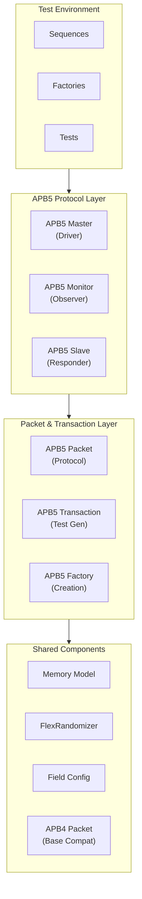

# APB5 Components Overview

The APB5 (Advanced Peripheral Bus 5) components provide a complete verification environment for the APB5 protocol, implementing the AMBA5 extensions to the APB specification. These components extend the existing APB4 infrastructure with user-defined signals, wake-up support, and parity error tracking, enabling comprehensive testing of APB5-compliant peripherals.

## Architecture Overview

The APB5 components follow a layered architecture that extends the APB4 protocol layer with AMBA5-specific capabilities:



## Component Categories

### Protocol Implementation
Core APB5 protocol components that handle signal-level communication:

- **APB5Master**: Drives APB5 transactions with user signal and wake-up support
- **APB5Slave**: Responds to APB5 transactions with memory backing and randomized user signal responses
- **APB5Monitor**: Observes and logs APB5 protocol activity including AMBA5 extensions

**Key Features:**
- Full APB5 signal support including PAUSER, PWUSER, PRUSER, PBUSER, PWAKEUP
- Backward-compatible APB4 base signals (PSEL, PENABLE, PWRITE, PADDR, etc.)
- Configurable user signal widths (independently sized)
- Optional parity signal monitoring (PWDATAPARITY, PADDRPARITY, PCTRLPARITY, etc.)
- Memory model integration for realistic slave behavior
- Configurable timing randomization with user signal value randomization

### Packet & Transaction Management
High-level transaction abstraction for test stimulus:

- **APB5Packet**: Protocol-specific packet with APB5 fields including user signals and parity
- **APB5Transaction**: Randomized transaction generator with APB5 user signal constraints
- **APB4 Interop**: Bidirectional conversion between APB5 and APB4 packets

**Key Features:**
- All APB4 fields plus PAUSER, PWUSER, PRUSER, PBUSER, PWAKEUP
- Parity error flag tracking (write data, read data, control)
- Built-in randomization with configurable constraints for user signals
- APB4-to-APB5 and APB5-to-APB4 packet conversion
- Direction-aware equality comparison with user signal matching

### Factory Functions & Utilities
Simplified component creation and configuration:

- **create_apb5_master**: One-line master creation with user signal width configuration
- **create_apb5_slave**: Slave creation with configurable wakeup generator and error overflow
- **create_apb5_monitor**: Monitor creation with user signal width support
- **create_apb5_randomizer**: Pre-configured randomizer for APB5 slave responses

**Key Features:**
- One-line component creation with sensible defaults
- Configurable user signal widths for all four channels (AUSER, WUSER, RUSER, BUSER)
- Pre-configured randomizer factory with ready delay and error injection
- Automatic user signal range calculation based on configured widths

## APB5 Protocol Support

### Protocol Features
- **APB4 Backward Compatibility**: Full support for all APB4 signals and behavior
- **User Signals**: Four independent user signal channels (PAUSER, PWUSER, PRUSER, PBUSER)
- **Wake-up Support**: PWAKEUP signal for low-power wake-up notification
- **Parity Protection**: Optional parity signals for data, address, and control integrity
- **Error Handling**: PSLVERR generation and detection

### AMBA5 Extensions

| Extension | Signal(s) | Direction | Description |
|-----------|-----------|-----------|-------------|
| Request User | PAUSER | Master -> Slave | User-defined request attributes |
| Write Data User | PWUSER | Master -> Slave | User-defined write data attributes |
| Read Data User | PRUSER | Slave -> Master | User-defined read data attributes |
| Response User | PBUSER | Slave -> Master | User-defined response attributes |
| Wake-up | PWAKEUP | Slave -> Master | Wake-up request from slave |
| Write Data Parity | PWDATAPARITY | Master -> Slave | Write data parity check |
| Address Parity | PADDRPARITY | Master -> Slave | Address parity check |
| Control Parity | PCTRLPARITY | Master -> Slave | Control signal parity check |
| Read Data Parity | PRDATAPARITY | Slave -> Master | Read data parity check |
| Ready Parity | PREADYPARITY | Slave -> Master | Ready signal parity check |
| Error Parity | PSLVERRPARITY | Slave -> Master | Slave error parity check |

### Signal Mapping

| APB5 Master Signals | Direction | APB5 Slave Signals | Direction |
|---------------------|-----------|---------------------|-----------|
| PSEL | out | PSEL | in |
| PENABLE | out | PENABLE | in |
| PWRITE | out | PWRITE | in |
| PADDR | out | PADDR | in |
| PWDATA | out | PWDATA | in |
| PSTRB | out | PSTRB | in |
| PPROT | out | PPROT | in |
| PAUSER | out | PAUSER | in |
| PWUSER | out | PWUSER | in |
| PRDATA | in | PRDATA | out |
| PREADY | in | PREADY | out |
| PSLVERR | in | PSLVERR | out |
| PRUSER | in | PRUSER | out |
| PBUSER | in | PBUSER | out |
| PWAKEUP | in | PWAKEUP | out |

## Design Principles

### 1. **APB4 Backward Compatibility**
- APB5 components extend APB4 behavior transparently
- All APB5 extension signals are optional on the bus
- Packets can be converted between APB5 and APB4 formats
- Tests written for APB4 can be adapted to APB5 with minimal changes

### 2. **Configurable User Signal Widths**
- Each user signal channel has an independently configurable width
- Default width of 4 bits for all user channels
- Randomizers automatically adjust to configured widths
- Field configuration auto-generated based on width parameters

### 3. **Realism**
- Memory model backing for slave responses
- Randomized user signal values on slave responses (PRUSER, PBUSER)
- Configurable ready delays and error conditions
- Wake-up generator callback for realistic low-power scenarios

### 4. **Ease of Use**
- Factory functions provide one-line component creation
- Sensible defaults for all configuration parameters
- Automatic signal presence detection for optional signals
- Pre-built randomizer factory for common test scenarios

## Usage Patterns

### Basic Testbench Setup

```python
import cocotb
from CocoTBFramework.components.apb5 import *

@cocotb.test()
async def basic_apb5_test(dut):
    # Create components using factory functions
    master = create_apb5_master(dut, "APB5_Master", "apb_", dut.clk)
    slave = create_apb5_slave(
        dut, "APB5_Slave", "apb_", dut.clk,
        registers=[0] * 1024
    )
    monitor = create_apb5_monitor(dut, "APB5_Monitor", "apb_", dut.clk)

    # Perform write with user signals
    await master.write(
        address=0x100,
        data=0xDEADBEEF,
        pauser=0x5,
        pwuser=0xA
    )

    # Perform read
    result = await master.read(address=0x100, pauser=0x5)
```

### User Signal Testing

```python
@cocotb.test()
async def user_signal_test(dut):
    master = create_apb5_master(
        dut, "Master", "apb_", dut.clk,
        auser_width=8, wuser_width=8,
        ruser_width=8, buser_width=8
    )

    # Create packet with user signals
    packet = APB5Packet(
        auser_width=8, wuser_width=8,
        ruser_width=8, buser_width=8,
        pwrite=1, paddr=0x200,
        pwdata=0x12345678,
        pstrb=0xF,
        pauser=0xAB,
        pwuser=0xCD
    )
    await master.send(packet)
```

### APB4/APB5 Interoperability

```python
from CocoTBFramework.components.apb.apb_packet import APBPacket
from CocoTBFramework.components.apb5 import APB5Packet

# Convert APB4 packet to APB5
apb4_pkt = APBPacket(pwrite=1, paddr=0x100, pwdata=0xABCD)
apb5_pkt = APB5Packet.from_apb4_packet(apb4_pkt)

# Convert APB5 packet back to APB4
apb4_again = apb5_pkt.to_apb4_packet()
```

## Integration with Framework

### Shared Components Integration
- **Memory Model**: Realistic slave memory backing via MemoryModel
- **FlexRandomizer**: Advanced randomization for timing, errors, and user signal values
- **Field Configuration**: Flexible packet field definitions via FieldConfig/FieldDefinition
- **Base Packet**: Inherits from framework Packet class for consistent field management

### APB4 Protocol Compatibility
- Extends APB4 packet format with additional fields
- Uses same signal names for base APB signals
- Maintains same transaction pipeline (setup phase, access phase, response)
- Shares PWRITE_MAP direction mapping with APB4

## Key Features

### Transaction Management
- **Automatic Queuing**: Transaction pipelining via sentQ deque
- **Timing Control**: Configurable delays via FlexRandomizer
- **User Signal Randomization**: Slave automatically randomizes PRUSER and PBUSER
- **Wake-up Support**: Configurable wake-up generator callback

### Verification Support
- **Protocol Checking**: APB5 specification compliance monitoring
- **Transaction Monitoring**: Complete protocol observation including user signals
- **Error Detection**: Slave errors, address overflow, and parity error tracking
- **Packet Comparison**: Direction-aware equality with user signal matching

## Getting Started

### Quick Setup
1. **Import Components**: `from CocoTBFramework.components.apb5 import *`
2. **Create Master/Slave**: Use factory functions with DUT signals and user signal widths
3. **Generate Transactions**: Use APB5Transaction or create APB5Packets directly
4. **Run Test**: Send packets via `master.send()`, `master.write()`, or `master.read()`

### Advanced Usage
1. **Custom User Signal Widths**: Configure independent widths for each user channel
2. **Wake-up Testing**: Provide a wakeup_generator callback to the slave
3. **Parity Monitoring**: Monitor parity error flags in captured packets
4. **APB4 Migration**: Convert existing APB4 packets to APB5 using `from_apb4_packet()`

Each component includes comprehensive signal presence detection to handle optional APB5 signals gracefully, allowing the same test infrastructure to work with both minimal and fully-featured APB5 interfaces.
