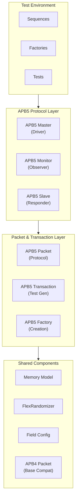

# APB5 Components Overview

APB5 is APB4 plus the AMBA5 bolt-ons: user-defined sideband signals, a wake-up request, and optional parity protection. This family covers the whole protocol — master, slave, monitor, packets, and stimulus generation — and it's built directly on the APB4 infrastructure, so if you know the APB4 BFM you're most of the way here already.

## Architecture Overview

The layering will look familiar if you've used any other family in the framework: tests on top, protocol components in the middle, packets and shared infrastructure underneath, with the APB4 packet as the compatibility base.


```mermaid
graph TB
    subgraph TestEnv["Test Environment"]
        Seq[Sequences]
        Fact[Factories]
        Tests[Tests]
    end

    subgraph APB5Layer["APB5 Protocol Layer"]
        Master["APB5 Master<br/>(Driver)"]
        Monitor["APB5 Monitor<br/>(Observer)"]
        Slave["APB5 Slave<br/>(Responder)"]
    end

    subgraph PacketLayer["Packet & Transaction Layer"]
        Packet["APB5 Packet<br/>(Protocol)"]
        Trans["APB5 Transaction<br/>(Test Gen)"]
        Factory["APB5 Factory<br/>(Creation)"]
    end

    subgraph Shared["Shared Components"]
        MemModel[Memory Model]
        Random[FlexRandomizer]
        FieldCfg[Field Config]
        APB4["APB4 Packet<br/>(Base Compat)"]
    end

    TestEnv --> APB5Layer
    APB5Layer --> PacketLayer
    PacketLayer --> Shared
```

## Component Categories

### Protocol Implementation

The signal-level pieces:

- **APB5Master**: drives transfers and owns PWAKEUP plus the request-side user signals
- **APB5Slave**: answers from a memory-backed register array, with randomized timing, errors, and response sidebands
- **APB5Monitor**: observes everything and drives nothing, recording the AMBA5 extensions alongside the base signals

**Key Features:**

- Full APB5 signal support: PAUSER, PWUSER, PRUSER, PBUSER, PWAKEUP
- The APB4 base signals (PSEL, PENABLE, PWRITE, PADDR, etc.) behave exactly as they always did
- Independently sized user signal channels
- Optional parity signal monitoring (PWDATAPARITY, PADDRPARITY, PCTRLPARITY, etc.)
- Memory model integration for the slave
- Timing randomization with user signal value randomization

### Packet & Transaction Management

The objects your tests actually create, send, and compare:

- **APB5Packet**: the transfer record — APB4 fields plus user sidebands, wake-up state, and parity flags
- **APB5Transaction**: constrained-random generator that stamps out APB5Packets
- **APB4 Interop**: two-way conversion between APB5 and APB4 packets

**Key Features:**

- Every APB4 field, plus PAUSER, PWUSER, PRUSER, PBUSER, and PWAKEUP
- Parity error flags for write data, read data, and control
- Constrained randomization whose ranges follow your configured widths
- `to_apb4_packet()` / `from_apb4_packet()` conversion
- Direction-aware equality that includes the user signals

### Factory Functions & Utilities

Shortcuts that keep testbench setup to a few lines:

- **create_apb5_master**: one-line master creation, user signal widths included
- **create_apb5_slave**: slave creation with optional address-overflow errors
- **create_apb5_monitor**: monitor creation with width support
- **create_apb5_randomizer**: a ready-made randomizer for slave responses

**Key Features:**

- Sensible defaults throughout — override only what you care about
- Independent widths for all four user channels (AUSER, WUSER, RUSER, BUSER)
- A randomizer factory with ready-delay and error-injection knobs
- User signal randomization ranges computed from the configured widths

## APB5 Protocol Support

### Protocol Features

- **APB4 Backward Compatibility**: every APB4 signal and behavior works unchanged
- **User Signals**: four independent sideband channels (PAUSER, PWUSER, PRUSER, PBUSER)
- **Wake-up Support**: requester-driven PWAKEUP — the master drives it; slave and monitor only observe
- **Parity Protection**: optional parity on data, address, and control
- **Error Handling**: PSLVERR generation on the slave side, detection everywhere

### AMBA5 Extensions

| Extension | Signal(s) | Direction | Description |
|-----------|-----------|-----------|-------------|
| Request User | PAUSER | Master -> Slave | User-defined request attributes |
| Write Data User | PWUSER | Master -> Slave | User-defined write data attributes |
| Read Data User | PRUSER | Slave -> Master | User-defined read data attributes |
| Response User | PBUSER | Slave -> Master | User-defined response attributes |
| Wake-up | PWAKEUP | Master -> Slave | Requester-driven wake-up (asserted with PSEL, per IHI 0024E) |
| Write Data Parity | PWDATAPARITY | Master -> Slave | Write data parity check |
| Address Parity | PADDRPARITY | Master -> Slave | Address parity check |
| Control Parity | PCTRLPARITY | Master -> Slave | Control signal parity check |
| Read Data Parity | PRDATAPARITY | Slave -> Master | Read data parity check |
| Ready Parity | PREADYPARITY | Slave -> Master | Ready signal parity check |
| Error Parity | PSLVERRPARITY | Slave -> Master | Slave error parity check |

### Signal Mapping

| APB5 Master Signals | Direction | APB5 Slave Signals | Direction |
|---------------------|-----------|---------------------|-----------|
| PSEL | out | PSEL | in |
| PENABLE | out | PENABLE | in |
| PWRITE | out | PWRITE | in |
| PADDR | out | PADDR | in |
| PWDATA | out | PWDATA | in |
| PSTRB | out | PSTRB | in |
| PPROT | out | PPROT | in |
| PAUSER | out | PAUSER | in |
| PWUSER | out | PWUSER | in |
| PRDATA | in | PRDATA | out |
| PREADY | in | PREADY | out |
| PSLVERR | in | PSLVERR | out |
| PRUSER | in | PRUSER | out |
| PBUSER | in | PBUSER | out |
| PWAKEUP | out | PWAKEUP | in |

## Design Principles

### 1. **APB4 Backward Compatibility**

- The APB5 components extend the APB4 ones rather than replacing them
- Every AMBA5 extension signal is optional on the bus — an APB4-style DUT still binds
- Packets convert in both directions between APB5 and APB4 formats
- An APB4 test ports to APB5 with new constructor arguments, not a rewrite

### 2. **Configurable User Signal Widths**

- Each user channel gets its own width — PAUSER can be 8 bits while PBUSER stays at 4
- All channels default to 4 bits
- Randomizer ranges follow the configured widths automatically
- The packet field configuration is generated from the same width parameters, so nothing drifts out of sync

### 3. **Realism**

- Slave responses come out of a real memory model
- PRUSER and PBUSER are randomized per response — your DUT shouldn't get comfortable assuming they're zero
- Configurable ready delays and error injection
- A master-side PWAKEUP policy (`wakeup_enable`) so low-power scenarios look like the real thing

### 4. **Ease of Use**

- Factory functions collapse component creation to one line
- Defaults are chosen so a minimal testbench needs almost no configuration
- Optional signals are detected, not assumed
- A pre-built randomizer factory covers the common slave behaviors

## Usage Patterns

### Basic Testbench Setup

Factories, a write with user attributes, a read back — that's a working testbench:

```python
import cocotb
from CocoTBFramework.components.apb5 import *

@cocotb.test()
async def basic_apb5_test(dut):
    # Create components using factory functions
    master = create_apb5_master(dut, "APB5_Master", "apb_", dut.clk)
    slave = create_apb5_slave(
        dut, "APB5_Slave", "apb_", dut.clk,
        registers=[0] * 1024
    )
    monitor = create_apb5_monitor(dut, "APB5_Monitor", "apb_", dut.clk)

    # Perform write with user signals
    await master.write(
        address=0x100,
        data=0xDEADBEEF,
        pauser=0x5,
        pwuser=0xA
    )

    # Perform read
    result = await master.read(address=0x100, pauser=0x5)
```

### User Signal Testing

Widen the sidebands and put real values on them:

```python
@cocotb.test()
async def user_signal_test(dut):
    master = create_apb5_master(
        dut, "Master", "apb_", dut.clk,
        auser_width=8, wuser_width=8,
        ruser_width=8, buser_width=8
    )

    # Create packet with user signals
    packet = APB5Packet(
        auser_width=8, wuser_width=8,
        ruser_width=8, buser_width=8,
        pwrite=1, paddr=0x200,
        pwdata=0x12345678,
        pstrb=0xF,
        pauser=0xAB,
        pwuser=0xCD
    )
    await master.send(packet)
```

### APB4/APB5 Interoperability

Converting between formats is explicit, and it works in both directions:

```python
from CocoTBFramework.components.apb.apb_packet import APBPacket
from CocoTBFramework.components.apb5 import APB5Packet

# Convert APB4 packet to APB5
apb4_pkt = APBPacket(pwrite=1, paddr=0x100, pwdata=0xABCD)
apb5_pkt = APB5Packet.from_apb4_packet(apb4_pkt)

# Convert APB5 packet back to APB4
apb4_again = apb5_pkt.to_apb4_packet()
```

## Integration with Framework

### Shared Components Integration

- **Memory Model**: backs the slave's register storage
- **FlexRandomizer**: drives timing, error, and user-value randomization
- **Field Configuration**: packet layouts via FieldConfig/FieldDefinition
- **Base Packet**: APB5Packet inherits the framework's Packet field management

### APB4 Protocol Compatibility

- Extends the APB4 packet format rather than forking it
- Same signal names for the base APB signals
- Same transfer pipeline: setup phase, access phase, response
- Shares the PWRITE_MAP direction mapping with APB4

## Key Features

### Transaction Management

- **Automatic Queuing**: every component keeps a `sentQ` deque of completed transactions
- **Timing Control**: configurable delays via FlexRandomizer
- **User Signal Randomization**: the slave randomizes PRUSER and PBUSER on its own
- **Wake-up Support**: master-driven PWAKEUP via `wakeup_enable` / `set_wakeup_enable()`

### Verification Support

- **Protocol Checking**: APB5 specification compliance monitoring
- **Transaction Monitoring**: full bus observation, user signals included
- **Error Detection**: slave errors, address overflow, and parity error tracking
- **Packet Comparison**: direction-aware equality with user signal matching

## Getting Started

### Quick Setup

1. **Import Components**: `from CocoTBFramework.components.apb5 import *`
2. **Create Master/Slave**: factory functions, DUT signals, and user signal widths
3. **Generate Transactions**: APB5Transaction for random traffic, or hand-built APB5Packets
4. **Run Test**: send packets via `master.send()`, `master.write()`, or `master.read()`

### Advanced Usage

1. **Custom User Signal Widths**: size each user channel independently
2. **Wake-up Testing**: toggle requester-driven PWAKEUP mid-test with `APB5Master(wakeup_enable=...)` or `master.set_wakeup_enable()`
3. **Parity Monitoring**: check the parity error flags in captured packets
4. **APB4 Migration**: upgrade existing APB4 stimulus with `from_apb4_packet()`

One last thing worth repeating, because it's what makes mixed DUTs painless: every component detects which optional signals are actually connected instead of assuming. The same testbench runs against a stripped-down APB4-style peripheral and a fully loaded APB5 one — you just stop touching the signals that aren't there.

---
