<!-- RTL Design Sherpa Documentation Header -->
<table>
<tr>
<td width="80">
  <a href="https://github.com/sean-galloway/RTLDesignSherpa-DV">
    
  </a>
</td>
<td>
  <strong>CocoTB Framework</strong> · <em>Verification Infrastructure for RTL Testing</em><br>
  <sub>
    <a href="https://github.com/sean-galloway/RTLDesignSherpa-DV">GitHub</a> ·
    <a href="https://github.com/sean-galloway/RTLDesignSherpa/blob/main/docs/DOCUMENTATION_INDEX.md">Documentation Index</a> ·
    <a href="https://github.com/sean-galloway/RTLDesignSherpa/blob/main/LICENSE">MIT License</a>
  </sub>
</td>
</tr>
</table>

---

<!-- End Header -->

# AXI4 Components Overview

The AXI4 components are the full-weight members of the family: five channels, bursts up to 256 beats, outstanding transactions, QoS — everything AXI4-Full carries. They sit on the GAXI infrastructure, so field configuration, memory models, statistics, and signal resolution all behave the same way they do in the other protocol BFMs. Learn one and the rest feel familiar.

## Framework Integration

### GAXI Infrastructure Foundation

AXI4 is built on GAXI, the generic AXI layer every protocol component in this framework shares. That buys you:

**Unified Field Configuration**: Transaction structures come from the same field configuration system the rest of the framework uses
**Memory Model Support**: Slaves can be backed by a real memory model, so write-then-read checking just works
**Statistics Integration**: Per-channel transaction and performance metrics, collected as the test runs
**Signal Resolution**: Automatic signal detection and mapping across different naming conventions
**Advanced Debugging**: Multi-level debug with transaction-level logging when you need to see the traffic

### Memory-Mapped Protocol Specialization

What the AXI4 layer adds on top of GAXI:

**Five Channel Architecture**: Dedicated components for the AR, R, AW, W, and B channels
**Burst Transaction Management**: Native support for INCR, FIXED, and WRAP burst types
**Outstanding Transaction Support**: Multiple concurrent transactions, tracked per ID
**Address and Data Decoupling**: Independent address and data phases, overlapped for throughput
**Protocol Compliance**: An integrated checker that watches for spec violations while your test runs

## Core Components Architecture

```mermaid
graph TB
    subgraph Ecosystem["AXI4 Component Ecosystem"]
        subgraph Components["Core Components"]
            MasterRd["AXI4MasterRd<br/>(AR/R)"]
            MasterWr["AXI4MasterWr<br/>(AW/W/B)"]
            SlaveRd["AXI4SlaveRd<br/>(AR/R)"]
            SlaveWr["AXI4SlaveWr<br/>(AW/W/B)"]
        end

        subgraph FieldConfig["AXI4 Field Configurations"]
            AR[AR Config]
            R[R Config]
            AW[AW Config]
            W[W Config]
            B[B Config]
        end

        subgraph Advanced["Advanced AXI4 Features"]
            Compliance[Compliance]
            Random[Randomization]
            Timing[Timing Config]
            Factories[Factories]
            PktUtils[Packet Utils]
            TxnSupport[Transaction Support]
        end

        subgraph GAXI["GAXI Infrastructure"]
            SigRes[Signal Resolution]
            MemModels[Memory Models]
            Stats[Statistics]
            FieldHandle[Field Handling]
            Debug[Debug Support]
            Config[Configuration]
        end
    end

    Components --> FieldConfig
    FieldConfig --> Advanced
    Advanced --> GAXI
```



## Component Capabilities

### AXI4MasterRead - Memory Read Operations

The read master drives AXI4 read transactions:

**Address Request Management**:
- **AR Channel Control**: Complete ARADDR, ARLEN, ARSIZE, ARBURST, ARID management
- **Outstanding Transactions**: Multiple concurrent read requests in flight
- **Address Alignment**: Automatic address alignment and burst boundary checking
- **QoS and Caching**: Complete ARQOS, ARCACHE, ARPROT, ARREGION support

**Read Data Reception**:
- **R Channel Monitoring**: RDATA, RRESP, RID, RLAST processed for you
- **Burst Assembly**: Multi-beat read bursts reassembled into a single result
- **Error Handling**: RRESP errors detected and surfaced, not silently passed through
- **Flow Control**: RREADY backpressure managed by the channel component

**Performance Features**:
- **Pipeline Optimization**: Overlapped address and data phases
- **Memory Integration**: Direct memory model hooks for read data verification
- **Statistics Tracking**: Real-time performance monitoring as the test runs

### AXI4MasterWrite - Memory Write Operations

The write master drives AXI4 write transactions:

**Address and Data Management**:
- **AW Channel Control**: Complete AWADDR, AWLEN, AWSIZE, AWBURST management
- **W Channel Control**: WDATA, WSTRB, WLAST coordination
- **Address/Data Synchronization**: Address and data phases kept in the right order
- **Write Strobes**: Byte-level write enable control

**Write Response Handling**:
- **B Channel Processing**: BRESP, BID responses verified automatically
- **Error Detection**: Write response errors caught and reported
- **Transaction Completion**: Full write lifecycle — address, data, response — tied together

**Advanced Write Features**:
- **Partial Writes**: WSTRB-based partial word writing
- **Write Ordering**: Support for write ordering requirements
- **Outstanding Management**: Multiple concurrent write transactions

### AXI4SlaveRead - Memory Read Response

The read slave answers AXI4 read transactions:

**Address Processing**:
- **AR Channel Monitoring**: Watches AR for incoming read requests
- **Address Decode**: Configurable address range checking and routing
- **Burst Analysis**: ARLEN, ARSIZE, ARBURST parameters decoded for you
- **QoS Processing**: ARQOS, ARCACHE, ARPROT parameters handled

**Data Response Generation**:
- **R Channel Control**: RDATA, RRESP, RID, RLAST generation
- **Memory Interface**: Data sourced straight from a memory model
- **Error Injection**: Configurable SLVERR, DECERR response generation
- **Timing Control**: Configurable RVALID timing and latency

**Slave-Specific Features**:
- **Address Range Configuration**: Flexible address space definition
- **Response Randomization**: Realistic slave timing behavior
- **Protocol Compliance**: Protocol-legal slave responses by construction

### AXI4SlaveWrite - Memory Write Response

The write slave answers AXI4 write transactions:

**Write Transaction Processing**:
- **AW/W Channel Coordination**: Address and data phases synchronized, including legal W-before-AW arrivals
- **Write Data Assembly**: Multi-beat bursts collected and reassembled
- **Strobe Processing**: WSTRB byte enables applied per beat
- **Write Ordering**: Write ordering and hazard detection support

**Write Response Generation**:
- **B Channel Control**: BRESP, BID response generation
- **Error Response**: Configurable error condition simulation
- **Response Timing**: Realistic write response latency modeling

**Memory Integration Features**:
- **Write-Through**: Writes land directly in the memory model
- **Write Verification**: Written data validated automatically
- **Conflict Detection**: Write hazard and ordering conflict detection

## Field Configuration System

### AXI4FieldConfigs - Channel-Specific Configuration

Field configs are how the framework adapts to your bus widths. Each channel gets its own, and a helper builds them:

**Channel-Specific Configurations**:
```python
# AR Channel Configuration
ar_config = AXI4FieldConfigHelper.create_ar_field_config(
    id_width=8, addr_width=32, user_width=1
)

# AW Channel Configuration
aw_config = AXI4FieldConfigHelper.create_aw_field_config(
    id_width=8, addr_width=32, user_width=1
)

# R Channel Configuration
r_config = AXI4FieldConfigHelper.create_r_field_config(
    id_width=8, data_width=32, user_width=1
)

# W Channel Configuration
w_config = AXI4FieldConfigHelper.create_w_field_config(
    data_width=32, user_width=1
)

# B Channel Configuration
b_config = AXI4FieldConfigHelper.create_b_field_config(
    id_width=8, user_width=1
)
```

**Flexible Parameter Support**:
- **Variable Widths**: Different data, address, and ID widths per design
- **Optional Signals**: Zero-width USER, QOS, REGION signals handled cleanly
- **Custom Extensions**: Proprietary sideband signals can be added

## Advanced Features

### AXI4ComplianceChecker - Protocol Verification

The integrated checker watches live traffic and holds it against the spec:

**Transaction-Level Checking**:
- **Handshake Protocol**: VALID/READY signal timing verification
- **Burst Compliance**: AWLEN, ARLEN, *LAST signal consistency
- **Address Alignment**: Burst boundary and size alignment checking
- **ID Consistency**: Transaction ID matching across channels

**System-Level Monitoring**:
- **Outstanding Limits**: Maximum outstanding transaction enforcement
- **Ordering Requirements**: Read/write ordering rule verification
- **Deadlock Detection**: System-level deadlock condition monitoring
- **Performance Analysis**: Bus utilization and efficiency metrics

### AXI4Randomization - Realistic Test Scenarios

The randomization layer varies what you send and when you send it. Pick a profile, then tighten the constraints you care about:

**Transaction Randomization**:
```python
from CocoTBFramework.components.axi4.axi4_randomization_config import (
    AXI4RandomizationConfig, AXI4RandomizationProfile
)

# Pick a profile and tune constraints
config = AXI4RandomizationConfig(profile=AXI4RandomizationProfile.STRESS)
config.set_burst_constraints(max_len=16, preferred_sizes=[1, 2, 4, 8])
config.set_error_injection_rate(0.02)
config.constraints.addr_min = 0x1000
config.constraints.addr_max = 0x8000
config.constraints.burst_types = [1, 2]   # INCR, WRAP
config.constraints.id_min = 1
config.constraints.id_max = 5
```

**Data Pattern Generation**:
- **Pseudorandom Data**: LFSR-based data pattern generation
- **Address-Based Patterns**: Data values derived from address
- **Custom Patterns**: User-defined data generation algorithms
- **Error Injection**: Controlled error condition insertion

## Usage Patterns and Integration

### Basic Read Transaction

```python
# Create AXI4 master read interface
master_read = AXI4MasterRead(
    dut=dut,
    clock=clk,
    prefix="m_axi_",
    data_width=32,
    id_width=8,
    addr_width=32
)

# Perform single read
data = await master_read.read_transaction(
    address=0x1000,
    burst_len=1,
    id=1
)

# Perform burst read
burst_data = await master_read.read_transaction(
    address=0x2000,
    burst_len=8,
    id=2,
    burst_type=1,  # INCR
    size=2         # 4-byte transfers
)
```

### Basic Write Transaction

```python
# Create AXI4 master write interface
master_write = AXI4MasterWrite(
    dut=dut,
    clock=clk,
    prefix="m_axi_",
    data_width=32,
    id_width=8,
    addr_width=32
)

# Perform single write
await master_write.write_transaction(
    address=0x1000,
    data=[0x12345678],
    id=1
)

# Perform burst write with a partial strobe (applied to every beat)
await master_write.write_transaction(
    address=0x2000,
    data=[0xDEADBEEF, 0xCAFEBABE, 0xFEEDFACE],
    strb=0xC,      # Byte enables for all beats
    id=2,
    burst_type=1  # INCR
)
```

### Memory Model Integration

```python
from CocoTBFramework.components.shared.memory_model import MemoryModel
from CocoTBFramework.components.axi4.axi4_interfaces import AXI4SlaveRead, AXI4SlaveWrite

# Create memory model and pass it to the slave interfaces
memory = MemoryModel(num_lines=1024, bytes_per_line=4)
slave_write = AXI4SlaveWrite(dut, clk, "s_axi_", memory_model=memory)
slave_read = AXI4SlaveRead(dut, clk, "s_axi_", memory_model=memory)

# Writes update the memory model; subsequent reads are served from it
result = await master_write.write_transaction(0x1000, [0x12345678])
read_data = await master_read.read_transaction(0x1000, burst_len=1)
assert read_data[0] == 0x12345678
```

### Burst Sequences with AXI4Sequence

```python
from CocoTBFramework.components.axi4 import AXI4Sequence, run_axi4_sequence

# Author bursts as data, then run them back-to-back
seq = AXI4Sequence("reads", data_width=32, id_width=4)
for i in range(4):
    seq.add_read(0x1000 + i * 0x100, length=4, axid=i)

read_results = await run_axi4_sequence(seq, master_rd=master_read, raise_on_error=True)
```

## Performance Optimization

### Pipeline Control

**Address/Data Overlap**:
- **Write Channel Coordination**: AW and W channel timing optimization
- **Read Pipeline**: AR and R channel pipeline management
- **Outstanding Balance**: Tune the outstanding count to what the DUT can actually absorb

**Flow Control Optimization**:
- **Backpressure Management**: Intelligent READY signal timing
- **Throughput Maximization**: Keep bubbles out of the data phase
- **Latency Minimization**: Optimized handshake timing

### Memory Efficiency

**Transaction Batching**:
- **Burst Optimization**: Burst size and alignment chosen for the transfer
- **Outstanding Queuing**: Efficient outstanding transaction queue management
- **Data Caching**: Smart data caching for repetitive patterns

## Debug and Analysis

### Logging and Tracing

**Transaction Tracing**:
- **Channel-Level Logging**: Detailed per-channel transaction logs
- **Timing Analysis**: Handshake timing and pipeline analysis
- **Protocol Compliance**: Compliance violations reported as they happen
- **Performance Metrics**: Throughput and latency measurement

**Integration Tools**:
- **Waveform Annotation**: Automatic transaction marker generation
- **Coverage Integration**: Hooks into functional coverage
- **Debug Interfaces**: Integration with external debug tools

## Configuration Examples

### Hardware Parameter Matching

Match the widths on your RTL interface and the BFM lines up with it:

```python
# Match SystemVerilog AXI4 interface parameters
# parameter AXI_DATA_WIDTH = 64,
# parameter AXI_ADDR_WIDTH = 40,
# parameter AXI_ID_WIDTH = 4,
# parameter AXI_USER_WIDTH = 0

master_read = AXI4MasterRead(
    dut=dut,
    clock=clk,
    prefix="m_axi_",
    data_width=64,
    addr_width=40,
    id_width=4,
    user_width=0  # Disabled user signals
)
```

### Protocol Variant Support

The same parameters scale down toward AXI4-Lite or up to a wide custom interconnect:

```python
# AXI4-Lite configuration (single transaction, no bursts)
axi4_lite_config = {
    'data_width': 32,
    'addr_width': 32,
    'id_width': 0,      # No ID signals
    'user_width': 0,    # No USER signals
    'burst_support': False,  # Single transactions only
    'outstanding_limit': 1   # Single outstanding transaction
}

# Custom AXI4 variant
custom_config = {
    'data_width': 512,   # Wide data bus
    'addr_width': 48,    # Extended addressing
    'id_width': 16,      # Many outstanding transactions
    'user_width': 32,    # Rich sideband data
    'qos_support': True, # Quality of Service
    'region_support': True  # Memory regions
}
```

That's the shape of the AXI4 support: GAXI underneath doing the heavy lifting, AXI4-specific pieces on top for bursts, IDs, ordering, and compliance. If you've driven another BFM in this framework, you already know most of the API.
