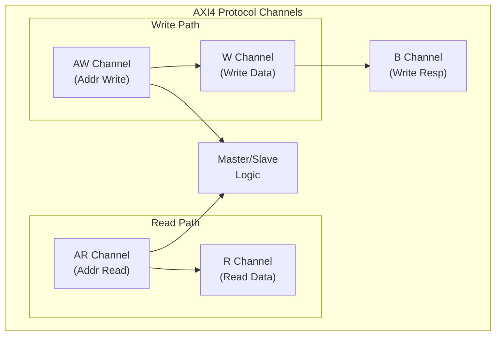

<!-- RTL Design Sherpa Documentation Header -->
<table>
<tr>
<td width="80">
  <a href="https://github.com/sean-galloway/RTLDesignSherpa-DV">
    
  </a>
</td>
<td>
  <strong>CocoTB Framework</strong> · <em>Verification Infrastructure for RTL Testing</em><br>
  <sub>
    <a href="https://github.com/sean-galloway/RTLDesignSherpa-DV">GitHub</a> ·
    <a href="https://github.com/sean-galloway/RTLDesignSherpa/blob/main/docs/DOCUMENTATION_INDEX.md">Documentation Index</a> ·
    <a href="https://github.com/sean-galloway/RTLDesignSherpa/blob/main/LICENSE">MIT License</a>
  </sub>
</td>
</tr>
</table>

---

<!-- End Header -->

**[← Back to Components Index](../components_index.md)** | **[CocoTBFramework Index](../../index.md)**

# AXI4 Components

The AXI4 (AXI4-Full) components provide comprehensive verification capabilities for AXI4 protocol implementations. Built on the robust GAXI infrastructure, these components offer advanced memory-mapped transaction generation, protocol compliance checking, and comprehensive verification features for full AXI4 implementations.

## Component Overview

The AXI4 component ecosystem includes specialized interfaces and utilities for comprehensive full AXI4 protocol verification:

### Core Interface Components

- **AXI4MasterRead** - Master read interface (AR/R channels)
- **AXI4MasterWrite** - Master write interface (AW/W/B channels)
- **AXI4SlaveRead** - Slave read interface (AR/R channels)
- **AXI4SlaveWrite** - Slave write interface (AW/W/B channels)

### Data Structure and Configuration

- **AXI4Packet** - Transaction packet management
- **AXI4FieldConfigs** - Protocol field configuration system
- **AXI4Transaction** - High-level transaction representation

### Advanced Features

- **AXI4ComplianceChecker** - Protocol compliance verification
- **AXI4Factories** - Component factory methods
- **AXI4PacketUtils** - Packet manipulation utilities
- **AXI4RandomizationConfig** - Randomization configuration
- **AXI4TimingConfig** - Timing constraint configuration

## Key Features

### Full AXI4 Protocol Support
- Complete 5-channel implementation (AR, R, AW, W, B)
- Master and slave interface support
- Advanced features: Burst transactions, outstanding transactions, QoS
- Complete sideband signal support (ID, USER, CACHE, PROT, QOS, REGION)

### GAXI Infrastructure Integration
- Unified field configuration system
- Memory model integration for data verification
- Comprehensive statistics and performance metrics
- Advanced debugging and transaction logging
- Automatic signal resolution across naming conventions

### Advanced Verification Features
- Integrated protocol compliance checking
- Configurable timing randomization
- Outstanding transaction management
- Burst transaction support
- Error injection and recovery testing

## Getting Started

```python
from CocoTBFramework.components.axi4.axi4_interfaces import AXI4MasterRead, AXI4MasterWrite

# Create AXI4 master read interface
master_read = AXI4MasterRead(
    dut=dut,
    clock=clk,
    prefix="m_axi_",
    data_width=32,
    id_width=8,
    addr_width=32,
    user_width=1
)

# Create AXI4 master write interface
master_write = AXI4MasterWrite(
    dut=dut,
    clock=clk,
    prefix="m_axi_",
    data_width=32,
    id_width=8,
    addr_width=32,
    user_width=1
)

# Perform read transaction
read_data = await master_read.read_transaction(
    address=0x1000,
    burst_len=4,
    id=1,
    burst_type=1  # INCR
)

# Perform write transaction
await master_write.write_transaction(
    address=0x2000,
    data=[0x12345678, 0x9ABCDEF0],
    id=2,
    burst_type=1  # INCR
)
```

## Protocol Architecture

AXI4 implements a full 5-channel protocol:



## Documentation Structure

- **[Overview](components_axi4_overview.md)** - Comprehensive component architecture and capabilities
- **Interface References** - Detailed documentation for each AXI4 interface class
- **Usage Examples** - See code examples above
- **Configuration Guide** - Field configuration and customization options
- **Compliance Guide** - Protocol compliance checking and verification

## Advanced Use Cases

### Pipelined Traffic with AXI4Sequence
```python
from CocoTBFramework.components.axi4 import AXI4Sequence, run_axi4_sequence

# Author the traffic once as data
seq = AXI4Sequence("pipelined", data_width=32)
for addr in [0x1000, 0x2000, 0x3000, 0x4000]:
    seq.add_read(addr, length=4)

# Run all bursts against the master
results = await run_axi4_sequence(seq, master_rd=master_read, raise_on_error=True)
```

### Protocol Compliance Verification
```python
# Enable compliance checking via environment variable
import os
os.environ['AXI4_COMPLIANCE_CHECK'] = '1'

# Compliance checker automatically integrated
master_read = AXI4MasterRead(dut, clk, "m_axi_")
# All transactions automatically monitored for compliance
```

### Memory Model Integration
```python
from CocoTBFramework.components.shared.memory_model import MemoryModel
from CocoTBFramework.components.axi4.axi4_interfaces import AXI4SlaveRead, AXI4SlaveWrite

# Pass a shared memory model to the slave interfaces
memory = MemoryModel(num_lines=1024, bytes_per_line=4)
slave_write = AXI4SlaveWrite(dut, clk, "s_axi_", memory_model=memory)
slave_read = AXI4SlaveRead(dut, clk, "s_axi_", memory_model=memory)

# Writes land in the memory model; reads are served from it
```

The AXI4 components provide a complete solution for AXI4-Full protocol verification, combining the power and flexibility of the GAXI infrastructure with AXI4-specific optimizations and advanced features for comprehensive memory-mapped interface testing.