# AXI5 Components Overview

The CocoTBFramework AXI5 components provide comprehensive support for AXI5 protocol verification and transaction generation. Built on the proven GAXI infrastructure, these components offer a consistent and powerful interface for memory-mapped protocol testing with advanced features for atomic operations, memory tagging, security contexts, chunked transfers, and protocol compliance verification.

## Key Differences from AXI4

AXI5 extends AXI4 with significant new capabilities while removing some legacy signals:

**Removed Signals**:
- `ARREGION`, `AWREGION` -- region signals removed from the specification

**Added Signals (Address Channels)**:
- `ATOP` (AW only) -- Atomic operation type (6 bits)
- `NSAID` -- Non-secure Access ID (4 bits)
- `TRACE` -- Transaction tracing enable (1 bit)
- `MPAM` -- Memory Partitioning and Monitoring (11 bits)
- `MECID` -- Memory Encryption Context ID (16 bits)
- `UNIQUE` -- Unique/Exclusive access indicator (1 bit)
- `TAGOP` -- Memory Tagging operation (2 bits)
- `TAG` -- Memory tag values (width depends on data width)
- `CHUNKEN` (AR only) -- Chunking enable (1 bit)

**Added Signals (Data/Response Channels)**:
- `POISON` (W, R) -- Data poison indicator (1 bit)
- `TAGUPDATE` (W) -- Tag update indicators
- `CHUNKV`, `CHUNKNUM`, `CHUNKSTRB` (R) -- Chunked transfer response fields
- `TAGMATCH` (B, R) -- Tag match result (1 bit)
- `TRACE` (B) -- Transaction trace echo (1 bit)

## Framework Integration

### GAXI Infrastructure Foundation

The AXI5 components inherit from the robust GAXI framework, providing:

**Unified Field Configuration**: Complete integration with the CocoTBFramework field configuration system for flexible transaction structures
**Memory Model Support**: Seamless integration with memory models for data verification and complex test scenarios
**Statistics Integration**: Comprehensive performance metrics and transaction tracking
**Signal Resolution**: Automatic signal detection and mapping across different naming conventions
**Advanced Debugging**: Multi-level debugging capabilities with detailed transaction logging

### Memory-Mapped Protocol Specialization

While inheriting GAXI's power, AXI5 components are specifically optimized for next-generation memory-mapped protocols:

**Five Channel Architecture**: Complete support for AR, R, AW, W, and B channels
**Atomic Operations**: Native support for AtomicStore, AtomicLoad, AtomicSwap, and AtomicCompare
**Memory Tagging Extension (MTE)**: Full TAG, TAGOP, TAGUPDATE, and TAGMATCH support
**Security Context Management**: NSAID, MPAM, and MECID signal handling
**Chunked Transfer Support**: CHUNKEN/CHUNKV/CHUNKNUM/CHUNKSTRB for large data widths
**Poison Indicators**: Data integrity marking for error propagation
**Transaction Tracing**: TRACE signal for debug and profiling infrastructure

## Core Components Architecture

```mermaid
graph TB
    subgraph Ecosystem["AXI5 Component Ecosystem"]
        subgraph Components["Core Components"]
            MasterRd["AXI5MasterRead<br/>(AR/R)"]
            MasterWr["AXI5MasterWrite<br/>(AW/W/B)"]
            SlaveRd["AXI5SlaveRead<br/>(AR/R)"]
            SlaveWr["AXI5SlaveWrite<br/>(AW/W/B)"]
        end

        subgraph FieldConfig["AXI5 Field Configurations"]
            AR[AR Config]
            R[R Config]
            AW[AW Config]
            W[W Config]
            B[B Config]
        end

        subgraph Advanced["Advanced AXI5 Features"]
            Compliance[Compliance Checker]
            Random[Randomization]
            Timing[Timing Config]
            Factories[Factories]
            PktUtils[Packet Utils]
            TxnSupport[Transaction Tracking]
        end

        subgraph GAXI["GAXI Infrastructure"]
            SigRes[Signal Resolution]
            MemModels[Memory Models]
            Stats[Statistics]
            FieldHandle[Field Handling]
            Debug[Debug Support]
            Config[Configuration]
        end
    end

    Components --> FieldConfig
    FieldConfig --> Advanced
    Advanced --> GAXI
```



## Component Capabilities

### AXI5MasterRead - Memory Read Operations

The `AXI5MasterRead` component drives AXI5 read transactions as a master:

**Address Request Management**:
- **AR Channel Control**: Complete ARADDR, ARLEN, ARSIZE, ARBURST, ARID management
- **Outstanding Transactions**: Support for multiple concurrent read requests
- **AXI5 Security Context**: NSAID, MPAM, MECID signal generation
- **Tag Operations**: TAGOP signaling for Memory Tagging Extension reads
- **Chunked Reads**: CHUNKEN support for wide data bus transfers

**Read Data Reception**:
- **R Channel Monitoring**: Automatic RDATA, RRESP, RID, RLAST processing
- **Poison Detection**: RPOISON indicator checking and warning
- **Chunk Response Handling**: CHUNKV, CHUNKNUM, CHUNKSTRB processing
- **Tag Match Results**: TAGMATCH result extraction from responses

### AXI5MasterWrite - Memory Write Operations

The `AXI5MasterWrite` component drives AXI5 write transactions as a master:

**Address and Data Management**:
- **AW Channel Control**: Complete AWADDR, AWLEN, AWSIZE, AWBURST management
- **Atomic Operations**: AWATOP signaling for atomic read-modify-write
- **Memory Tagging**: AWTAGOP, AWTAG support for MTE writes
- **Security Context**: AWNSAID, AWMPAM, AWMECID signal generation

**Write Data and Response**:
- **W Channel Control**: WDATA, WSTRB, WLAST, WPOISON, WTAG, WTAGUPDATE coordination
- **B Channel Processing**: BRESP, BID, BTRACE, BTAGMATCH response verification
- **Atomic Convenience**: Dedicated `atomic_operation()` method for ATOP transactions

### AXI5SlaveRead - Memory Read Response

The `AXI5SlaveRead` component responds to AXI5 read transactions as a slave:

**Address Processing**:
- **AR Channel Monitoring**: Automatic read address request detection
- **Out-of-Order Responses**: Configurable OOO response reordering
- **Memory Model Integration**: Direct memory model integration for data sourcing

**Data Response Generation**:
- **R Channel Control**: RDATA, RRESP, RID, RLAST generation
- **Chunk Response**: CHUNKV, CHUNKNUM, CHUNKSTRB generation for chunked reads
- **Poison Injection**: Configurable RPOISON response generation

### AXI5SlaveWrite - Memory Write Response

The `AXI5SlaveWrite` component responds to AXI5 write transactions as a slave:

**Write Transaction Processing**:
- **AW/W Channel Coordination**: Proper address and data phase synchronization
- **Atomic Handling**: ATOP-aware write response generation
- **Tag Processing**: TAGOP/TAGUPDATE processing and TAGMATCH response

**Write Response Generation**:
- **B Channel Control**: BRESP, BID, BTRACE, BTAGMATCH response generation
- **Memory Integration**: Direct memory model updates with tag awareness

## Field Configuration System

### AXI5FieldConfigHelper - Channel-Specific Configuration

The field configuration system enables flexible AXI5 parameter adaptation:

**Channel-Specific Configurations**:
```python
# AR Channel Configuration
ar_config = AXI5FieldConfigHelper.create_ar_field_config(
    id_width=8, addr_width=32, user_width=1,
    nsaid_width=4, mpam_width=11, mecid_width=16, tagop_width=2
)

# AW Channel Configuration
aw_config = AXI5FieldConfigHelper.create_aw_field_config(
    id_width=8, addr_width=32, user_width=1,
    nsaid_width=4, mpam_width=11, mecid_width=16,
    atop_width=6, tagop_width=2, tag_width=4, data_width=32
)

# R Channel Configuration
r_config = AXI5FieldConfigHelper.create_r_field_config(
    id_width=8, data_width=32, user_width=1,
    chunknum_width=4, tag_width=4
)

# W Channel Configuration
w_config = AXI5FieldConfigHelper.create_w_field_config(
    data_width=32, user_width=1, tag_width=4
)

# B Channel Configuration
b_config = AXI5FieldConfigHelper.create_b_field_config(
    id_width=8, user_width=1, tag_width=4, data_width=32
)

# All channels at once
all_configs = AXI5FieldConfigHelper.create_all_field_configs(
    id_width=8, addr_width=32, data_width=64, user_width=1
)
```

## Advanced Features

### AXI5ComplianceChecker - Protocol Verification

The integrated compliance checker provides comprehensive AXI5 specification verification. See `components_axi5_compliance.md` for full API documentation.

### AXI5Randomization - Realistic Test Scenarios

The randomization system provides comprehensive parameter variation with AXI5-specific profiles:

**Transaction Randomization**:
```python
from CocoTBFramework.components.axi5 import (
    AXI5RandomizationConfig, AXI5RandomizationProfile,
    create_unified_randomization
)

# Create unified randomization manager
manager = create_unified_randomization(data_width=64, performance_mode='normal')

# Configure for atomic operations testing
manager.configure_for_atomic_testing()

# Configure for MTE testing
manager.configure_for_mte_testing()

# Configure for security context testing
manager.configure_for_security_testing()
```

**Industry-Specific Profiles**:
- `BASIC` -- Standard randomization
- `COMPLIANCE` -- Strict protocol adherence
- `PERFORMANCE` -- High-throughput stress testing
- `ATOMIC` -- Atomic operation focused
- `MTE` -- Memory Tagging Extension focused
- `SECURITY` -- NSAID/MPAM/MECID focused
- `AUTOMOTIVE` -- Conservative, safety-oriented
- `DATACENTER` -- Wide bus, high bandwidth
- `MOBILE` -- Power-efficient, mixed workloads

## Usage Patterns and Integration

### Basic Read Transaction

```python
from CocoTBFramework.components.axi5 import create_axi5_master_rd

# Create AXI5 master read interface
master_rd = create_axi5_master_rd(
    dut=dut, clock=clk, prefix="m_axi_",
    data_width=32, id_width=8, addr_width=32
)

# Perform single read
data = await master_rd['interface'].single_read(address=0x1000, id=1)

# Perform burst read with AXI5 features
responses = await master_rd['interface'].read_transaction(
    address=0x2000,
    burst_len=4,
    id=2,
    nsaid=1,        # Security context
    trace=1,        # Enable tracing
    tagop=1,        # Tag transfer operation
    chunken=0       # No chunking
)
```

### Basic Write Transaction

```python
from CocoTBFramework.components.axi5 import create_axi5_master_wr

# Create AXI5 master write interface
master_wr = create_axi5_master_wr(
    dut=dut, clock=clk, prefix="m_axi_",
    data_width=32, id_width=8, addr_width=32
)

# Perform single write
result = await master_wr['interface'].single_write(
    address=0x1000, data=0x12345678, id=1
)

# Perform atomic swap operation
result = await master_wr['interface'].atomic_operation(
    address=0x2000,
    data=0xCAFEBABE,
    atop=0x30,      # AtomicSwap
    id=3
)
```

### Complete Testbench Setup

```python
from CocoTBFramework.components.axi5 import create_complete_axi5_testbench_components

# Create all master and slave interfaces
components = create_complete_axi5_testbench_components(
    dut=dut,
    clock=clk,
    master_prefix="m_axi_",
    slave_prefix="s_axi_",
    data_width=64,
    id_width=4,
    addr_width=40
)

# Access individual components
master_write = components['master_write']['interface']
master_read = components['master_read']['interface']
slave_write = components['slave_write']['interface']
slave_read = components['slave_read']['interface']
```

## Timing Configuration

### Timing Profiles

AXI5 provides specialized timing profiles for different test scenarios:

```python
from CocoTBFramework.components.axi5 import (
    create_axi5_timing_from_profile,
    get_axi5_timing_profiles,
    get_timing_for_axi5_feature
)

# Available profiles
profiles = get_axi5_timing_profiles()
# ['axi5_normal', 'axi5_fast', 'axi5_slow', 'axi5_backtoback',
#  'axi5_stress', 'axi5_atomic', 'axi5_mte', 'axi5_secure', 'axi5_chunked']

# Get timing for a specific AXI5 feature
atomic_timing = get_timing_for_axi5_feature('atomic')
mte_timing = get_timing_for_axi5_feature('mte')
```

## Configuration Examples

### Hardware Parameter Matching

```python
# Match SystemVerilog AXI5 interface parameters
# parameter AXI_DATA_WIDTH = 64,
# parameter AXI_ADDR_WIDTH = 40,
# parameter AXI_ID_WIDTH = 4,
# parameter AXI_USER_WIDTH = 0,
# parameter AXI_NSAID_WIDTH = 4

master_read = create_axi5_master_rd(
    dut=dut,
    clock=clk,
    prefix="m_axi_",
    data_width=64,
    addr_width=40,
    id_width=4,
    user_width=0,
    nsaid_width=4
)
```

### Feature-Specific Configurations

```python
from CocoTBFramework.components.axi5 import (
    create_axi5_with_mte,
    create_axi5_with_atomic,
    create_axi5_with_security
)

# Memory Tagging Extension configuration
mte_components = create_axi5_with_mte(
    dut=dut, clock=clk, prefix="m_axi_",
    tag_width=4
)

# Atomic operations configuration
atomic_components = create_axi5_with_atomic(
    dut=dut, clock=clk, prefix="m_axi_",
    atop_width=6
)

# Security features configuration
security_components = create_axi5_with_security(
    dut=dut, clock=clk, prefix="m_axi_",
    nsaid_width=4, mpam_width=11, mecid_width=16
)
```

The AXI5 components provide a comprehensive, high-performance, and flexible solution for AXI5 protocol verification, combining the power of the GAXI infrastructure with AXI5-specific optimizations and advanced features for complete next-generation memory-mapped interface testing.
