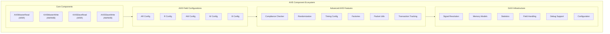

# AXI5 Components Overview

The AXI5 component family covers transaction generation and verification for AXI5: master and slave interfaces, packets, randomization, timing profiles, and a compliance checker. All of it sits on GAXI — the same infrastructure the AXI4, AXI-Lite, and AXI-Stream components are built on — so the channel objects, memory models, and statistics behave the way they do elsewhere in the framework. What this family adds is the AXI5 signal set and everything that rides on it: atomic operations, memory tagging, security contexts, chunked transfers, poison indicators, and a compliance checker that knows the new rules.

## Key Differences from AXI4

AXI5 drops a couple of signals and adds quite a few more.

**Removed Signals**:
- `ARREGION`, `AWREGION` — the region signals are gone from the spec

**Added Signals (Address Channels)**:
- `ATOP` (AW only) — atomic operation type (6 bits)
- `NSAID` — Non-secure Access ID (4 bits)
- `TRACE` — transaction tracing enable (1 bit)
- `MPAM` — Memory Partitioning and Monitoring (11 bits)
- `MECID` — Memory Encryption Context ID (16 bits)
- `UNIQUE` — unique/exclusive access indicator (1 bit)
- `TAGOP` — memory tagging operation (2 bits)
- `TAG` — memory tag values (width depends on data width)
- `CHUNKEN` (AR only) — chunking enable (1 bit)

**Added Signals (Data/Response Channels)**:
- `POISON` (W, R) — data poison indicator (1 bit)
- `TAGUPDATE` (W) — tag update indicators
- `CHUNKV`, `CHUNKNUM`, `CHUNKSTRB` (R) — chunked transfer response fields
- `TAGMATCH` (B, R) — tag match result (1 bit)
- `TRACE` (B) — transaction trace echo (1 bit)

## Framework Integration

### GAXI Infrastructure Foundation

Most of the heavy lifting comes straight from GAXI:

**Unified Field Configuration**: transaction field layouts come from the framework-wide field configuration system, so adapting to your RTL's widths is a parameter change, not new code
**Memory Model Support**: slaves can source and sink data through memory models, which is what makes self-checking tests practical
**Statistics Integration**: performance metrics and transaction tracking, built in
**Signal Resolution**: automatic signal detection and mapping across different naming conventions
**Advanced Debugging**: multi-level debug support with detailed transaction logging

### Memory-Mapped Protocol Specialization

On top of that base, the AXI5 layer is shaped around what the new spec actually adds:

**Five Channel Architecture**: AR, R, AW, W, and B, all covered
**Atomic Operations**: AtomicStore, AtomicLoad, AtomicSwap, and AtomicCompare as first-class transactions
**Memory Tagging Extension (MTE)**: TAG, TAGOP, TAGUPDATE, and TAGMATCH, end to end
**Security Context Management**: NSAID, MPAM, and MECID signal handling
**Chunked Transfer Support**: CHUNKEN/CHUNKV/CHUNKNUM/CHUNKSTRB for wide data buses
**Poison Indicators**: data-integrity marking that travels with the beat
**Transaction Tracing**: TRACE signal for debug and profiling infrastructure

## Core Components Architecture


```mermaid
graph TB
    subgraph Ecosystem["AXI5 Component Ecosystem"]
        subgraph Components["Core Components"]
            MasterRd["AXI5MasterRead<br/>(AR/R)"]
            MasterWr["AXI5MasterWrite<br/>(AW/W/B)"]
            SlaveRd["AXI5SlaveRead<br/>(AR/R)"]
            SlaveWr["AXI5SlaveWrite<br/>(AW/W/B)"]
        end

        subgraph FieldConfig["AXI5 Field Configurations"]
            AR[AR Config]
            R[R Config]
            AW[AW Config]
            W[W Config]
            B[B Config]
        end

        subgraph Advanced["Advanced AXI5 Features"]
            Compliance[Compliance Checker]
            Random[Randomization]
            Timing[Timing Config]
            Factories[Factories]
            PktUtils[Packet Utils]
            TxnSupport[Transaction Tracking]
        end

        subgraph GAXI["GAXI Infrastructure"]
            SigRes[Signal Resolution]
            MemModels[Memory Models]
            Stats[Statistics]
            FieldHandle[Field Handling]
            Debug[Debug Support]
            Config[Configuration]
        end
    end

    Components --> FieldConfig
    FieldConfig --> Advanced
    Advanced --> GAXI
```

## Component Capabilities

### AXI5MasterRead - Memory Read Operations

The `AXI5MasterRead` component drives AXI5 read transactions as a master.

**Address Request Management**:
- **AR Channel Control**: full ARADDR, ARLEN, ARSIZE, ARBURST, ARID management
- **Outstanding Transactions**: multiple read requests in flight at once
- **AXI5 Security Context**: NSAID, MPAM, and MECID signal generation
- **Tag Operations**: TAGOP signaling for Memory Tagging Extension reads
- **Chunked Reads**: CHUNKEN support for wide-data-bus transfers

**Read Data Reception**:
- **R Channel Monitoring**: RDATA, RRESP, RID, RLAST handled automatically
- **Poison Detection**: RPOISON indicator checked and flagged
- **Chunk Response Handling**: CHUNKV, CHUNKNUM, CHUNKSTRB processing
- **Tag Match Results**: TAGMATCH extracted from responses

### AXI5MasterWrite - Memory Write Operations

The `AXI5MasterWrite` component drives AXI5 write transactions as a master.

**Address and Data Management**:
- **AW Channel Control**: full AWADDR, AWLEN, AWSIZE, AWBURST management
- **Atomic Operations**: AWATOP signaling for atomic read-modify-write
- **Memory Tagging**: AWTAGOP and AWTAG support for MTE writes
- **Security Context**: AWNSAID, AWMPAM, AWMECID signal generation

**Write Data and Response**:
- **W Channel Control**: WDATA, WSTRB, WLAST, WPOISON, WTAG, WTAGUPDATE coordination across the burst
- **B Channel Processing**: BRESP, BID, BTRACE, BTAGMATCH response verification
- **Atomic Convenience**: a dedicated `atomic_operation()` method, so you never hand-roll ATOP traffic

### AXI5SlaveRead - Memory Read Response

The `AXI5SlaveRead` component responds to AXI5 read transactions as a slave.

**Address Processing**:
- **AR Channel Monitoring**: read address requests detected automatically
- **Out-of-Order Responses**: configurable reordering, random or deterministic
- **Memory Model Integration**: data sourced directly from a memory model

**Data Response Generation**:
- **R Channel Control**: RDATA, RRESP, RID, RLAST generation
- **Chunk Response**: CHUNKV, CHUNKNUM, CHUNKSTRB generation for chunked reads
- **Poison Injection**: configurable RPOISON generation — the easy way to find out whether your master actually handles poisoned data

### AXI5SlaveWrite - Memory Write Response

The `AXI5SlaveWrite` component responds to AXI5 write transactions as a slave.

**Write Transaction Processing**:
- **AW/W Channel Coordination**: address and data phases kept in sync
- **Atomic Handling**: ATOP-aware write response generation
- **Tag Processing**: TAGOP/TAGUPDATE in, TAGMATCH out

**Write Response Generation**:
- **B Channel Control**: BRESP, BID, BTRACE, BTAGMATCH response generation
- **Memory Integration**: memory model updates with tag awareness

## Field Configuration System

### AXI5FieldConfigHelper - Channel-Specific Configuration

Every width from the constructor tables lands in a field configuration. `AXI5FieldConfigHelper` builds them per channel, or all five in one call:

```python
# AR Channel Configuration
ar_config = AXI5FieldConfigHelper.create_ar_field_config(
    id_width=8, addr_width=32, user_width=1,
    nsaid_width=4, mpam_width=11, mecid_width=16, tagop_width=2
)

# AW Channel Configuration
aw_config = AXI5FieldConfigHelper.create_aw_field_config(
    id_width=8, addr_width=32, user_width=1,
    nsaid_width=4, mpam_width=11, mecid_width=16,
    atop_width=6, tagop_width=2, tag_width=4, data_width=32
)

# R Channel Configuration
r_config = AXI5FieldConfigHelper.create_r_field_config(
    id_width=8, data_width=32, user_width=1,
    chunknum_width=4, tag_width=4
)

# W Channel Configuration
w_config = AXI5FieldConfigHelper.create_w_field_config(
    data_width=32, user_width=1, tag_width=4
)

# B Channel Configuration
b_config = AXI5FieldConfigHelper.create_b_field_config(
    id_width=8, user_width=1, tag_width=4, data_width=32
)

# All channels at once
all_configs = AXI5FieldConfigHelper.create_all_field_configs(
    id_width=8, addr_width=32, data_width=64, user_width=1
)
```

## Advanced Features

### AXI5ComplianceChecker - Protocol Verification

A passive protocol monitor, gated by an environment variable, that checks live traffic against the AXI5 rule set. Full API documentation lives in `components_axi5_compliance.md`.

### AXI5Randomization - Realistic Test Scenarios

Randomization is profile-driven: pick a profile (or a feature helper) and the manager varies the parameters that matter for it.

**Transaction Randomization**:
```python
from CocoTBFramework.components.axi5 import (
    AXI5RandomizationConfig, AXI5RandomizationProfile,
    create_unified_randomization
)

# Create unified randomization manager
manager = create_unified_randomization(data_width=64, performance_mode='normal')

# Configure for atomic operations testing
manager.configure_for_atomic_testing()

# Configure for MTE testing
manager.configure_for_mte_testing()

# Configure for security context testing
manager.configure_for_security_testing()
```

**Industry-Specific Profiles**:
- `BASIC` — standard randomization
- `COMPLIANCE` — strict protocol adherence
- `PERFORMANCE` — high-throughput stress testing
- `ATOMIC` — atomic operation focused
- `MTE` — Memory Tagging Extension focused
- `SECURITY` — NSAID/MPAM/MECID focused
- `AUTOMOTIVE` — conservative, safety-oriented
- `DATACENTER` — wide bus, high bandwidth
- `MOBILE` — power-efficient, mixed workloads

## Usage Patterns and Integration

### Basic Read Transaction

Build the interface, then read — a single beat, or a burst with the AXI5 knobs turned:

```python
from CocoTBFramework.components.axi5 import create_axi5_master_rd

# Create AXI5 master read interface
master_rd = create_axi5_master_rd(
    dut=dut, clock=clk, prefix="m_axi_",
    data_width=32, id_width=8, addr_width=32
)

# Perform single read
data = await master_rd['interface'].single_read(address=0x1000, id=1)

# Perform burst read with AXI5 features
responses = await master_rd['interface'].read_transaction(
    address=0x2000,
    burst_len=4,
    id=2,
    nsaid=1,        # Security context
    trace=1,        # Enable tracing
    tagop=1,        # Tag transfer operation
    chunken=0       # No chunking
)
```

### Basic Write Transaction

Same shape on the write side — a plain single write, then an atomic swap:

```python
from CocoTBFramework.components.axi5 import create_axi5_master_wr

# Create AXI5 master write interface
master_wr = create_axi5_master_wr(
    dut=dut, clock=clk, prefix="m_axi_",
    data_width=32, id_width=8, addr_width=32
)

# Perform single write
result = await master_wr['interface'].single_write(
    address=0x1000, data=0x12345678, id=1
)

# Perform atomic swap operation
result = await master_wr['interface'].atomic_operation(
    address=0x2000,
    data=0xCAFEBABE,
    atop=0x30,      # AtomicSwap
    id=3
)
```

### Complete Testbench Setup

One call builds all four interfaces; pull the pieces you need out of the dictionary:

```python
from CocoTBFramework.components.axi5 import create_complete_axi5_testbench_components

# Create all master and slave interfaces
components = create_complete_axi5_testbench_components(
    dut=dut,
    clock=clk,
    master_prefix="m_axi_",
    slave_prefix="s_axi_",
    data_width=64,
    id_width=4,
    addr_width=40
)

# Access individual components
master_write = components['master_write']['interface']
master_read = components['master_read']['interface']
slave_write = components['slave_write']['interface']
slave_read = components['slave_read']['interface']
```

## Timing Configuration

### Timing Profiles

Timing profiles bundle per-channel delays for a given scenario, and there's a helper that returns timing tuned for a specific AXI5 feature:

```python
from CocoTBFramework.components.axi5 import (
    create_axi5_timing_from_profile,
    get_axi5_timing_profiles,
    get_timing_for_axi5_feature
)

# Available profiles
profiles = get_axi5_timing_profiles()
# ['axi5_normal', 'axi5_fast', 'axi5_slow', 'axi5_backtoback',
#  'axi5_stress', 'axi5_atomic', 'axi5_mte', 'axi5_secure', 'axi5_chunked']

# Get timing for a specific AXI5 feature
atomic_timing = get_timing_for_axi5_feature('atomic')
mte_timing = get_timing_for_axi5_feature('mte')
```

## Configuration Examples

### Hardware Parameter Matching

The constructor kwargs line up one-to-one with the parameters on a SystemVerilog AXI5 interface, so matching your DUT is transcription, not translation:

```python
# Match SystemVerilog AXI5 interface parameters
# parameter AXI_DATA_WIDTH = 64,
# parameter AXI_ADDR_WIDTH = 40,
# parameter AXI_ID_WIDTH = 4,
# parameter AXI_USER_WIDTH = 0,
# parameter AXI_NSAID_WIDTH = 4

master_read = create_axi5_master_rd(
    dut=dut,
    clock=clk,
    prefix="m_axi_",
    data_width=64,
    addr_width=40,
    id_width=4,
    user_width=0,
    nsaid_width=4
)
```

### Feature-Specific Configurations

If you only care about one AXI5 feature area, there are convenience factories that preconfigure for it:

```python
from CocoTBFramework.components.axi5 import (
    create_axi5_with_mte,
    create_axi5_with_atomic,
    create_axi5_with_security
)

# Memory Tagging Extension configuration
mte_components = create_axi5_with_mte(
    dut=dut, clock=clk, prefix="m_axi_",
    tag_width=4
)

# Atomic operations configuration
atomic_components = create_axi5_with_atomic(
    dut=dut, clock=clk, prefix="m_axi_",
    atop_width=6
)

# Security features configuration
security_components = create_axi5_with_security(
    dut=dut, clock=clk, prefix="m_axi_",
    nsaid_width=4, mpam_width=11, mecid_width=16
)
```

Coming from the AXI4 components? The channel objects, memory models, and statistics all work the same way here — start with the differences list at the top of this page, and the rest is the AXI5 fields plus the checks that ride on them.

---
