<!-- RTL Design Sherpa Documentation Header -->
<table>
<tr>
<td width="80">
  <a href="https://github.com/sean-galloway/RTLDesignSherpa-DV">
    
  </a>
</td>
<td>
  <strong>CocoTB Framework</strong> · <em>Verification Infrastructure for RTL Testing</em><br>
  <sub>
    <a href="https://github.com/sean-galloway/RTLDesignSherpa-DV">GitHub</a> ·
    <a href="https://github.com/sean-galloway/RTLDesignSherpa/blob/main/docs/DOCUMENTATION_INDEX.md">Documentation Index</a> ·
    <a href="https://github.com/sean-galloway/RTLDesignSherpa/blob/main/LICENSE">MIT License</a>
  </sub>
</td>
</tr>
</table>

---

<!-- End Header -->

# AXIL4 Components Overview

AXI4-Lite is what you reach for when the bus only needs to move registers: no bursts, no IDs, no sideband signals, one beat per transaction. The AXIL4 components in CocoTBFramework are built on the same GAXI substrate as the full AXI4 BFMs, so field configuration, memory models, statistics, and debug tooling all carry over -- what's gone is everything the Lite spec throws away.

## Framework Integration

### GAXI Infrastructure Foundation

AXIL4 isn't a separate stack; it's a specialization layered on GAXI. That buys you:

**Unified Field Configuration**: the same field configuration system the rest of the framework uses, trimmed to Lite's smaller field sets
**Memory Model Support**: slaves can be backed by the shared memory and register models for real read-after-write behavior
**Statistics Integration**: transaction counts and performance metrics come straight from the GAXI monitors
**Signal Resolution**: automatic signal detection and mapping across different naming conventions
**Advanced Debugging**: multi-level debug with detailed transaction logging

### AXI4-Lite Protocol Specialization

On top of that foundation, these components are shaped specifically for Lite:

**Simplified Five Channel Architecture**: AR, R, AW, W, and B, with none of the burst bookkeeping
**Single Transaction Model**: no burst support, single outstanding transaction architecture
**Register-Oriented Design**: the API is built around control/status register access patterns
**Reduced Signaling**: no ID, USER, QoS, or REGION signals -- Lite doesn't have them
**Protocol Compliance**: an integrated checker scoped to the Lite subset of the AXI4 rules

## Core Components Architecture

```mermaid
graph TB
    subgraph Ecosystem["AXIL4 Component Ecosystem"]
        subgraph Components["Core Components - Single Transaction"]
            MstrRd["AXIL4MstrRd<br/>(AR/R)"]
            MstrWr["AXIL4MstrWr<br/>(AW/W/B)"]
            SlvRd["AXIL4SlvRd<br/>(AR/R)"]
            SlvWr["AXIL4SlvWr<br/>(AW/W/B)"]
        end

        subgraph FieldCfg["AXIL4 Field Configs - Simplified"]
            AR["AR Config<br/>(No ID/User)"]
            R["R Config<br/>(No ID/User)"]
            AW["AW Config<br/>(No ID/User)"]
            W["W Config<br/>(No User)"]
            B["B Config<br/>(No ID/User)"]
        end

        subgraph Features["AXIL4 Specific Features"]
            RegAPI[Register API]
            Single[Single Outstanding]
            Compliance[Compliance]
            PktUtils[Packet Utils]
            Timing[Simplified Timing]
            Factories[Factories]
        end

        subgraph GAXI["GAXI Infrastructure"]
            SigRes[Signal Resolution]
            MemMdl[Memory Models]
            Stats[Statistics]
            Fields[Field Handling]
            Debug[Debug Support]
            Config[Configuration]
        end
    end

    Components --> FieldCfg
    FieldCfg --> Features
    Features --> GAXI
```



## Component Capabilities

### AXIL4MasterRead - Register Read Operations

The read master drives AR and listens on R. On the address side it manages ARADDR and ARPROT -- and that's the whole list, since there's no ARID, ARLEN, ARSIZE, or ARBURST to worry about. Addresses are aligned automatically, and the single-transaction model keeps timing simple.

On the data side it processes RDATA and RRESP (again: no RID, no RLAST), raises on SLVERR and DECERR, and manages RREADY so the DUT can apply backpressure. Both 32-bit and 64-bit data widths are supported.

**Register-Oriented API**:
```python
# Register access methods
data = await master_read.read_register(address=0x100)
data = await master_read.single_read(address=0x200)  # API consistency
values = await master_read.read_transaction(address=0x300)  # Generic method
```

### AXIL4MasterWrite - Register Write Operations

The write master keeps the two outgoing phases in order and checks the response. AW carries AWADDR/AWPROT, W carries WDATA/WSTRB -- no IDs, no AWLEN, no WLAST. WSTRB gives you byte-lane control over the write, and the B channel response is verified the same way RRESP is on the read side, with SLVERR/DECERR surfaced as errors.

**Register-Oriented API**:
```python
# Register write methods
await master_write.write_register(address=0x100, data=0x12345678)
await master_write.write_register(address=0x100, data=0xFF, strb=0x1)  # Byte write
await master_write.single_write(address=0x200, data=0xDEADBEEF)  # API consistency
```

### AXIL4SlaveRead - Register Read Response

The read slave watches AR, decodes the address against a configurable address range, handles ARPROT, and answers on R. With no bursts to sequence, the decode logic stays genuinely simple. Response data can come straight from a register or memory model, SLVERR/DECERR generation is configurable, and RVALID timing can be delayed to model a slow register block.

**Memory Model Integration**:
```python
from CocoTBFramework.components.shared.memory_model import MemoryModel

# Back the slave with a memory model; reads are served from it
memory = MemoryModel(num_lines=1024, bytes_per_line=4)
slave_read = AXIL4SlaveRead(dut, clk, "s_axil_", memory_model=memory)
```

### AXIL4SlaveWrite - Register Write Response

The write slave coordinates the AW and W phases -- both must land before it responds -- applies WSTRB per byte, updates the backing register or memory model, and drives B with the result. Address-based write protection and configurable response latency are available.

**Advanced Features**:
```python
# Observe write traffic via the underlying channel callbacks
def on_w_packet(w_packet):
    print(f"W data=0x{w_packet.data:08X} strb=0x{w_packet.strb:X}")

slave_write.w_channel.add_callback(on_w_packet)
```

## Field Configuration System

### AXIL4FieldConfigs - Simplified Channel Configuration

The field configs are where the Lite diet shows. Each channel's config contains exactly the fields the spec allows, and the helper builds them for you:

**Simplified Channel Configurations**:
```python
# AR Channel Configuration (no ID, LEN, SIZE, BURST)
ar_config = AXIL4FieldConfigHelper.create_ar_field_config(
    addr_width=32
)

# AW Channel Configuration (no ID, LEN, SIZE, BURST)
aw_config = AXIL4FieldConfigHelper.create_aw_field_config(
    addr_width=32
)

# R Channel Configuration (no ID, LAST)
r_config = AXIL4FieldConfigHelper.create_r_field_config(
    data_width=32
)

# W Channel Configuration (no ID, LAST)
w_config = AXIL4FieldConfigHelper.create_w_field_config(
    data_width=32
)

# B Channel Configuration (no ID)
b_config = AXIL4FieldConfigHelper.create_b_field_config()
```

The omissions are the point:

- **No ID Fields**: a single outstanding transaction leaves nothing for an ID to distinguish
- **No Burst Fields**: AWLEN, ARLEN, AWSIZE, ARSIZE, AWBURST, ARBURST simply don't exist here
- **No USER Fields**: Lite has no sideband signaling
- **No LAST Fields**: one beat per transaction makes WLAST and RLAST meaningless

## Advanced Features

### AXIL4ComplianceChecker - Simplified Protocol Verification

The compliance checker covers the rules that survive in Lite -- VALID/READY handshake timing, payload stability, address alignment, write-strobe validity, response-code range -- and skips the ones that don't. No burst checking, no ID tracking: there are no bursts and no IDs. Concurrent read and write activity is legal in AXI4-Lite, so outstanding depth is reported as a statistic rather than flagged as a violation.

### Register Model Integration

AXIL4 slaves pair naturally with a register map. A small definition class is enough to get readable names and access policies:

**Register Definition**:
```python
class RegisterDef:
    def __init__(self, name, width, reset=0, readonly=False, writeonly=False):
        self.name = name
        self.width = width
        self.reset = reset
        self.readonly = readonly
        self.writeonly = writeonly
        self.current_value = reset

# Create register map
register_map = {
    0x000: RegisterDef("DEVICE_ID", 32, reset=0x12345678, readonly=True),
    0x004: RegisterDef("CONTROL", 32, reset=0x00000000),
    0x008: RegisterDef("STATUS", 32, reset=0x00000001, readonly=True),
    0x00C: RegisterDef("DATA_IN", 32, reset=0x00000000, writeonly=True),
    0x010: RegisterDef("DATA_OUT", 32, reset=0x00000000, readonly=True)
}
```

**Register Access Monitoring**:
```python
def register_access_monitor(address, data, is_write, strobe=None):
    reg_name = register_map[address].name if address in register_map else "UNKNOWN"
    operation = "WRITE" if is_write else "READ"
    strobe_info = f" (strobe=0x{strobe:X})" if is_write and strobe is not None else ""
    print(f"Register {operation}: {reg_name} @ 0x{address:03X} = 0x{data:08X}{strobe_info}")
```

## Usage Patterns and Integration

### Basic Register Access

The common case: two masters, full-word and byte-lane access.

```python
# Create AXIL4 master interfaces
master_read = AXIL4MasterRead(dut, clk, "m_axil_", data_width=32, addr_width=32)
master_write = AXIL4MasterWrite(dut, clk, "m_axil_", data_width=32, addr_width=32)

# Basic register operations
await master_write.write_register(0x100, 0x12345678)  # Write control register
status = await master_read.read_register(0x104)       # Read status register

# Byte-level operations
await master_write.write_register(0x108, 0xFF, strb=0x1)  # Write byte 0 only
await master_write.write_register(0x108, 0xFF00, strb=0x2)  # Write byte 1 only
```

### Configuration Space Testing

The register idioms map cleanly onto PCIe-style configuration space -- write-all-ones BAR sizing and friends:

```python
async def test_configuration_space():
    """Test PCIe-style configuration space access."""

    # Test device identification
    device_id = await master_read.read_register(0x000)
    vendor_id = await master_read.read_register(0x002)

    # Test configuration registers
    await master_write.write_register(0x004, 0x00000006)  # Enable bus master
    command = await master_read.read_register(0x004)
    assert (command & 0x6) == 0x6, "Bus master not enabled"

    # Test BAR configuration
    await master_write.write_register(0x010, 0xFFFFFFFF)  # Write all 1s
    bar0_size = await master_read.read_register(0x010)    # Read back
    size = (~bar0_size + 1) & 0xFFFFFFFF
    print(f"BAR0 size: {size} bytes")
```

### Peripheral Control Interface

A typical poll-until-done peripheral sequence:

```python
async def test_peripheral_control():
    """Test typical peripheral control interface."""

    # Configure peripheral
    await master_write.write_register(0x000, 0x00000001)  # Enable peripheral
    await master_write.write_register(0x004, 0x12345678)  # Set data value
    await master_write.write_register(0x008, 0x00000080)  # Start operation

    # Wait for completion
    while True:
        status = await master_read.read_register(0x00C)
        if status & 0x1:  # Done bit
            break
        await Timer(100, units='ns')

    # Read results
    result = await master_read.read_register(0x010)
    error_status = await master_read.read_register(0x014)

    assert error_status == 0, f"Operation failed with error: {error_status}"
    return result
```

### Memory-Mapped FIFO Testing

A memory-mapped FIFO, exercised through its status and data registers:

```python
async def test_memory_mapped_fifo():
    """Test memory-mapped FIFO interface."""

    # Check FIFO status
    status = await master_read.read_register(0x100)  # FIFO status
    empty = (status >> 0) & 1
    full = (status >> 1) & 1
    count = (status >> 8) & 0xFF

    print(f"FIFO: empty={empty}, full={full}, count={count}")

    # Write data to FIFO
    test_data = [0x11111111, 0x22222222, 0x33333333, 0x44444444]
    for data in test_data:
        await master_write.write_register(0x104, data)  # FIFO data register

    # Read data from FIFO
    read_data = []
    for _ in range(len(test_data)):
        data = await master_read.read_register(0x108)  # FIFO read register
        read_data.append(data)

    assert read_data == test_data, "FIFO data mismatch"
```

## Performance Optimization

### Single Transaction Benefits

The single-transfer model isn't just less protocol -- it's less testbench. With no bursts and one transaction in flight, there's no outstanding-transaction scoreboarding, slave state machines stay small, responses come back without queueing delay, and buffering requirements are minimal. Addresses map straight onto registers with no burst decode in between, so a read can complete in a cycle, and arbitration is trivial when there's at most one thing to arbitrate.

### Timing Optimization

Slave response latency is a construction parameter, so you can model a slow register block without touching your stimulus:

```python
# Slave response latency is configured at construction time
slave_read = AXIL4SlaveRead(
    dut, clk, "s_axil_",
    memory_model=memory,
    response_delay=1,   # Cycles before the R response is sent
)
```

## Debug and Analysis

### Register Access Logging

Hand the components a logger and every register access is logged at DEBUG level -- address, data, strobe patterns, response codes:

```python
# Pass a logger at construction; all register accesses are logged at
# DEBUG level with address, data, strobe patterns, and response codes.
master_read = AXIL4MasterRead(dut, clk, "m_axil_", log=my_logger)
master_write = AXIL4MasterWrite(dut, clk, "m_axil_", log=my_logger)
```

If you want your own view of the traffic, callbacks on the underlying channels hand you the packets:

```python
# Attach callbacks to the underlying channels to build custom access reports
accesses = []

master_read.r_channel.add_callback(lambda pkt: accesses.append(('R', pkt)))
master_write.b_channel.add_callback(lambda pkt: accesses.append(('B', pkt)))
```

### Performance Analysis

Worth tracking on a Lite bus:

- **Register Access Frequency**: per-register hit counts -- which registers are actually hot
- **Response Latency**: read and write response timing
- **Bus Utilization**: how much of the time the bus is actually moving data
- **Error Rate**: how often SLVERR/DECERR shows up

## Configuration Examples

### Standard 32-bit Configuration

The setup most designs want. Strobe width follows from `data_width`:

```python
# Typical 32-bit AXIL4 configuration (strobe width derives from data_width)
axil_config = {
    'data_width': 32,
    'addr_width': 32,
    'timeout_cycles': 1000,
}

master_read = AXIL4MasterRead(dut, clk, "m_axil_", **axil_config)
master_write = AXIL4MasterWrite(dut, clk, "m_axil_", **axil_config)
```

### 64-bit AXIL4 Configuration

Lite at 64 bits, for wider register blocks:

```python
# 64-bit wide AXIL4 configuration for high-performance applications
axil_64_config = {
    'data_width': 64,
    'addr_width': 64,     # Extended addressing
}

master_read = AXIL4MasterRead(dut, clk, "m_axil_", **axil_64_config)
```

Same GAXI machinery underneath -- just a lot less protocol on the wire.

---
