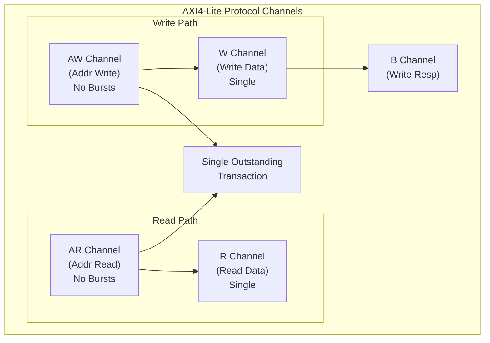

<!-- RTL Design Sherpa Documentation Header -->
<table>
<tr>
<td width="80">
  <a href="https://github.com/sean-galloway/RTLDesignSherpa-DV">
    
  </a>
</td>
<td>
  <strong>CocoTB Framework</strong> · <em>Verification Infrastructure for RTL Testing</em><br>
  <sub>
    <a href="https://github.com/sean-galloway/RTLDesignSherpa-DV">GitHub</a> ·
    <a href="https://github.com/sean-galloway/RTLDesignSherpa/blob/main/docs/DOCUMENTATION_INDEX.md">Documentation Index</a> ·
    <a href="https://github.com/sean-galloway/RTLDesignSherpa/blob/main/LICENSE">MIT License</a>
  </sub>
</td>
</tr>
</table>

---

<!-- End Header -->

**[← Back to Components Index](../components_index.md)** | **[CocoTBFramework Index](../../index.md)**

# AXIL4 Components

AXI4-Lite is the register-access dialect of AXI: five channels, single beats, no IDs, nothing extra. These components give you masters and slaves for it, built on the shared GAXI infrastructure, with protocol compliance checking included.

## Component Overview

The AXIL4 family, at a glance:

### Core Interface Components

- **AXIL4MasterRead** - Master read interface (AR/R channels)
- **AXIL4MasterWrite** - Master write interface (AW/W/B channels)
- **AXIL4SlaveRead** - Slave read interface (AR/R channels)
- **AXIL4SlaveWrite** - Slave write interface (AW/W/B channels)

### Data Structure and Configuration

- **AXIL4Packet** - Transaction packet management
- **AXIL4FieldConfigs** - Protocol field configuration system
- **AXIL4PacketUtils** - Packet manipulation utilities

### Advanced Features

- **AXIL4ComplianceChecker** - Protocol compliance verification
- **AXIL4Factories** - Component factory methods

## Key Features

### AXI4-Lite Protocol Support
- All five channels (AR, R, AW, W, B), no burst machinery
- Master and slave interface support
- Single outstanding transaction architecture
- None of the signals Lite doesn't have: no ID, USER, QoS, or REGION

### GAXI Infrastructure Integration
- The framework's unified field configuration system
- Memory model integration for data verification
- Statistics and performance metrics from the GAXI monitors
- Transaction-level debug logging
- Automatic signal resolution across naming conventions

### AXI4-Lite Specific Optimizations
- Single transfers only -- no burst support to trip over
- Simple address decode logic
- An API shaped for registers (`read_register`, `write_register`)
- A compliance checker scoped to the Lite rule set

## Getting Started

Two masters -- one per direction -- and you're talking to registers:

```python
from CocoTBFramework.components.axil4.axil4_interfaces import AXIL4MasterRead, AXIL4MasterWrite

# Create AXIL4 master interfaces
master_read = AXIL4MasterRead(
    dut=dut,
    clock=clk,
    prefix="m_axil_",
    data_width=32,
    addr_width=32
)

master_write = AXIL4MasterWrite(
    dut=dut,
    clock=clk,
    prefix="m_axil_",
    data_width=32,
    addr_width=32
)

# Perform register read
data = await master_read.read_register(address=0x1000)

# Perform register write
await master_write.write_register(address=0x1000, data=0x12345678)
```

## Protocol Architecture

Five channels, and the read and write halves only meet at the slave:



## Key Differences from AXI4-Full

### Simplified Signaling
- **No Burst Support**: fixed length of one transfer per transaction
- **No ID Signals**: single outstanding transaction, so nothing to tag
- **No User Signals**: no sideband at all
- **No QoS/Region**: plain memory access only
- **Fixed Size**: transfer size always matches the data width

### Register-Oriented Interface
```python
# AXI4-Lite is optimized for register access patterns
await master_write.write_register(0x100, 0x12345678)  # Control register
config_value = await master_read.read_register(0x104)  # Status register

# Byte-level register access with strobes
await master_write.write_register(0x108, 0xFF, strb=0x1)  # Write byte 0 only
```

## Documentation Structure

- **[Overview](components_axil4_overview.md)** - Component architecture and capabilities in depth
- **Interface References** - Per-class documentation for each AXIL4 interface
- **Usage Examples** - See code examples above
- **Configuration Guide** - Field configuration and customization options
- **Compliance Guide** - Protocol compliance checking and verification

## Common Use Cases

### Register Map Verification

Walk a register map and check every location reads back:

```python
# Define register map
register_map = {
    0x000: "CONTROL",
    0x004: "STATUS",
    0x008: "DATA_IN",
    0x00C: "DATA_OUT",
    0x010: "INTERRUPT_ENABLE",
    0x014: "INTERRUPT_STATUS"
}

# Test register access
for addr, name in register_map.items():
    # Write test pattern
    test_value = 0xA5A5A5A5
    await master_write.write_register(addr, test_value)

    # Read back and verify
    read_value = await master_read.read_register(addr)
    assert read_value == test_value, f"Register {name} mismatch"
```

### Memory-Mapped Peripheral Testing

Emulate the DUT side instead -- back both slave halves with one memory model and they behave like real register storage:

```python
from CocoTBFramework.components.axil4.axil4_interfaces import AXIL4SlaveRead, AXIL4SlaveWrite
from CocoTBFramework.components.shared.memory_model import MemoryModel

# Configure AXIL4 slaves for peripheral emulation, backed by a shared memory model
memory = MemoryModel(num_lines=1024, bytes_per_line=4)
slave_read = AXIL4SlaveRead(dut, clk, "s_axil_", memory_model=memory)
slave_write = AXIL4SlaveWrite(dut, clk, "s_axil_", memory_model=memory)

# Writes update the memory model; reads are served from it
```

### Configuration Space Access

PCIe-style configuration accesses run through the same calls:

```python
# PCIe-style configuration space accesses through the master interfaces
await master_write.write_register(0x1004, 0x00000006)  # Command register
device_id = await master_read.read_register(0x1000)     # Device ID
```

## Performance Considerations

### Single Transaction Focus
- **Simple state machines**: no burst or outstanding-transaction bookkeeping
- **Low latency**: minimal protocol overhead per transfer
- **Register access tuned**: the control/status pattern is the fast path

### Memory Efficiency
- **Small footprint**: very little per-transaction state
- **Trivial queuing**: one outstanding transaction doesn't need much of a queue

If your DUT talks registers over AXI4-Lite, this is the toolkit: the same GAXI machinery the full AXI4 BFMs use, wearing a much lighter protocol.

---
