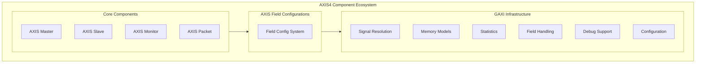

<!-- RTL Design Sherpa Documentation Header -->
<table>
<tr>
<td width="80">
  <a href="https://github.com/sean-galloway/RTLDesignSherpa-DV">
    
  </a>
</td>
<td>
  <strong>CocoTB Framework</strong> · <em>Verification Infrastructure for RTL Testing</em><br>
  <sub>
    <a href="https://github.com/sean-galloway/RTLDesignSherpa-DV">GitHub</a> ·
    <a href="https://github.com/sean-galloway/RTLDesignSherpa/blob/main/docs/DOCUMENTATION_INDEX.md">Documentation Index</a> ·
    <a href="https://github.com/sean-galloway/RTLDesignSherpa/blob/main/LICENSE">MIT License</a>
  </sub>
</td>
</tr>
</table>

---

<!-- End Header -->

# AXIS4 Components Overview

The AXIS4 family covers AXI4-Stream verification end to end: a master to drive streams, a slave to sink them, a monitor to watch them, a packet class for the beats themselves, and a field-config factory to keep everyone's idea of the bus in sync. All of it sits on the GAXI layer — the shared machinery that resolves signals, runs the pipelines, and keeps the statistics — so most of this page is about what the stream components add on top.

## Framework Integration

### GAXI Infrastructure Foundation

The AXIS4 components inherit from the GAXI framework, and that sentence carries more weight than it looks like:

**Delegation, not duplication**: GAXI is the workhorse layer. `AXISMaster` drives the bus exclusively through `GAXIMaster`'s structured transmit pipeline (queue → delay → drive/handshake → complete), `AXISSlave` receives exclusively through `GAXISlave`'s receive pipeline (which is also the sole driver of TREADY), and `AXISMonitor` observes exclusively through `GAXIMonitor`'s receive loop. The AXIS classes are thin wrappers that add stream/frame conveniences and TLAST-aware statistics — they do not maintain a parallel hand-rolled drive, ready-control, or sampling path.

**Protocol packet classes via `_build_packet`**: every AXIS component declares `_default_packet_class = AXISPacket`, so the GAXI pipelines construct real `AXISPacket` instances (see `GAXIComponentBase._build_packet`). An explicit `packet_class=` argument still wins; AXIS5 overrides `_build_packet` outright because `AXIS5Packet` needs extra constructor options.

**Factories return AXIS classes**: `create_axis_master`, `create_axis_slave`, and `create_axis_monitor` construct `AXISMaster`, `AXISSlave`, and `AXISMonitor` respectively, so the returned `interface` always exposes the documented AXIS API (`send_packet`, `send_stream_data`, `wait_for_frame`, frame statistics, …).

What that inheritance buys you, in practical terms:

- **Unified field configuration** — one `FieldConfig`, shared by master, slave, monitor and packets.
- **Memory model support** — attach a memory model and sent/received data lands in it automatically.
- **Statistics** — transaction and byte counters maintained by the pipelines, not by you.
- **Signal resolution** — automatic signal detection and mapping across naming conventions.
- **Debug support** — multi-level logging, from quiet to `super_debug`, with per-transaction detail when you want it.

### Stream Protocol Specialization

What the AXIS layer itself adds is stream-shaped:

**One channel**: AXI4-Stream is just the T channel — TVALID, TREADY, and payload. No addresses, no responses.
**Frame boundaries**: TLAST is a first-class concept here. Frames are detected, counted, and awaited on, not reconstructed by hand.
**Flow control**: backpressure is the interesting half of stream verification, and both ends have dedicated support for it.
**Sidebands**: TID, TDEST, TUSER, and TSTRB are proper packet fields, sized by your field config.

## Core Components Architecture



## Component Capabilities

### AXISMaster - Stream Data Generation

The `AXISMaster` drives the T channel as a source.

**Sending data**:
- Send single beats, lists of values, or whole frames; TLAST can be set automatically on the final beat.
- TREADY backpressure is handled by the pipeline — beats wait, they don't drop.
- Queued beats stream back-to-back for zero-bubble transfers when the sink stays ready.
- Optional timing randomization for a source that behaves less perfectly.

**Sidebands and routing**:
- TID for multi-stream identification, TDEST for destination routing.
- TUSER for whatever sideband data your design carries.
- TSTRB for byte-lane control of the payload.

**Performance**:
- The GAXI transmit pipeline does the driving, so throughput is a property of the pipeline, not of a Python loop.
- Optional memory-model attachment records what was sent.
- Packet, frame and byte counters included.

### AXISSlave - Stream Data Reception

The `AXISSlave` sinks the T channel.

**Receiving data**:
- TVALID/TREADY handshaking handled automatically by the receive pipeline — the sole driver of TREADY.
- Frame boundaries detected from TLAST; frames counted as they close.
- Configurable backpressure via ready-delay constraints the pipeline consults.
- Per-beat capture into `AXISPacket` objects.

**Working with what arrived**:
- Stream separation by TID, classification by TDEST.
- TUSER extraction and TSTRB pattern analysis on the received packets.
- Frame-level statistics and current-frame progress queries.

**Memory integration**:
- Attach a memory model and received data is written automatically.
- Compare against expected patterns after `wait_for_frame()` returns.

### AXISMonitor - Protocol Analysis

The `AXISMonitor` watches the bus without driving anything.

**Structure**: `AXISMonitor` extends `GAXIMonitor` and has no receive loop of its own — `GAXIMonitor._monitor_recv` performs handshake detection, falling-edge sampling, packet construction, coverage-hook dispatch, and delivery to the standard cocotb `_recvQ`. AXIS behaviour is layered on through two extension points:

- `_build_packet` (via `_default_packet_class = AXISPacket`) so observed transactions are real `AXISPacket` objects.
- `_finish_packet`, which calls the GAXI implementation first and then runs `_axis_packet_observed` for TLAST frame accounting, AXIS protocol-violation checks, and the optional memory-model write.

The frame hook is deliberately **not** registered with `add_callback`: cocotb's `Monitor._recv()` stops appending to `_recvQ` as soon as any callback exists, and `monitor._recvQ.popleft()` is the documented way to consume monitor traffic.

**Protocol compliance**:
- TVALID/TREADY timing relationship checks.
- AXI4-Stream specification violation detection.
- TLAST placement and frame boundary analysis.
- TID/TDEST/TUSER consistency checking.

**Performance analysis**:
- Throughput measurement and trending.
- Latency distribution across transactions.
- TREADY assertion patterns — who's applying backpressure, and how much it costs.
- Channel utilization: efficiency versus idle time.

**Keeping track of several streams**:
- Per-TID stream analysis and correlation.
- Error classification with enough detail to find the root cause.
- Functional coverage collection.
- Debug output aimed at waveform viewers and external tools.

### AXISPacket - Data Structure Management

The `AXISPacket` is the object every component passes around:

**Field access**:
- One property per field, consistent across data, strobe, last, and the sidebands.
- Field widths and validation come from the shared field config.
- Runtime-configurable layout — the same class serves a 32-bit bus and a 512-bit bus.
- Compatible with existing GAXI-based infrastructure.

**Data handling**:
- Byte-level packing and unpacking against the strobe pattern.
- Conversion between packet objects and what goes on the wire.
- Range and consistency checking from the field configuration.

## Field Configuration System

### AXISFieldConfigs - Protocol Adaptation

The field config is the contract between the BFMs and your RTL's parameters:

```python
# Example AXIS field configuration
axis_config = AXISFieldConfigs.create_t_field_config(
    data_width=32,
    id_width=8,
    dest_width=4,
    user_width=16
)
```

**What it handles for you**:
- Widths are parameters, not fixed constants — data, ID, DEST and USER sizes all come from the config.
- Zero width means absent, matching the RTL convention where a 0-width parameter removes the signal.
- TSTRB width follows the data width automatically (one bit per byte lane).

## Usage Patterns and Integration

### Basic Stream Testing

```python
# Configure stream properties
config = AXISFieldConfigs.create_t_field_config(
    data_width=32, id_width=8, dest_width=4)

# Create AXIS components
master = AXISMaster(dut, "StreamSource", "m_axis_", clk, field_config=config)
slave = AXISSlave(dut, "StreamSink", "s_axis_", clk, field_config=config)
monitor = AXISMonitor(dut, "StreamMon", "s_axis_", clk, field_config=config)

# Generate and send a stream packet
success = await master.send_single_beat(data=0x12345678, last=1, id=5, dest=2)

# Wait for the monitor to observe it
observed = await monitor.wait_for_packets(1, timeout_cycles=1000)
```

### Memory Model Integration

```python
from CocoTBFramework.components.shared.memory_model import MemoryModel

# Create memory model for data verification
memory = MemoryModel(num_lines=256, bytes_per_line=4)

# Attach memory to AXIS components at construction time
master = AXISMaster(dut, "Source", "m_axis_", clk, memory_model=memory)
slave = AXISSlave(dut, "Sink", "s_axis_", clk, memory_model=memory)

# Sent/received packets are automatically written to the memory model
await master.send_stream_data([0x1000, 0x2000, 0x3000])
```

### Multi-Stream Scenarios

```python
# Generate multiple streams distinguished by TID/TDEST
for stream_id in range(4):
    stream_data = [0x1000 + (stream_id << 8) + i for i in range(8)]
    await master.send_stream_data(
        data_list=stream_data,
        id=stream_id,
        dest=stream_id % 2
    )

# Analyze aggregate activity on the monitor
stream_stats = monitor.get_stats()
```

## Advanced Features

### Performance Optimization

**Pipeline control**:
- **Bubble insertion** — controlled idle cycles between beats, to see how the DUT handles gappy streams.
- **Throughput** — the pipelines keep TVALID/TREADY behavior tight between queued beats.
- **Backpressure patterns** — randomized or constrained TREADY behavior from the slave side.
- **Load balancing** — coordinate multiple masters when the DUT has several stream inputs.

**Memory efficiency**:
- **Streaming mode** — low-memory handling for large data sets.
- **Compression** — repetitive data patterns stored compactly.
- **Caching** — frequently accessed data kept close.
- **Zero-copy** — direct memory access where it matters.

### Debug and Analysis

**Logging and tracing**:
- Per-transaction logging with timing detail when you turn it up.
- Protocol compliance checking as traffic flows.
- Performance counters that point at the bottleneck.
- Error reports with enough context to act on.

**Tool integration**:
- Waveform marker generation.
- Functional coverage hooks.
- Assertion monitoring and reporting.
- Interfaces for external debug and analysis tools.

## Configuration and Customization

### Field Configuration Examples

```python
# Simple AXIS configuration (data/strb/last only)
config = AXISFieldConfigs.create_simple_axis_config(data_width=64)

# Advanced configuration with all sideband signals
config = AXISFieldConfigs.create_t_field_config(
    data_width=128,
    id_width=16,
    dest_width=8,
    user_width=32
)

# Manual signal mapping for non-standard signal names
from CocoTBFramework.components.axis4 import get_axis_signal_map

signal_map = get_axis_signal_map(prefix="custom_", direction="master")
master = AXISMaster(dut, "Custom", "", clk, signal_map=signal_map)
```

### Protocol Customization

**Room to grow**:
- **Proprietary sideband** — custom sideband signals via the field configuration system.
- **Protocol variants** — adaptation for protocol variations and extensions.
- **Custom validation** — your own rules and checkers on top of the packet flow.
- **Integration hooks** — callbacks for custom processing and analysis.

## Statistics and Monitoring

### Statistics Key Structure

Statistics come back as nested dicts, and the key names differ between component types — and between the GAXI-level and AXIS-level counters. The idiom that won't blow up your test is a defensive `.get()` chain:

```python
# Get statistics from any AXIS component
stats = component.get_stats()

# For received packets (slaves and monitors):
packets_received = stats.get('received_transactions',
                             stats.get('slave_stats', {}).get('received_transactions',
                                      stats.get('packets_received', 0)))

# For sent packets (masters):
packets_sent = stats.get('transactions_sent',
                        stats.get('master_stats', {}).get('transactions_sent',
                                 stats.get('packets_sent', 0)))

# For observed packets (monitors):
packets_observed = stats.get('transactions_observed',
                            stats.get('monitor_stats', {}).get('transactions_observed',
                                     stats.get('packets_observed', 0)))
```

**Keys you'll encounter**:
- `received_transactions` - Packets received by slave components
- `transactions_sent` - Packets sent by master components
- `transactions_observed` - Packets observed by monitor components
- `protocol_violations` - Protocol compliance violations detected
- `total_data_bytes` - Total bytes transferred
- `frames_sent/received` - Complete frames (TLAST boundaries)

### Best Practices

**Defensive statistics access**: always `.get()` with fallbacks. The nested key layout isn't identical across component types, and a bare `stats['...']` is a KeyError waiting to happen.

**Timing tolerance**: with deep skid buffers (depth > 4), give monitor assertions some slack — pipeline effects shift when things land.

**Clock gating**: gated-clock tests have messier timing by nature and may show slightly lower pass rates. Set thresholds accordingly.

If you're new to the family: read the packet and field-config pages first, then the master or slave page depending on which end of the bus your testbench sits on. The monitor earns its keep the first time you need to know *why* a frame didn't arrive.

---
