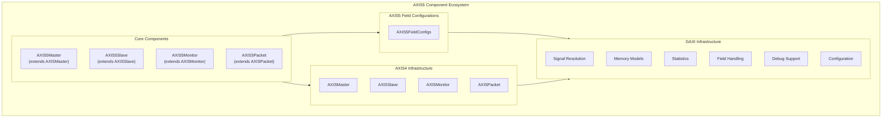

# AXIS5 Components Overview

The CocoTBFramework AXIS5 components provide comprehensive support for AXI5-Stream protocol verification and transaction generation. Built on the proven GAXI infrastructure and extending the existing AXIS4 components, these components offer a consistent and powerful interface for stream protocol testing with AMBA5-specific extensions for power management and data integrity.

## Key Differences from AXIS4

AXI5-Stream extends AXI4-Stream with two significant additions focused on power management and data integrity:

**Added Signals**:
- `TWAKEUP` -- Wake-up signaling for power management coordination (1 bit). Allows a master to signal a slave to exit a low-power state before data transfer begins.
- `TPARITY` -- Data parity protection (1 bit per data byte). Provides per-byte odd parity checking for TDATA integrity verification.

**Backward Compatibility**: AXIS5 components extend AXIS4 components directly. All AXIS4 signals (TDATA, TSTRB, TLAST, TID, TDEST, TUSER, TVALID, TREADY) remain unchanged. Existing AXIS4 testbenches can be upgraded to AXIS5 by changing the component class with minimal code changes.

## Framework Integration

### GAXI Infrastructure Foundation

The AXIS5 components inherit from the robust GAXI framework through their AXIS4 parent classes, providing:

**Unified Field Configuration**: Complete integration with the CocoTBFramework field configuration system for flexible packet structures
**Memory Model Support**: Seamless integration with memory models for data verification and complex test scenarios
**Statistics Integration**: Comprehensive performance metrics and transaction tracking, extended with AXIS5-specific counters
**Signal Resolution**: Automatic signal detection and mapping across different naming conventions, including TWAKEUP and TPARITY
**Advanced Debugging**: Multi-level debugging capabilities with detailed transaction logging

### Stream Protocol Specialization

While inheriting GAXI's power through AXIS4, AXIS5 components add:

**Wake-up Signaling**: Master-driven power management coordination with configurable hold cycles
**Parity Protection**: Automatic per-byte odd parity generation and checking
**Extended Protocol Monitoring**: AXIS5-specific violation detection including parity errors and wakeup protocol violations
**Power State Tracking**: Wakeup event history and timing analysis

## Core Components Architecture



## Component Capabilities

### AXIS5Master - Stream Data Generation with Wake-up and Parity

The `AXIS5Master` component drives AXI5-Stream protocol as a master (source):

**Wake-up Signaling**:
- **TWAKEUP Assertion**: Configurable wake-up signaling before data transfer
- **Hold Cycle Control**: Programmable number of clock cycles for TWAKEUP assertion
- **Automatic Coordination**: Wake-up automatically asserted before first packet in a stream

**Parity Generation**:
- **Automatic Calculation**: Per-byte odd parity computed for TDATA
- **Error Injection**: Programmable parity error injection for testing error handling
- **Transparent Operation**: Parity added without affecting data flow

**Inherited AXIS4 Features**:
- **Packet-Based Transmission**: Variable-length packets with TLAST boundaries
- **Flow Control**: Intelligent TREADY backpressure handling
- **Multi-Stream Support**: TID-based stream identification
- **Byte-Level Control**: TSTRB byte-level data control

### AXIS5Slave - Stream Data Reception with Wake-up Detection and Parity Checking

The `AXIS5Slave` component receives AXI5-Stream protocol as a slave (sink):

**Wake-up Detection**:
- **TWAKEUP Monitoring**: Continuous monitoring of wake-up signal
- **Event Tracking**: Timestamped wakeup event history
- **Background Monitoring**: Automatic cocotb coroutine for non-intrusive detection

**Parity Checking**:
- **Automatic Verification**: Per-byte parity checking on received data
- **Error Reporting**: Parity error detection with detailed logging
- **Error Statistics**: Pass/fail counters and error rate calculation
- **Packet Marking**: Received packets marked with parity error status

**Inherited AXIS4 Features**:
- **Automatic Handshaking**: TVALID/TREADY protocol handling
- **Packet Assembly**: Automatic frame boundary detection using TLAST
- **Memory Integration**: Direct memory model integration

### AXIS5Monitor - Protocol Analysis with Extended Checking

The `AXIS5Monitor` component provides comprehensive AXIS5 protocol monitoring:

**Wake-up Observation**:
- **Signal Tracking**: Full TWAKEUP assert/deassert history with timestamps
- **Protocol Compliance**: Wakeup-before-transfer sequence verification
- **Statistics Collection**: Wakeup event counts and violation tracking

**Parity Verification**:
- **Non-Intrusive Checking**: Parity verification without affecting data flow
- **Error Logging**: Detailed parity error reports with expected vs actual values
- **Coverage Tracking**: Parity check pass/fail statistics

**Extended Protocol Monitoring**:
- **AXIS5-Specific Violations**: Parity width mismatch detection, wakeup protocol violations
- **Combined Violation Counts**: Both AXIS4 and AXIS5 violation tracking
- **Wakeup History**: Complete timeline of wakeup events for analysis

## Field Configuration System

### AXIS5FieldConfigs - Protocol Adaptation

The field configuration system enables flexible AXIS5 protocol adaptation:

**Configuration Methods**:
```python
from CocoTBFramework.components.axis5 import AXIS5FieldConfigs

# Full AXIS5 configuration with all sideband signals
config = AXIS5FieldConfigs.create_t_field_config(
    data_width=32, id_width=8, dest_width=4, user_width=1,
    enable_wakeup=True, enable_parity=False
)

# Default configuration
config = AXIS5FieldConfigs.create_axis5_field_config(
    data_width=64, enable_wakeup=True, enable_parity=True
)

# Simple configuration with minimal sideband signals
config = AXIS5FieldConfigs.create_simple_axis5_config(data_width=32)

# Match hardware module parameters
config = AXIS5FieldConfigs.create_axis5_config_from_hw_params(
    data_width=128, id_width=4, dest_width=4, user_width=8,
    enable_wakeup=True, enable_parity=True
)

# Parity only (no wakeup)
config = AXIS5FieldConfigs.create_parity_only_config(data_width=64)

# All extensions enabled
config = AXIS5FieldConfigs.create_full_axis5_config(data_width=32)
```

## Usage Patterns and Integration

### Basic Stream Testing

```python
from CocoTBFramework.components.axis5 import (
    create_axis5_master, create_axis5_slave, create_axis5_monitor
)

# Create AXIS5 components
master = create_axis5_master(
    dut, clk, prefix="m_axis5_",
    data_width=32, enable_wakeup=True, enable_parity=True
)
slave = create_axis5_slave(
    dut, clk, prefix="s_axis5_",
    data_width=32, enable_wakeup=True, enable_parity=True
)
monitor = create_axis5_monitor(
    dut, clk, prefix="s_axis5_",
    data_width=32, is_slave=True,
    enable_wakeup=True, enable_parity=True
)

# Send stream data with automatic wakeup
await master['interface'].send_stream_data_with_wakeup(
    data_list=[0x11111111, 0x22222222, 0x33333333],
    id=1, dest=0, auto_last=True
)
```

### Wake-up Protocol Testing

```python
# Request wakeup before next transfer
master['interface'].request_wakeup()

# Send packet (wakeup automatically asserted first)
await master['interface'].send_single_beat_axis5(
    data=0xDEADBEEF, last=1, id=1, wakeup=True
)

# Check wakeup status on slave side
is_awake = slave['interface'].is_wakeup_active()
last_wakeup_time = slave['interface'].get_last_wakeup_time()
```

### Parity Error Injection and Detection

```python
# Enable parity error injection on master
master['interface'].inject_parity_error(enable=True)

# Send packet with bad parity
await master['interface'].send_single_beat_axis5(
    data=0x12345678, last=1
)

# Check parity error detection on slave
stats = slave['interface'].get_stats()
assert stats['parity_errors_detected'] > 0
```

### Complete Testbench Setup

```python
from CocoTBFramework.components.axis5 import create_axis5_testbench

# Create full testbench with master, slave, and monitors
components = create_axis5_testbench(
    dut, clk,
    master_prefix="m_axis5_",
    slave_prefix="s_axis5_",
    data_width=64,
    id_width=4,
    enable_wakeup=True,
    enable_parity=True
)

# Access components
master = components['master']['interface']
slave = components['slave']['interface']
master_mon = components['master_monitor']['interface']
slave_mon = components['slave_monitor']['interface']

# Get aggregated statistics
from CocoTBFramework.components.axis5 import get_axis5_stats_summary
summary = get_axis5_stats_summary(components)
```

## Statistics and Monitoring

### Statistics Key Structure

AXIS5 components extend AXIS4 statistics with additional fields:

```python
stats = component.get_stats()

# Standard AXIS4 statistics (inherited)
packets_sent = stats.get('packets_sent', 0)
packets_received = stats.get('packets_received', 0)
frames_sent = stats.get('frames_sent', 0)
total_data_bytes = stats.get('total_data_bytes', 0)

# AXIS5-specific statistics
wakeup_events = stats.get('wakeup_events', 0)
wakeup_enabled = stats.get('wakeup_enabled', False)
parity_enabled = stats.get('parity_enabled', False)
parity_errors = stats.get('parity_errors_detected', 0)
parity_passed = stats.get('parity_checks_passed', 0)
```

### Monitor-Specific Statistics

```python
# Parity statistics
parity_stats = monitor.get_parity_stats()
# {'parity_enabled': True, 'parity_errors': 0, 'parity_passed': 100,
#  'total_checks': 100, 'error_rate': 0.0}

# Wakeup statistics
wakeup_stats = monitor.get_wakeup_stats()
# {'wakeup_enabled': True, 'wakeup_events': 3, 'wakeup_violations': 0,
#  'wakeup_active': False, 'wakeup_history_count': 6}

# Wakeup event history
history = monitor.get_wakeup_history()
# [{'time': 1000.0, 'type': 'assert'}, {'time': 1030.0, 'type': 'deassert'}, ...]
```

## Configuration Examples

### Hardware Parameter Matching

```python
# Match SystemVerilog AXIS5 interface parameters
# parameter AXIS_DATA_WIDTH = 64,
# parameter AXIS_ID_WIDTH = 4,
# parameter AXIS_DEST_WIDTH = 4,
# parameter AXIS_USER_WIDTH = 8,
# parameter ENABLE_WAKEUP = 1,
# parameter ENABLE_PARITY = 1

master = create_axis5_master(
    dut, clk, prefix="m_axis5_",
    data_width=64,
    id_width=4,
    dest_width=4,
    user_width=8,
    enable_wakeup=True,
    enable_parity=True,
    wakeup_cycles=3
)
```

### Simple Data Pipe Configuration

```python
from CocoTBFramework.components.axis5 import (
    create_simple_axis5_master, create_simple_axis5_slave
)

# Minimal configuration without sideband signals
master = create_simple_axis5_master(
    dut, clk, prefix="m_axis5_",
    data_width=32, enable_wakeup=True
)

slave = create_simple_axis5_slave(
    dut, clk, prefix="s_axis5_",
    data_width=32, enable_wakeup=True
)
```

The AXIS5 components provide a comprehensive, backward-compatible extension of the AXIS4 infrastructure with power management and data integrity features, combining the power of the GAXI infrastructure with AXI5-Stream-specific optimizations for complete next-generation stream interface testing.
