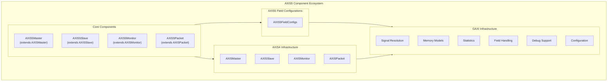

# AXIS5 Components Overview

The AXIS5 components bring AXI5-Stream support to the framework: master, slave, monitor, and packet classes with the two AMBA5 additions — TWAKEUP power signaling and TPARITY data protection — built in. They inherit from the AXIS4 components and sit on the same GAXI substrate as everything else here, so moving an existing AXIS4 testbench to AXIS5 is mostly a matter of changing class names.

## Key Differences from AXIS4

AXI5-Stream adds two signals to AXI4-Stream, aimed at two different problems — power management and data integrity:

**Added Signals**:
- `TWAKEUP` — wake-up signaling for power management coordination (1 bit). Lets a master warn a slave to come out of a low-power state before data starts moving.
- `TPARITY` — data parity protection (1 bit per data byte). Per-byte **odd** parity checking for TDATA integrity, per the AMBA AXI5-Stream specification.

**Backward Compatibility**: AXIS5 components extend the AXIS4 components directly. All AXIS4 signals (TDATA, TSTRB, TLAST, TID, TDEST, TUSER, TVALID, TREADY) are unchanged, and all AXIS4 APIs keep working. Upgrading an AXIS4 testbench is a class-name change, not a rewrite.

## Framework Integration

### GAXI Infrastructure Foundation

The AXIS5 components reach the GAXI framework through their AXIS4 parents, and that's where the heavy lifting lives:

**Unified Field Configuration**: packet layouts come from the framework's field configuration system — widths and sidebands are declarations, not code
**Memory Model Support**: received traffic can land in a memory model for checking against expected data
**Statistics Integration**: the standard performance and transaction counters, extended with AXIS5-specific ones
**Signal Resolution**: automatic signal detection across naming conventions, TWAKEUP and TPARITY included
**Advanced Debugging**: multi-level debug logging with per-transaction detail when you turn it up

### Stream Protocol Specialization

On top of what AXIS4 already provides, AXIS5 adds:

**Wake-up Signaling**: master-driven power coordination with a configurable hold time
**Parity Protection**: automatic per-byte odd parity generation and checking (the AMBA AXI5-Stream TPARITY convention)
**Extended Protocol Monitoring**: AXIS5-specific violation detection — parity errors and wakeup sequencing problems
**Power State Tracking**: a timestamped history of wakeup events

## Core Components Architecture


```mermaid
graph TB
    subgraph Ecosystem["AXIS5 Component Ecosystem"]
        subgraph Components["Core Components"]
            Master["AXIS5Master<br/>(extends AXISMaster)"]
            Slave["AXIS5Slave<br/>(extends AXISSlave)"]
            Monitor["AXIS5Monitor<br/>(extends AXISMonitor)"]
            Packet["AXIS5Packet<br/>(extends AXISPacket)"]
        end

        subgraph FieldCfg["AXIS5 Field Configurations"]
            Cfg["AXIS5FieldConfigs"]
        end

        subgraph AXIS4["AXIS4 Infrastructure"]
            A4Master[AXISMaster]
            A4Slave[AXISSlave]
            A4Monitor[AXISMonitor]
            A4Packet[AXISPacket]
        end

        subgraph GAXI["GAXI Infrastructure"]
            SigRes[Signal Resolution]
            MemMdl[Memory Models]
            Stats[Statistics]
            FieldHandle[Field Handling]
            Debug[Debug Support]
            Config[Configuration]
        end
    end

    Components --> FieldCfg
    Components --> AXIS4
    FieldCfg --> GAXI
    AXIS4 --> GAXI
```

## Component Capabilities

### AXIS5Master - Stream Data Generation with Wake-up and Parity

The `AXIS5Master` drives AXI5-Stream as a master (source):

**Wake-up Signaling**:
- **TWAKEUP Assertion**: wake-up signaling ahead of a transfer, on demand or automatic
- **Hold Cycle Control**: programmable number of clock cycles for the TWAKEUP assertion
- **Automatic Coordination**: wake-up is asserted automatically before the first packet of a stream

**Parity Generation**:
- **Automatic Calculation**: per-byte odd parity computed over TDATA
- **Error Injection**: corrupt parity on purpose to exercise the DUT's error handling
- **Transparent Operation**: parity rides along without changing the data flow

**Inherited AXIS4 Features**:
- **Packet-Based Transmission**: variable-length packets delimited by TLAST
- **Flow Control**: respects TREADY backpressure, with a configurable timeout
- **Multi-Stream Support**: TID-based stream identification
- **Byte-Level Control**: TSTRB byte enables

### AXIS5Slave - Stream Data Reception with Wake-up Detection and Parity Checking

The `AXIS5Slave` receives AXI5-Stream as a slave (sink):

**Wake-up Detection**:
- **TWAKEUP Monitoring**: continuous monitoring of the wake-up signal
- **Event Tracking**: timestamped history of wakeup events
- **Background Monitoring**: a cocotb coroutine does the watching, so your test doesn't have to

**Parity Checking**:
- **Automatic Verification**: per-byte parity checked on received data
- **Error Reporting**: parity errors detected and logged with the details
- **Error Statistics**: pass/fail counters and an error rate
- **Packet Marking**: received packets are marked with their parity error status

**Inherited AXIS4 Features**:
- **Automatic Handshaking**: TVALID/TREADY protocol handling
- **Packet Assembly**: frame boundaries detected from TLAST
- **Memory Integration**: direct memory model integration

### AXIS5Monitor - Protocol Analysis with Extended Checking

The `AXIS5Monitor` watches the bus and checks both generations of the protocol.

**Structure**: `AXIS5Monitor` → `AXISMonitor` → `GAXIMonitor`. The GAXI receive loop is the only sampling path; AXIS5 adds behaviour through `_build_packet` (real `AXIS5Packet` instances with this monitor's wakeup/parity options) and `_axis_packet_observed` (parity verification and AXIS5 protocol checks, ahead of the inherited AXIS4 frame tracking). TWAKEUP gets its own background coroutine because it's a sideband signal, not part of the data handshake.

**Wake-up Observation**:
- **Signal Tracking**: full TWAKEUP assert/deassert history with timestamps
- **Protocol Compliance**: verifies wakeup actually precedes the transfer
- **Statistics Collection**: wakeup event counts and violation tracking

**Parity Verification**:
- **Non-Intrusive Checking**: parity verified without affecting data flow
- **Error Logging**: expected-vs-actual detail on every parity error
- **Coverage Tracking**: parity pass/fail statistics

**Extended Protocol Monitoring**:
- **AXIS5-Specific Violations**: parity width mismatches, wakeup protocol violations
- **Combined Violation Counts**: AXIS4 and AXIS5 violations tracked together
- **Wakeup History**: the full wakeup timeline for post-test analysis

## Field Configuration System

### AXIS5FieldConfigs - Protocol Adaptation

Field configs are how you describe your particular flavor of AXIS5 — widths, sidebands, and whether the AMBA5 extensions are present:

**Configuration Methods**:
```python
from CocoTBFramework.components.axis5 import AXIS5FieldConfigs

# Full AXIS5 configuration with all sideband signals
config = AXIS5FieldConfigs.create_t_field_config(
    data_width=32, id_width=8, dest_width=4, user_width=1,
    enable_wakeup=True, enable_parity=False
)

# Default configuration
config = AXIS5FieldConfigs.create_axis5_field_config(
    data_width=64, enable_wakeup=True, enable_parity=True
)

# Simple configuration with minimal sideband signals
config = AXIS5FieldConfigs.create_simple_axis5_config(data_width=32)

# Match hardware module parameters
config = AXIS5FieldConfigs.create_axis5_config_from_hw_params(
    data_width=128, id_width=4, dest_width=4, user_width=8,
    enable_wakeup=True, enable_parity=True
)

# Parity only (no wakeup)
config = AXIS5FieldConfigs.create_parity_only_config(data_width=64)

# All extensions enabled
config = AXIS5FieldConfigs.create_full_axis5_config(data_width=32)
```

## Usage Patterns and Integration

### Basic Stream Testing

Master, slave, and monitor created through the factories, then a wakeup-annotated stream:

```python
from CocoTBFramework.components.axis5 import (
    create_axis5_master, create_axis5_slave, create_axis5_monitor
)

# Create AXIS5 components
master = create_axis5_master(
    dut, clk, prefix="m_axis5_",
    data_width=32, enable_wakeup=True, enable_parity=True
)
slave = create_axis5_slave(
    dut, clk, prefix="s_axis5_",
    data_width=32, enable_wakeup=True, enable_parity=True
)
monitor = create_axis5_monitor(
    dut, clk, prefix="s_axis5_",
    data_width=32, is_slave=True,
    enable_wakeup=True, enable_parity=True
)

# Send stream data with automatic wakeup
await master['interface'].send_stream_data_with_wakeup(
    data_list=[0x11111111, 0x22222222, 0x33333333],
    id=1, dest=0, auto_last=True
)
```

### Wake-up Protocol Testing

Wakeup can be armed explicitly on the master and observed on the far side:

```python
# Request wakeup before next transfer
master['interface'].request_wakeup()

# Send packet (wakeup automatically asserted first)
await master['interface'].send_single_beat_axis5(
    data=0xDEADBEEF, last=1, id=1, wakeup=True
)

# Check wakeup status on slave side
is_awake = slave['interface'].is_wakeup_active()
last_wakeup_time = slave['interface'].get_last_wakeup_time()
```

### Parity Error Injection and Detection

Injection on the master, detection on the slave — the pairing you want for error-handling tests:

```python
# Enable parity error injection on master
master['interface'].inject_parity_error(enable=True)

# Send packet with bad parity
await master['interface'].send_single_beat_axis5(
    data=0x12345678, last=1
)

# Check parity error detection on slave
stats = slave['interface'].get_stats()
assert stats['parity_errors_detected'] > 0
```

### Complete Testbench Setup

One call builds the whole bench:

```python
from CocoTBFramework.components.axis5 import create_axis5_testbench

# Create full testbench with master, slave, and monitors
components = create_axis5_testbench(
    dut, clk,
    master_prefix="m_axis5_",
    slave_prefix="s_axis5_",
    data_width=64,
    id_width=4,
    enable_wakeup=True,
    enable_parity=True
)

# Access components
master = components['master']['interface']
slave = components['slave']['interface']
master_mon = components['master_monitor']['interface']
slave_mon = components['slave_monitor']['interface']

# Get aggregated statistics
from CocoTBFramework.components.axis5 import get_axis5_stats_summary
summary = get_axis5_stats_summary(components)
```

## Statistics and Monitoring

### Statistics Key Structure

AXIS5 components keep all the AXIS4 statistics and add their own:

```python
stats = component.get_stats()

# Standard AXIS4 statistics (inherited)
packets_sent = stats.get('packets_sent', 0)
packets_received = stats.get('packets_received', 0)
frames_sent = stats.get('frames_sent', 0)
total_data_bytes = stats.get('total_data_bytes', 0)

# AXIS5-specific statistics
wakeup_events = stats.get('wakeup_events', 0)
wakeup_enabled = stats.get('wakeup_enabled', False)
parity_enabled = stats.get('parity_enabled', False)
parity_errors = stats.get('parity_errors_detected', 0)
parity_passed = stats.get('parity_checks_passed', 0)
```

### Monitor-Specific Statistics

The monitor breaks parity and wakeup out into their own dictionaries:

```python
# Parity statistics
parity_stats = monitor.get_parity_stats()
# {'parity_enabled': True, 'parity_errors': 0, 'parity_passed': 100,
#  'total_checks': 100, 'error_rate': 0.0}

# Wakeup statistics
wakeup_stats = monitor.get_wakeup_stats()
# {'wakeup_enabled': True, 'wakeup_events': 3, 'wakeup_violations': 0,
#  'wakeup_active': False, 'wakeup_history_count': 6}

# Wakeup event history
history = monitor.get_wakeup_history()
# [{'time': 1000.0, 'type': 'assert'}, {'time': 1030.0, 'type': 'deassert'}, ...]
```

## Configuration Examples

### Hardware Parameter Matching

Match the component widths to your RTL parameters and the BFM lines up with the SystemVerilog interface:

```python
# Match SystemVerilog AXIS5 interface parameters
# parameter AXIS_DATA_WIDTH = 64,
# parameter AXIS_ID_WIDTH = 4,
# parameter AXIS_DEST_WIDTH = 4,
# parameter AXIS_USER_WIDTH = 8,
# parameter ENABLE_WAKEUP = 1,
# parameter ENABLE_PARITY = 1

master = create_axis5_master(
    dut, clk, prefix="m_axis5_",
    data_width=64,
    id_width=4,
    dest_width=4,
    user_width=8,
    enable_wakeup=True,
    enable_parity=True,
    wakeup_cycles=3
)
```

### Simple Data Pipe Configuration

If your interface is just data with no sidebands, use the simple factories:

```python
from CocoTBFramework.components.axis5 import (
    create_simple_axis5_master, create_simple_axis5_slave
)

# Minimal configuration without sideband signals
master = create_simple_axis5_master(
    dut, clk, prefix="m_axis5_",
    data_width=32, enable_wakeup=True
)

slave = create_simple_axis5_slave(
    dut, clk, prefix="s_axis5_",
    data_width=32, enable_wakeup=True
)
```

Everything here is additive. If you know the AXIS4 components you already know most of this API, and the GAXI substrate underneath is the same one the rest of the framework runs on. Turn parity on when you need data integrity, use wakeup when your DUT sleeps, and leave both off when you don't.
