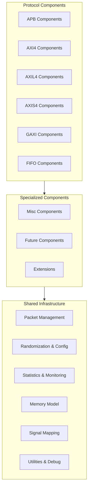

<!-- RTL Design Sherpa Documentation Header -->
<table>
<tr>
<td width="80">
  <a href="https://github.com/sean-galloway/RTLDesignSherpa-DV">
    
  </a>
</td>
<td>
  <strong>CocoTB Framework</strong> · <em>Verification Infrastructure for RTL Testing</em><br>
  <sub>
    <a href="https://github.com/sean-galloway/RTLDesignSherpa-DV">GitHub</a> ·
    <a href="https://github.com/sean-galloway/RTLDesignSherpa/blob/main/docs/DOCUMENTATION_INDEX.md">Documentation Index</a> ·
    <a href="https://github.com/sean-galloway/RTLDesignSherpa/blob/main/LICENSE">MIT License</a>
  </sub>
</td>
</tr>
</table>

---

<!-- End Header -->

# Components Index

Everything that talks to your DUT lives here: a master, slave, and monitor for each supported protocol, plus the shared infrastructure they all stand on. Find your protocol below — each directory has its own docs with examples and API details.

## Overview
- [**Overview**](components_overview.md) - How the components directory is put together, and the conventions every BFM in it follows

## Protocol Components

### Bus Protocols
- [**APB Components**](apb/components_apb_index.md) - APB masters, slaves, and monitors with multi-slave transaction support
- [**APB5 Components**](apb5/components_apb5_overview.md) - APB5 (AMBA5) extensions with USER and WAKEUP signal support
- [**AXI4 Components**](axi4/index.md) - Full AXI4: burst transactions, outstanding operations, and compliance checking
- [**AXI5 Components**](axi5/components_axi5_overview.md) - AMBA5-generation AXI with the extended signal set and compliance checking
- [**AXIL4 Components**](axil4/index.md) - AXI4-Lite, trimmed down for register-style memory-mapped interfaces
- [**AXIS4 Components**](axis4/index.md) - AXI4-Stream for packet-based streaming data
- [**AXIS5 Components**](axis5/components_axis5_overview.md) - AXI-Stream v5 components
- [**DFI Components**](dfi/components_dfi_overview.md) - DDR PHY Interface (v2.1-v5.x) memory-controller and PHY BFMs with JEDEC timing enforcement
- [**FIFO Components**](fifo/components_fifo_index.md) - Buffer and queue verification with flow control
- [**GAXI Components**](gaxi/components_gaxi_index.md) - The generic valid/ready layer the AXI and FIFO BFMs are built on — and a good lightweight choice on its own for checking small internal blocks

### Serial Protocols
- [**SMBus Components**](smbus/components_smbus_overview.md) - System Management Bus with open-drain modeling and CRC-8 packet error checking
- [**UART Components**](uart/uart_components.md) - UART transmit/receive components, 8N1

### Visualization
- [**Wavedrom Components**](wavedrom/wavedrom_index.md) - WaveJSON timing diagrams generated straight from simulation signals

### Specialized Components
- [**Misc Components**](misc/components_misc_index.md) - Monitors that don't belong to a single protocol, like the arbiter monitor

### Shared Infrastructure
- [**Shared Components**](shared/components_shared_index.md) - Packets, field configuration, randomization, statistics, and the memory model — used by every protocol above

## Quick Start

### Creating Components
```python
# Import protocol-specific factory functions
from CocoTBFramework.components.apb.apb_factories import create_apb_master, create_apb_slave
from CocoTBFramework.components.gaxi.gaxi_factories import create_gaxi_master, create_gaxi_slave
from CocoTBFramework.components.fifo.fifo_factories import create_fifo_master, create_fifo_slave

# Create components
apb_master = create_apb_master(dut, "APB_Master", "apb_", dut.clk)
gaxi_master = create_gaxi_master(dut, "GAXI_Master", "", dut.clk, field_config)
fifo_master = create_fifo_master(dut, "FIFO_Master", dut.clk)
```

### Wiring in the Shared Pieces
```python
# Use shared components for configuration and utilities
from CocoTBFramework.components.shared.field_config import FieldConfig, FieldDefinition
from CocoTBFramework.components.shared.flex_randomizer import FlexRandomizer
from CocoTBFramework.components.shared.memory_model import MemoryModel

# Create field configuration
field_config = FieldConfig()
field_config.add_field(FieldDefinition("addr", 32, format="hex"))
field_config.add_field(FieldDefinition("data", 32, format="hex"))

# Create randomizer
randomizer = FlexRandomizer({
    'addr': ([(0x1000, 0x2000)], [1.0]),
    'data': ([(0, 0xFFFF)], [1.0])
})

# Create memory model
memory = MemoryModel(num_lines=256, bytes_per_line=4)
```

Same field config, same randomizer, same memory model — every protocol uses them. Configure once, reuse everywhere.

## Architecture Overview

### Component Hierarchy



Read the arrows as "builds on": protocols at the top, shared infrastructure at the bottom, specialized pieces in between.

## Key Features

### Protocol Coverage
- **APB**: ARM's peripheral bus, with multi-slave support and register testing
- **AXI4**: full memory-mapped AXI4 — bursts and outstanding transactions
- **AXIL4**: AXI4-Lite for register access and configuration
- **AXIS4**: AXI4-Stream for high-throughput packet streaming
- **GAXI**: the shared valid/ready substrate, and the quickest way to exercise a small FIFO-based block
- **FIFO**: buffer and queue protocols with flow control
- **Extensible**: adding a new protocol follows a short, mechanical pattern

### Shared Infrastructure
- **Packet Management**: protocol-agnostic packets driven by a field configuration
- **Randomization**: constrained-random, weighted, sequence, and custom modes
- **Statistics**: latency, throughput, and error tracking built into every component
- **Memory Modeling**: NumPy-backed memory with access tracking
- **Signal Mapping**: automatic signal discovery, with manual overrides when your naming gets creative

### Component Types
- **Masters**: transaction initiators with configurable timing and randomization
- **Slaves**: responders with memory backing and error injection
- **Monitors**: passive observers for transaction logging and checking
- **Utilities**: configuration helpers, sequence generators, and debug tools

## Integration Patterns

### Cross-Protocol Testing
One memory model, two protocols — the fastest way to prove a bridge actually preserves data:

```python
# Create components from different protocols
apb_master = create_apb_master(dut, "APB_Master", "apb_", dut.clk)
gaxi_slave = create_gaxi_slave(dut, "GAXI_Slave", "", dut.clk, field_config)

# Use shared memory model for cross-protocol verification
shared_memory = MemoryModel(num_lines=1024, bytes_per_line=4)
apb_master.set_memory_model(shared_memory)
gaxi_slave.set_memory_model(shared_memory)
```

### Factory Functions
Every protocol ships factory functions, so component creation is one line instead of a constructor scavenger hunt:
- Sensible defaults for the common cases
- Automatic signal mapping and configuration
- Shared-component integration out of the box
- The same API shape across protocols

### Configuration Management
- Environment variables for test parameterization
- FieldConfig for describing packet structure
- Randomization profiles per test scenario
- Memory model integration for end-to-end data tracking

## Performance Features

### Optimizations
- **Signal Caching**: signal references resolved once, not on every access
- **Thread-Safe Operations**: components can run in parallel
- **Memory Efficiency**: NumPy-backed memory models for large data sets
- **Reduced Overhead**: optimized data strategies and signal handling

### Scalability
- Large field configurations without a slowdown
- Long-running tests without memory creep
- Parallel component operation
- Resource-conscious design

## Getting Started

1. **Pick your protocol** — APB, GAXI, FIFO, or one of the AXI flavors
2. **Describe your fields** with FieldConfig
3. **Create components** with the factory functions
4. **Set up randomization** with FlexRandomizer
5. **Attach a MemoryModel** if you need data checking
6. **Run** — the monitors and statistics collect themselves

Each component directory has full documentation — examples, API reference, and integration notes — so start with the one that matches your interface.

## Navigation
- [**Back to CocoTBFramework**](../index.md) - Return to main framework index

---
