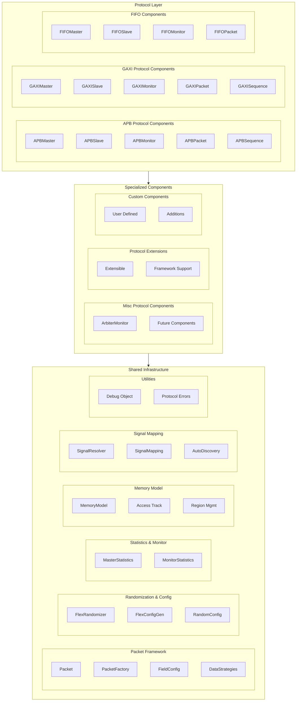

<!-- RTL Design Sherpa Documentation Header -->
<table>
<tr>
<td width="80">
  <a href="https://github.com/sean-galloway/RTLDesignSherpa-DV">
    
  </a>
</td>
<td>
  <strong>CocoTB Framework</strong> · <em>Verification Infrastructure for RTL Testing</em><br>
  <sub>
    <a href="https://github.com/sean-galloway/RTLDesignSherpa-DV">GitHub</a> ·
    <a href="https://github.com/sean-galloway/RTLDesignSherpa/blob/main/docs/DOCUMENTATION_INDEX.md">Documentation Index</a> ·
    <a href="https://github.com/sean-galloway/RTLDesignSherpa/blob/main/LICENSE">MIT License</a>
  </sub>
</td>
</tr>
</table>

---

<!-- End Header -->

# Components Overview

The components directory is where the framework meets your RTL: protocol BFMs that drive and observe pins, all built on one shared layer of packets, randomization, statistics, memory modeling, and signal mapping. That split is the whole design — you get consistent behavior across protocols without five copies of the same infrastructure drifting apart.

## Framework Philosophy

A few opinions, held firmly:

**Protocol Modularity**: each protocol gets its own master, slave, monitor, and packet classes — what they have in common lives in one place, not five
**Shared Infrastructure**: packets, field configuration, randomization, statistics, and memory models are implemented once in `shared/` and used by every protocol
**Performance Optimization**: signal caching and thread-safe operation are built in, not bolted on after the fact
**Ease of Use**: factory functions with sensible defaults get you a working component in one line
**Extensibility**: new protocols follow the same pattern as the existing ones — no special cases

## Architecture Overview

### Three-Layer Architecture

Three layers, each depending only on the one below it:



## Protocol Components

### APB (Advanced Peripheral Bus)
The APB components cover ARM's peripheral bus end to end:

**Core Components**:
- **APBMaster**: drives transactions with configurable timing and error injection
- **APBSlave**: responds with memory backing and realistic wait states
- **APBMonitor**: watches the bus for checking and debug

**Advanced Features**:
- Multi-slave support with address mapping
- Register map integration for systematic register testing
- Error injection and protocol-violation detection
- Statistics and performance monitoring

### GAXI (Generic AXI)
GAXI is the framework's workhorse. It's a generic valid/ready protocol, and it's also the layer the AXI4/AXI5/AXI-Lite/AXI-Stream channel BFMs are built on — learn it once and most of the framework feels familiar. Standalone, it's the right tool for validating individual FIFO-based interfaces on very small internal blocks. An interface can pack data into fields on a single bus or expose many discrete signals:

**Core Components**:
- **GAXIMaster**: drives transactions, with pipeline debugging and statistics
- **GAXISlave**: receives transactions with configurable ready delays and memory operations
- **GAXIMonitor**: observes transactions and flags protocol violations

**Key Features**:
- A much simpler handshake than full AXI4
- Pipeline state tracking for debug
- Multi-signal and packed-field modes
- Signal-caching optimizations for long runs

### FIFO (First-In-First-Out)
FIFO components handle buffer and queue protocols across the common interface types:

**Core Components**:
- **FIFOMaster**: drives write transactions into the FIFO, honoring flow control
- **FIFOSlave**: reads transactions out with configurable timing
- **FIFOMonitor**: watches transactions without touching the interface

**Specialized Features**:
- Multi-field packets for complex data structures
- Memory model integration for data checking
- Flow control and depth monitoring
- Performance statistics and error detection

### Misc Components
Specialized pieces for situations that don't fit a single protocol:

**Current Components**:
- **ArbiterMonitor**: enhanced monitoring for round-robin and weighted arbiters
- **Future Extensions**: the framework is ready for more of these as they come up

## Shared Infrastructure

### Packet Management Framework
Protocol-agnostic data handling, so packet code is written once:

**Core Classes**:
- **Packet**: base packet with field management and validation
- **PacketFactory**: factory pattern for packet creation and configuration
- **FieldConfig**: rich field definitions with validation and encoding
- **DataStrategies**: optimized data collection and driving

**Key Features**:
- Thread-safe for parallel testing
- Automatic field validation and masking
- FIFO packing/unpacking support
- Caching where it actually matters

### Randomization & Configuration
Directed and constrained testing without writing a generator per test:

**Components**:
- **FlexRandomizer**: multi-mode engine — constrained, sequence, and custom
- **FlexConfigGen**: helper for building weighted randomization profiles
- **RandomizationConfig**: high-level randomization configuration

**Capabilities**:
- Constrained random with weighted bins
- Sequence-based deterministic patterns
- Custom generator functions
- Object bins for non-numeric values
- Dependencies between fields

### Statistics & Monitoring
Every component keeps its own score:

**Components**:
- **MasterStatistics**: latency, throughput, and errors for masters and slaves
- **MonitorStatistics**: transaction and violation counts for monitors

**Features**:
- Real-time performance metrics
- Moving window averages
- Error categorization and tracking
- Protocol violation detection
- Reporting you can paste into a bug ticket

### Memory Modeling
Fast memory simulation with the diagnostics you'd want after a failure:

**Features**:
- NumPy backend, so large maps stay fast
- Comprehensive access tracking
- Region management
- Boundary checking and validation
- Coverage analysis and reporting

### Signal Mapping
Getting from "the port is called `s_apb_paddr`" to a handle, without hardcoding names everywhere:

**Features**:
- Pattern-based signal discovery
- Manual mapping override when discovery guesses wrong
- Prefix handling for cocotb compatibility
- Tolerance for different naming conventions

## Design Patterns

### Factory Pattern
Every protocol ships factory functions so creation is one line:

```python
# Simple component creation with sensible defaults
master = create_apb_master(dut, "APB_Master", "apb_", dut.clk)
slave = create_gaxi_slave(dut, "GAXI_Slave", "", dut.clk, field_config)

# Complete system creation
components = create_fifo_test_environment(
    dut=dut, clock=dut.clk, data_width=32, include_monitors=True
)
```

### Observer Pattern
Monitors are pure observers — they never drive a pin. Hang whatever callbacks you need on them:

```python
# Monitor automatically observes transactions
monitor = create_apb_monitor(dut, "Monitor", "apb_", dut.clk)

# Add callbacks for real-time processing
monitor.add_callback(scoreboard.add_transaction)
monitor.add_callback(statistics_collector.update_stats)
```

### Strategy Pattern
Randomization and data movement are pluggable:

```python
# Constrained-random, weighted, and sequence fields in one randomizer
randomizer = FlexRandomizer({
    'data': ([(0, 0xFFFF)], [1.0]),                          # constrained-random bin
    'addr': ([(0x1000, 0x1FFF), (0x2000, 0x2FFF)], [8, 2]),  # weighted bins
    'ctrl': [0, 1, 2, 3],                                    # deterministic sequence
})

# Data collection/driving strategies are selected automatically per component
# (see shared/data_strategies.py) based on the resolved signals.
```

## BFM Class Conventions

Two inheritance choices in this codebase surprise people on first read. Both are deliberate, and both are documented here so subclass authors don't get bitten.

### Slave-via-BusMonitor

Every protocol *Slave* BFM in the framework drives output signals (`PREADY`,
`PRDATA`, `RREADY`, etc.) — they are **responders**, not passive observers.
Yet they inherit from `cocotb_bus.monitors.BusMonitor`. That's a convention,
not a bug:

- `cocotb_bus` doesn't offer a "responder" base class.
- `BusMonitor` is reused as a *chassis* — for its signal-sampling coroutine,
  signal discovery, and `_recvQ` plumbing.
- Each Slave overrides the sampled-edge handler to also drive its
  protocol-specific response signals.

Classes that follow this pattern: `APBSlave`, `APB5Slave`, `GAXISlave` (via
`GAXIMonitorBase`), `FIFOSlave` (via `FIFOMonitorBase`), `AXISSlave`, and the
GAXI-based channel-slaves used inside `AXI4SlaveRead`, `AXI4SlaveWrite`,
`AXIL4Slave*`, and `AXI5Slave*`.

So when you subclass a Slave, treat `BusMonitor` as a chassis, not a semantic
claim of passivity. The responder behavior lives in the subclass's monitor
loop and its callback hooks.

### Master is `BusDriver`, Slave is `BusMonitor`

Same logic, other direction: every Master BFM inherits from `BusDriver` and
uses it as the chassis for its transmit-pipeline state machines. The
protocol-level entry point is the public `send(packet)` API — not
`BusDriver._driver_send`.

## Performance Characteristics

### Optimizations
- **40% faster data collection** through cached signal references
- **30% faster data driving** through optimized functions
- **Thread-safe caching** for parallel test execution
- **Lower memory overhead** from efficient data structures

### Scalability
- Large field configurations without a slowdown
- Long-running tests without memory creep
- Parallel component operation
- Resource-conscious design

## Integration Guidelines

### Component Creation
1. **Pick the protocol** that matches your design's interface
2. **Describe your fields** with FieldConfig
3. **Create components** with the factory functions
4. **Configure randomization** with FlexRandomizer
5. **Attach a memory model** if you need data checking and tracking

### Cross-Protocol Verification
Because the infrastructure is shared, crossing protocols is boring — which is exactly what you want:

```python
# Use same memory model across protocols
shared_memory = MemoryModel(num_lines=1024, bytes_per_line=4)

# Components from different protocols
apb_master = create_apb_master(dut, "APB", "apb_", clk, memory=shared_memory)
gaxi_slave = create_gaxi_slave(dut, "GAXI", "", clk, config, memory=shared_memory)

# Shared statistics and monitoring
stats_collector = MasterStatistics()
apb_master.set_statistics(stats_collector)
gaxi_slave.set_statistics(stats_collector)
```

### Test Framework Integration
Components drop straight into cocotb tests:

```python
@cocotb.test()
async def comprehensive_test(dut):
    # Create components using factories
    components = create_protocol_testbench(dut, protocol='gaxi')
    
    # Run test sequences
    await components['master'].send_sequence(test_sequence)
    
    # Verify results using shared infrastructure
    stats = components['master'].get_stats()
    assert stats['success_rate_percent'] > 95
```

## Future Extensibility

### New Protocols
Adding a protocol is mechanical:
1. Create protocol-specific components inheriting from the base classes
2. Implement the packet and sequence classes
3. Add factory functions
4. Plug into the shared infrastructure — no changes needed there

### Enhanced Features
Where the shared layer is likely to grow:
- More randomization modes and constraints
- Memory model features
- Signal mapping smarts
- Debugging and analysis tooling

The short version: build on these components and you get consistent behavior across protocols, shared checking infrastructure, and one less layer of homegrown BFM code to maintain.

---
