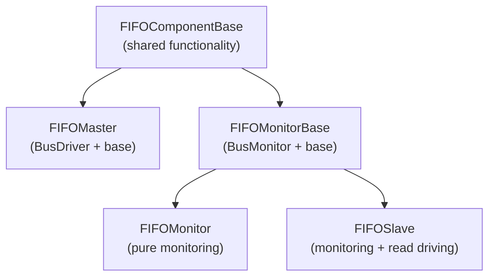

<!-- RTL Design Sherpa Documentation Header -->
<table>
<tr>
<td width="80">
  <a href="https://github.com/sean-galloway/RTLDesignSherpa-DV">
    
  </a>
</td>
<td>
  <strong>CocoTB Framework</strong> · <em>Verification Infrastructure for RTL Testing</em><br>
  <sub>
    <a href="https://github.com/sean-galloway/RTLDesignSherpa-DV">GitHub</a> ·
    <a href="https://github.com/sean-galloway/RTLDesignSherpa/blob/main/docs/DOCUMENTATION_INDEX.md">Documentation Index</a> ·
    <a href="https://github.com/sean-galloway/RTLDesignSherpa/blob/main/LICENSE">MIT License</a>
  </sub>
</td>
</tr>
</table>

---

<!-- End Header -->

# FIFO Components Index

The FIFO family: a master that writes, a slave that reads, monitors that watch, and the packets, sequences, and factories that tie them together. Everything sits on the shared base classes, so the components behave the same way by construction.

## Directory Structure

```
CocoTBFramework/components/fifo/
├── __init__.py
├── fifo_command_handler.py
├── fifo_component_base.py
├── fifo_factories.py
├── fifo_master.py
├── fifo_monitor.py
├── fifo_monitor_base.py
├── fifo_packet.py
├── fifo_sequence.py
└── fifo_slave.py
```

## Component Documentation

### Core Components
- [**fifo_component_base.py**](components_fifo_fifo_component_base.md) - Shared base class for all FIFO components (now a compatibility shim over GAXIComponentBase — read its deprecation note)
- [**fifo_master.py**](components_fifo_fifo_master.md) - FIFO Master (writer): drives transactions into the FIFO
- [**fifo_slave.py**](components_fifo_fifo_slave.md) - FIFO Slave (reader): drives `read` and captures what comes out
- [**fifo_monitor.py**](components_fifo_fifo_monitor.md) - FIFO Monitor: passive observer for the write or read side
- [**fifo_monitor_base.py**](components_fifo_fifo_monitor_base.md) - Shared plumbing behind monitor and slave

### Data and Configuration
- [**fifo_packet.py**](components_fifo_fifo_packet.md) - The transaction object: base Packet plus timing randomizers
- [**fifo_sequence.py**](components_fifo_fifo_sequence.md) - Pattern and sequence generator

### Utilities and Factories
- **fifo_factories.py** - Factory functions that wire up components in one call
- **fifo_command_handler.py** - Executes sequences through a master/slave pair

## Quick Start

### Basic FIFO Test Setup
The fastest way to a working testbench:

```python
from CocoTBFramework.components.fifo.fifo_factories import create_simple_fifo_test

# Create simple FIFO components
components = create_simple_fifo_test(dut, clock, data_width=32)
master = components['master']
slave = components['slave']
command_handler = components['command_handler']

# Create and send transactions
packet = master.create_packet(data=0xDEADBEEF)
await master.send(packet)
```

### Complete Test Environment
If you want monitors and a scoreboard too:

```python
from CocoTBFramework.components.fifo.fifo_factories import create_fifo_test_environment

# Create full test environment with monitors
components = create_fifo_test_environment(
    dut=dut,
    clock=clock,
    data_width=32,
    include_monitors=True
)

master = components['master']
slave = components['slave']
monitors = [components['master_monitor'], components['slave_monitor']]
scoreboard = components['scoreboard']
```

## Architecture Overview

### Component Hierarchy



### Key Features
- **One infrastructure**: signal resolution, data handling, and statistics come from the shared base classes, so master, slave, and monitor can't drift apart
- **Automatic signal discovery**: with a `signal_map` override when the RTL has its own naming ideas
- **Cached and fast**: pre-resolved signals and unified data strategies — 40% faster collection, 30% faster driving than the pre-unification components
- **Statistics everywhere**: throughput, latency, violations, utilization, all queryable mid-test
- **Memory integration**: MemoryModel support for scoreboard-style checking without writing a scoreboard
- **Randomization**: FlexRandomizer-driven timing on both sides

## Usage Patterns

### Master-Slave Testing
The minimal loop: master pushes, slave drains, queue holds the evidence.

```python
# Set up master and slave
master = create_fifo_master(dut, "Master", clock)
slave = create_fifo_slave(dut, "Slave", clock)

# Send data from master
packet = master.create_packet(data=0x12345678)
await master.send(packet)

# Slave automatically receives and processes
observed_packets = slave.get_observed_packets()
```

### Sequence-Based Testing
Sequences generate the traffic; the command handler executes it.

```python
# Create test sequence
sequence = FIFOSequence.create_pattern_test("patterns", data_width=32)

# Process sequence through command handler
command_handler = create_fifo_command_handler(master, slave)
responses = await command_handler.process_sequence(sequence)
```

### Monitoring and Verification
Monitors attach to either side and observe through the standard cocotb queue.

```python
# Set up monitors
write_monitor = create_fifo_monitor(dut, "WriteMonitor", clock, is_slave=False)
read_monitor = create_fifo_monitor(dut, "ReadMonitor", clock, is_slave=True)

# Monitor automatically observes transactions
# Access observed data through standard cocotb _recvQ
write_transactions = write_monitor._recvQ
read_transactions = read_monitor._recvQ
```

## Signal Mapping

Discovery first, override when you need to.

### Automatic Discovery
```python
# Components automatically discover signals
master = FIFOMaster(dut, "Master", "", clock, field_config)
```

### Manual Signal Mapping
When the RTL names its own signals — which is most of the time, in my experience:

```python
# Override signal names when needed
signal_map = {
    'write': 'wr_en',
    'full': 'fifo_full',
    'data': 'wr_data'
}
master = FIFOMaster(dut, "Master", "", clock, field_config, signal_map=signal_map)
```

## Performance Features

### Optimized Data Handling
- **Signal caching**: handles resolved once, reused every cycle
- **Unified data strategies**: where the 40% collection / 30% driving speedups come from
- **NumPy-backed memory model**: big buffers stay cheap

### Statistics and Monitoring
- **Live metrics**: transaction counts, throughput, and latency while the test runs
- **Error detection**: protocol violations, X/Z values, FIFO overflow/underflow attempts
- **Coverage analysis**: transaction coverage and pattern analysis hooks

## Integration

### With Shared Components
FIFO components use the framework's shared pieces directly:
- **FieldConfig**: packet structure definition
- **FlexRandomizer**: timing and data randomization
- **MemoryModel**: data storage and verification
- **Statistics**: performance monitoring

### With Test Framework
A complete test in a dozen lines:

```python
@cocotb.test()
async def fifo_test(dut):
    # Use factory functions for easy setup
    components = create_fifo_with_monitors(dut, clock)
    
    # Run test sequences
    sequence = FIFOSequence.create_stress_test("stress", count=100)
    await components['command_handler'].process_sequence(sequence)
    
    # Verify results
    stats = components['master'].get_stats()
    assert stats['master_stats']['success_rate_percent'] > 95
```

## Navigation
- [**Back to Components**](../components_index.md) - Return to components directory
- [**Framework Overview**](../../index.md) - Return to main framework
