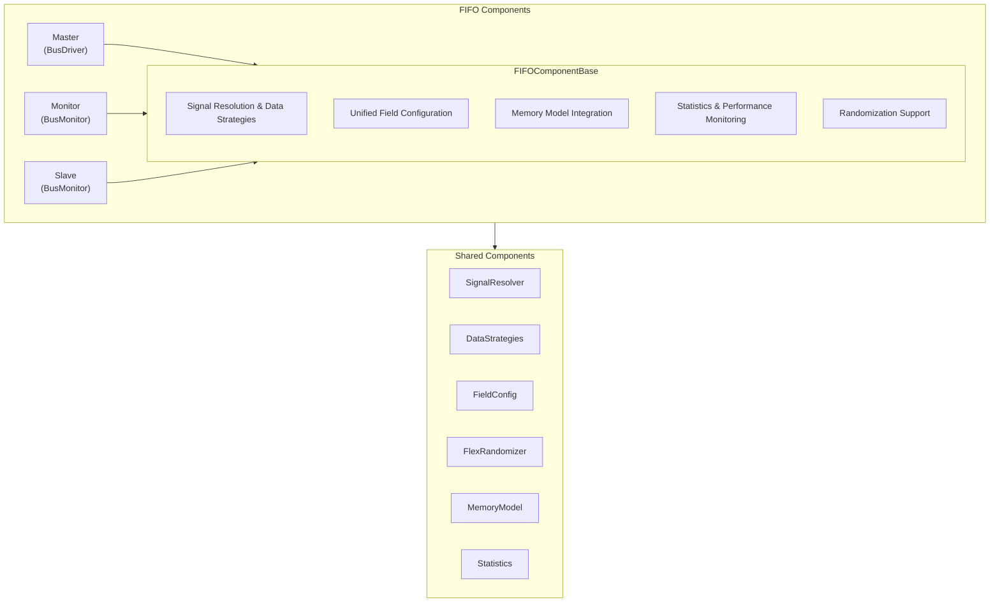

<!-- RTL Design Sherpa Documentation Header -->
<table>
<tr>
<td width="80">
  <a href="https://github.com/sean-galloway/RTLDesignSherpa-DV">
    
  </a>
</td>
<td>
  <strong>CocoTB Framework</strong> · <em>Verification Infrastructure for RTL Testing</em><br>
  <sub>
    <a href="https://github.com/sean-galloway/RTLDesignSherpa-DV">GitHub</a> ·
    <a href="https://github.com/sean-galloway/RTLDesignSherpa/blob/main/docs/DOCUMENTATION_INDEX.md">Documentation Index</a> ·
    <a href="https://github.com/sean-galloway/RTLDesignSherpa/blob/main/LICENSE">MIT License</a>
  </sub>
</td>
</tr>
</table>

---

<!-- End Header -->

# FIFO Components Overview

Everything you need to verify a FIFO: from a bare `write`/`read`/`full`/`empty` interface up to multi-field packets carrying address and command fields. The same components cover the whole range — what changes is the field configuration, not the code.

## Architecture Overview

### Unified Component Design

The family is built in layers: shared base classes on the bottom, the three components on top, and the framework's shared infrastructure underneath all of it. The layering is the point — behavior implemented once, like signal resolution or statistics, behaves identically in all three components.



### Key Design Principles

1. **Write it once**: common logic lives in the base classes. When a bug gets fixed, it's fixed for master, slave, and monitor at the same time.
2. **Don't pay for lookups twice**: signals are resolved once and cached; data moves through the unified strategies.
3. **Configure, don't customize**: a data-only FIFO and a multi-field command/address FIFO use the same components with different FieldConfigs.
4. **Keep the old APIs**: the refactor preserved the original components' APIs and timing, so existing tests didn't change.
5. **Make everything observable**: stats, violation counters, and queues are always available. You should never have to guess what the testbench did.

## Component Types

### 1. FIFOMaster - Transaction Driver
**Purpose**: Pushes write transactions into the FIFO
**Inherits**: `BusDriver`, `FIFOComponentBase`
**Key Features**:
- Queues and pipelines write transactions
- Configurable or randomized gaps between writes
- Watches `full` and backs off automatically
- Counts everything — sent, stalls, timeouts, violations
- Optional MemoryModel mirroring

### 2. FIFOSlave - Transaction Consumer  
**Purpose**: Pulls transactions out of the FIFO
**Inherits**: `BusMonitor`, `FIFOMonitorBase`
**Key Features**:
- Drives `read` with configurable or randomized timing
- Watches `empty`; read-while-empty attempts counted
- Captures and unpacks every transaction
- MemoryModel-backed storage and checking
- Same stats and violation detection as the monitor

### 3. FIFOMonitor - Passive Observer
**Purpose**: Watches either side of the FIFO without touching a signal
**Inherits**: `BusMonitor`, `FIFOMonitorBase`
**Key Features**:
- Write-side or read-side monitoring (`is_slave`)
- Write-while-full, read-while-empty, and X/Z detection
- Occupancy estimation given the FIFO capacity
- Packet log via the standard `_recvQ`
- Drives nothing — safe to attach anywhere

### 4. Support Components

#### FIFOPacket
- The base Packet plus master/slave timing randomizers
- Formatting, masking, validation, and pack/unpack all inherited
- Delays roll once per packet and cache

#### FIFOSequence  
- Pattern generation: incrementing, walking bits, random, corner cases
- Factory methods for the common test batteries
- No internal FIFO model — correctness checking is the scoreboard's job

#### FIFOCommandHandler
- Executes sequences through a master/slave pair
- Completion callbacks for sequencing test phases

## Protocol Support

### Basic FIFO Protocol
The smallest interface the components talk to:

```verilog
// Simple FIFO interface
input  wire       clk,
input  wire       rst_n,
input  wire       write,
input  wire [31:0] wr_data,
output wire        full,
input  wire        read,
output wire [31:0] rd_data,
output wire        empty
```

### Multi-Field FIFO Protocol
The same components, with fields unpacked to their own signals:

```verilog
// Complex FIFO with multiple fields
input  wire       clk,
input  wire       rst_n,
input  wire       write,
input  wire [31:0] addr,
input  wire [31:0] data,
input  wire [3:0]  cmd,
output wire        full,
input  wire        read,
output wire [31:0] rd_addr,
output wire [31:0] rd_data,
output wire [3:0]  rd_cmd,
output wire        empty
```

## Signal Mapping Modes

### Multi-Signal Mode (`multi_sig=True`)
Each field becomes its own DUT signal:

```python
field_config = FieldConfig()
field_config.add_field(FieldDefinition("addr", 32))
field_config.add_field(FieldDefinition("data", 32))
field_config.add_field(FieldDefinition("cmd", 4))

# Creates signals: addr_sig, data_sig, cmd_sig
master = FIFOMaster(dut, "Master", "", clock, field_config, multi_sig=True)
```

### Single-Signal Mode (`multi_sig=False`)
Everything packs into one data bus; the field config defines the layout:

```python
# All fields packed into data_sig
master = FIFOMaster(dut, "Master", "", clock, field_config, multi_sig=False)
```

## Timing Control

### Built-in Randomization
Components ship with sensible default randomizers. Pass your own to shape the traffic:

```python
# Default randomizer with realistic timing
master = create_fifo_master(dut, "Master", clock)

# Custom randomizer for specific patterns
custom_randomizer = FlexRandomizer({
    'write_delay': ([(0, 0), (1, 5), (10, 20)], [5, 3, 1])
})
master = create_fifo_master(dut, "Master", clock, randomizer=custom_randomizer)
```

### Deterministic Timing
Fixed delays when you want reproducibility:

```python
# Fixed timing for reproducible tests
deterministic_randomizer = FlexRandomizer({
    'write_delay': [2, 2, 2, 2]  # Always 2 cycles
})
```

## Memory Integration

### Automatic Memory Handling
Attach a model to both sides and writes can be checked against reads with no scoreboard code at all:

```python
# Components automatically handle memory operations
master = create_fifo_master(dut, "Master", clock, memory_model=memory)
slave = create_fifo_slave(dut, "Slave", clock, memory_model=memory)

# Master writes to memory, slave reads from memory
packet = master.create_packet(addr=0x1000, data=0xDEADBEEF)
await master.send(packet)  # Automatically written to memory

# Slave automatically reads from memory and validates
```

### Memory Model Features
- NumPy backend, so big address spaces stay cheap
- Address range checking and validation
- Access pattern tracking and analysis
- Coverage reporting
- Transaction-based read/write helpers

## Performance Features

### Optimized Data Handling
- **40% faster data collection** and **30% faster driving** than the pre-unification components, from cached signal handles and the unified strategies
- **Thread-safe operations** for parallel testing
- **Lower CPU overhead** because the infrastructure isn't duplicated per component

### Statistics and Monitoring
The numbers are always current — ask mid-test if you want:

```python
# Comprehensive performance metrics
stats = master.get_stats()
print(f"Throughput: {stats['master_stats']['current_throughput_tps']:.1f} TPS")
print(f"Success Rate: {stats['master_stats']['success_rate_percent']:.1f}%")
print(f"Average Latency: {stats['master_stats']['average_latency_ms']:.2f}ms")
```

## Factory Functions

### Simple Test Creation
One call, working testbench:

```python
# Minimal setup for basic testing
components = create_simple_fifo_test(dut, clock, data_width=32)
master = components['master']
slave = components['slave']
command_handler = components['command_handler']
```

### Complete Test Environment
Monitors, scoreboard, capacity awareness:

```python
# Full environment with monitoring and verification
components = create_fifo_test_environment(
    dut=dut,
    clock=clock,
    data_width=32,
    addr_width=32,
    include_monitors=True,
    fifo_capacity=16
)
```

### Custom Configurations
Every knob, when you need it:

```python
# Highly customized setup
master = create_fifo_master(
    dut=dut,
    title="CustomMaster",
    clock=clock,
    field_config=custom_field_config,
    randomizer=custom_randomizer,
    memory_model=custom_memory,
    mode='fifo_flop',
    multi_sig=True,
    signal_map={'write': 'wr_en', 'full': 'fifo_full'}
)
```

## Usage Patterns

### Basic Transaction Flow
End to end in five steps:

```python
# 1. Create components
master = create_fifo_master(dut, "Master", clock)
slave = create_fifo_slave(dut, "Slave", clock)

# 2. Create and send transactions
packet = master.create_packet(data=0x12345678)
await master.send(packet)

# 3. Verify reception
observed = slave.get_observed_packets()
assert len(observed) == 1
assert observed[0].data == 0x12345678
```

### Sequence-Based Testing
Sequences generate, the command handler executes:

```python
# 1. Create test sequence
sequence = FIFOSequence.create_stress_test("stress", count=100, burst_size=10)

# 2. Execute sequence
command_handler = create_fifo_command_handler(master, slave)
await command_handler.process_sequence(sequence)

# 3. Analyze results
# Note: command_handler.get_stats() nests each component's full get_stats()
# dict, so the master's own counters live under ['master_stats']['master_stats']
stats = command_handler.get_stats()
print(f"Processed {stats['master_stats']['master_stats']['transactions_completed']} transactions")
```

One quirk worth knowing, called out in the comment above: `command_handler.get_stats()` nests each component's stats dict, so the master's counters sit at `['master_stats']['master_stats']`. Deep, but unambiguous.

### Advanced Monitoring
Monitors on both sides plus a callback gives you live visibility into the traffic:

```python
# Set up comprehensive monitoring
write_monitor = create_fifo_monitor(dut, "WriteMonitor", clock, is_slave=False)
read_monitor = create_fifo_monitor(dut, "ReadMonitor", clock, is_slave=True)

# Add callback for real-time analysis
def analyze_transaction(packet):
    print(f"Observed: {packet.formatted()}")

write_monitor.add_callback(analyze_transaction)

# Run test and collect statistics
# Monitors automatically track protocol violations, timing, etc.
```

## Error Detection and Diagnostics

### Protocol Violation Detection
- Write-while-full attempts
- Read-while-empty attempts  
- X/Z values on control or data signals
- Timing constraint violations

### Logging
- Transaction-level logging with timestamps
- Warnings on every protocol violation
- Performance metrics and alerts
- Memory access traces

### Debug Support
- Signal state inspection
- Queue depth monitoring
- Statistics breakdowns by category
- Error counting by type

## Integration Guidelines

### With Scoreboards
Monitors feed expected/actual straight into a scoreboard:

```python
# Scoreboard integration for end-to-end verification
scoreboard = create_fifo_scoreboard("MainScoreboard", field_config)

# Connect monitors to scoreboard
write_monitor.add_callback(scoreboard.add_expected)
read_monitor.add_callback(scoreboard.add_actual)
```

### With Test Frameworks
Factories plus sequences keep the full-test pattern short:

```python
@cocotb.test()
async def comprehensive_fifo_test(dut):
    # Setup using factory functions
    components = create_fifo_with_monitors(dut, clock)
    
    # Create and execute test sequences
    sequences = [
        FIFOSequence.create_burst("burst", count=20),
        FIFOSequence.create_pattern_test("patterns"),
        FIFOSequence.create_stress_test("stress", count=100)
    ]
    
    for sequence in sequences:
        await components['command_handler'].process_sequence(sequence)
    
    # Comprehensive verification
    for component_name, component in components.items():
        if hasattr(component, 'get_stats'):
            stats = component.get_stats()
            verify_component_performance(component_name, stats)
```

## Best Practices

### Component Setup
1. **Use the factories**: fewer ways to miswire, and the wiring is the same in every test
2. **Put effort into the FieldConfig**: everything else — packets, sequences, monitors — keys off it
3. **Choose randomizers that match the test's intent**: throughput and stress want different delay profiles
4. **Attach a MemoryModel** whenever data integrity is what you're actually checking

### Performance Optimization
1. **Let the caching work**: don't re-resolve signals in your own code; use the unified methods
2. **Batch where you can**: process packets in groups rather than one observation at a time
3. **Watch stats during long runs**, not just at the end — trends show up before failures do
4. **Prefer the sequence generators**: their patterns are already shaped to hit corners

### Error Handling
1. **Check return values**: drives and memory operations report failure; believe them
2. **Assert on the violation counters**: a nonzero count should fail the test, not just log
3. **Sanity-check the stats**: compare success rate and throughput against expectations
4. **Turn on `super_debug` when something's off**: the signal-mapping trace usually names the culprit

That's the family. Start with the factories, add monitors when you want visibility, and reach for the base classes only when you're writing something new.
