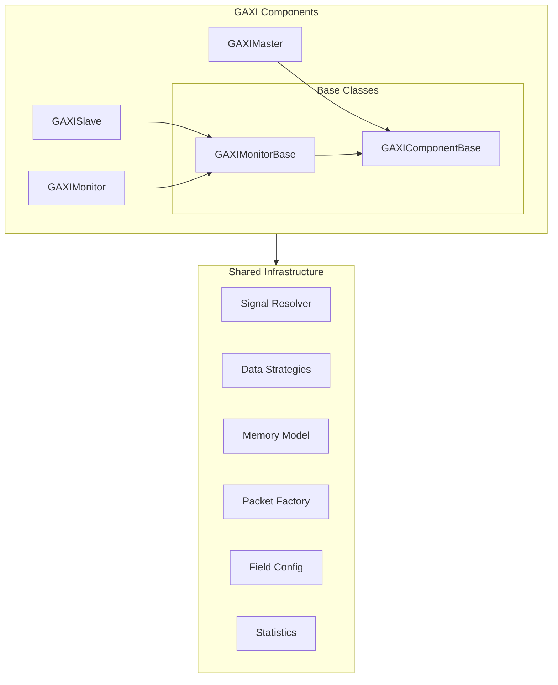
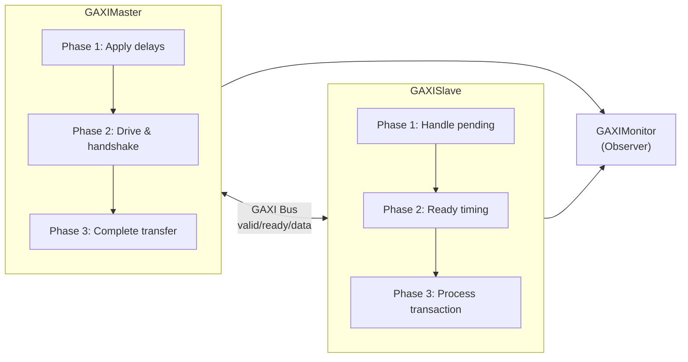
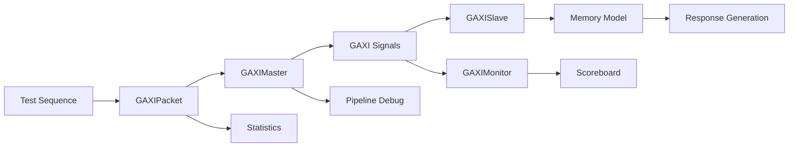

<!-- RTL Design Sherpa Documentation Header -->
<table>
<tr>
<td width="80">
  <a href="https://github.com/sean-galloway/RTLDesignSherpa-DV">
    
  </a>
</td>
<td>
  <strong>CocoTB Framework</strong> · <em>Verification Infrastructure for RTL Testing</em><br>
  <sub>
    <a href="https://github.com/sean-galloway/RTLDesignSherpa-DV">GitHub</a> ·
    <a href="https://github.com/sean-galloway/RTLDesignSherpa/blob/main/docs/DOCUMENTATION_INDEX.md">Documentation Index</a> ·
    <a href="https://github.com/sean-galloway/RTLDesignSherpa/blob/main/LICENSE">MIT License</a>
  </sub>
</td>
</tr>
</table>

---

<!-- End Header -->

# GAXI Components Overview

GAXI (Generic AXI) is a lightweight valid/ready handshake protocol — and, more importantly, the substrate this framework is built on. The components here validate FIFO-based interfaces on small internal blocks directly, where an interface might pack its fields into one bus or spread them across discrete signals (the field configuration system handles both). They also serve as the machinery the AXI4/AXI5, AXI-Lite, AXI-Stream and FIFO BFMs delegate to, so understanding this layer explains most of the rest of the framework. The design goal throughout: one implementation of the shared machinery, exact timing preserved, and debugging you can actually reach for at 2 AM.

## Architecture Overview

The GAXI component architecture follows a hierarchical design with shared base classes and unified infrastructure:



## Key Design Principles

### 1. **One Set of Base Classes**
- **GAXIComponentBase**: everything, for every GAXI component
- **GAXIMonitorBase**: the observe-side core, shared by slave and monitor (a slave is a monitor that also drives ready)
- The duplication is gone; the APIs and timing are not

### 2. **Resolve Signals Once**
- Signal references are cached, which is where the ~40% faster data collection comes from
- Data driving is ~30% faster for the same reason — pre-built strategy functions, not per-call lookups
- Thread-safe caching, so parallel tests don't trip over each other
- Field validation rules pre-computed at construction

### 3. **Debugging You Can Toggle**
- Structured pipeline phases with explicit states
- Optional per-phase logging — on for bring-up, off for regressions
- Statistics at the component, pipeline, and memory levels
- Protocol violation detection built into the normal path

### 4. **Configuration Over Custom Code**
- Automatic signal discovery, with manual `signal_map` when the DUT's naming defeats it
- Single-signal and multi-signal field modes
- Timing through FlexRandomizer constraints, not hard-coded delays
- Memory model optional everywhere it's offered

## Component Relationships

### Master - Slave Communication



### Data Flow Architecture



## Signal Resolution System

Signal names are the least standard thing in any RTL project, so resolution is a two-step affair:

### Automatic Discovery
- Pattern matching against DUT ports across parameter combinations
- Conventional naming recognized out of the box (`i_`/`o_` prefixes and friends)
- Multi-signal mode for one signal per field
- Single-signal mode for fields packed into one bus

### Manual Override

When the DUT names its pins something creative, hand in the map and skip the guessing:

```python
signal_map = {
    'valid': 'master_valid_signal',
    'ready': 'slave_ready_signal', 
    'data': 'transfer_data_signal'
}
component = GAXIMaster(dut, ..., signal_map=signal_map)
```

### Mode Support
- **Single-signal mode**: all fields packed into one data signal
- **Multi-signal mode**: individual signals for each field
- **Mixed mode**: per-field, driven by the field configuration

## Pipeline Architecture

### GAXIMaster Pipeline
1. **Phase 1**: Pull `valid_delay` from the randomizer and wait it out
2. **Phase 2**: Drive the fields, raise valid, wait for ready (with timeout)
3. **Phase 3**: Drop valid, clear the bus, record completion

### GAXISlave Pipeline  
1. **Phase 1**: Retire deferred captures (fifo_flop's one-cycle-late data)
2. **Phase 2**: Apply `ready_delay`, then raise ready
3. **Phase 3**: On handshake, build the packet and process it

### Timing Modes
- **Skid mode**: immediate data capture — the common case
- **FIFO MUX mode**: immediate data capture, for combinatorially-selected FIFO outputs
- **FIFO FLOP mode**: capture one cycle after the handshake (slave side only), for registered FIFO outputs — sample early there and every packet looks shifted

## Memory Integration

### Unified Memory Operations
```python
# Write to memory
success, error = component.write_to_memory_unified(packet)

# Read from memory  
success, data, error = component.read_from_memory_unified(packet)
```

### Memory Model Features
- High-performance NumPy backend
- Access tracking and coverage analysis
- Region management for logical organization
- Transaction-based read/write operations
- Boundary checking and validation

## Statistics and Monitoring

### Master Statistics
- Transaction throughput and latency metrics
- Protocol violation tracking
- Flow control and backpressure monitoring
- Error categorization and reporting

### Slave Statistics
- Transaction acceptance rates and processing times
- Protocol compliance monitoring
- Memory operation tracking
- Immediate versus deferred capture counts — the quick check that your mode matches the DUT

### Monitor Statistics
- Observed transaction counting
- Protocol violation detection
- X/Z signal violation tracking
- Coverage analysis

## Randomization and Timing

### FlexRandomizer Integration
```python
# Constrained random delays
constraints = {
    'valid_delay': ([(0, 0), (1, 5), (10, 20)], [0.6, 0.3, 0.1]),
    'ready_delay': ([(0, 2), (3, 8)], [0.8, 0.2])
}
randomizer = FlexRandomizer(constraints)
```

### Timing Profiles
- **Backtoback**: zero delay, always — measures what the DUT can actually sustain
- **Fast**: mostly zero delay with occasional stalls
- **Constrained**: a balanced mix, the default for everyday testing
- **Stress**: wide delay swings, for hunting corner cases in flow control

## Error Handling and Recovery

### Pipeline Error Recovery
- Signals cleaned up on timeout or error, so the bus doesn't wedge
- Missing signals degrade gracefully where possible
- Errors reported with the pipeline state attached
- Reset works mid-operation, not just at the start

### Protocol Validation
- Valid/ready handshake verification
- X/Z detection on critical signals
- Timing constraint checking
- Memory boundary validation

## Factory System

### Simple Component Creation
```python
# Create individual components
master = create_gaxi_master(dut, "Master", "", clock, field_config)
slave = create_gaxi_slave(dut, "Slave", "", clock, field_config)

# Create complete system
system = create_gaxi_components(dut, clock, field_config=field_config)
```

### Test Environment Setup
```python
# Complete test environment with defaults
env = create_gaxi_test_environment(dut, clock, data_width=32)
```

## Performance Characteristics

### Optimizations
- **~40% faster data collection** through cached signal references
- **~30% faster data driving** through cached driving functions
- **Thread-safe caching** for parallel test execution
- **Compact transaction storage** in sequences, so long tests stay cheap

### Scalability
- Optimized initialization for large field configurations (>50 bits)
- Efficient memory usage in long-running tests
- Parallel test execution capabilities
- Resource-conscious operation

## Integration Points

### CocoTB Integration
- Standard BusDriver/BusMonitor inheritance
- Compatible with cocotb timing and event model
- Proper signal handling and lifecycle management
- Reset and clock domain handling

### Framework Integration
- Built on the shared component infrastructure
- Scoreboard and transformer compatibility
- Statistics aggregation and reporting
- The protocol BFMs (AXI4/AXI5, AXI-Lite, AXI-Stream, FIFO) delegate to these pipelines

## Advanced Features

### Dependency Tracking
- Transaction dependency chains in sequences
- Completion-based dependency resolution
- Circular dependency detection
- Order enforcement for dependent transactions

### Debug Capabilities
- Pipeline state visualization
- Signal transition logging
- Performance bottleneck identification
- Memory access pattern analysis

### Extensibility
- The `_build_packet()` hook controls every packet the pipelines produce — subclass it (or pass `packet_class=`) and your packet type flows through receive, transmit, and `create_packet()` unchanged
- Callback systems for transaction processing
- Custom field configurations and packet types
- This is how the protocol BFMs layer AXI4/AXI5/AXIS/FIFO behavior on top without forking the pipelines

GAXI is the layer worth reading first. The protocol BFMs above it are mostly field configuration and delegation — the behavior lives here.
