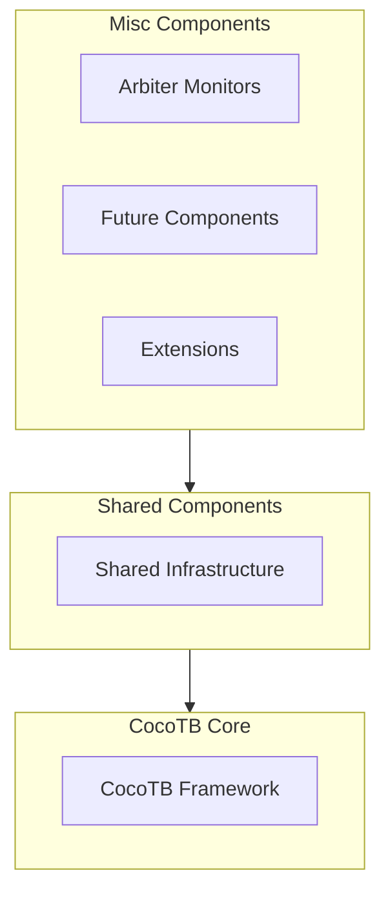

<!-- RTL Design Sherpa Documentation Header -->
<table>
<tr>
<td width="80">
  <a href="https://github.com/sean-galloway/RTLDesignSherpa-DV">
    
  </a>
</td>
<td>
  <strong>CocoTB Framework</strong> · <em>Verification Infrastructure for RTL Testing</em><br>
  <sub>
    <a href="https://github.com/sean-galloway/RTLDesignSherpa-DV">GitHub</a> ·
    <a href="https://github.com/sean-galloway/RTLDesignSherpa/blob/main/docs/DOCUMENTATION_INDEX.md">Documentation Index</a> ·
    <a href="https://github.com/sean-galloway/RTLDesignSherpa/blob/main/LICENSE">MIT License</a>
  </sub>
</td>
</tr>
</table>

---

<!-- End Header -->

# Misc Components Overview

The misc section is where verification components live when they don't belong to a protocol family. Arbitration is the current example: it shows up *inside* designs — bus fabrics, schedulers, DMA engines — rather than on a port you can hang a BFM on, so it doesn't fit under GAXI, FIFO, APB, or AXI4. It still needs verifying, though, and arbiters have a real talent for failing quietly.

> **Note:** These modules live under `src/CocoTBFramework/components/shared/` (e.g. `arbiter_monitor.py`); import them from `CocoTBFramework.components.shared`.

## Architecture Overview

Misc components build on the same shared infrastructure as everything else in the framework — different problem, same foundation:



## Current Components

### **Arbiter Monitoring**

Monitors that sit on arbitration logic and grade its behavior — fairness, order, weight compliance:

- **arbiter_monitor.py**: Round-robin and weighted round-robin monitoring, built on a shared base with per-scheme analysis

**Key Features:**
- Full transaction records with request-to-grant timing
- Fairness scoring via Jain's fairness index
- Round-robin order and weight compliance checking
- Statistics you can poll while the test runs
- Callbacks for transaction and reset events

## Design Principles

### 1. **Specialized Functionality**
Each component here does one job that doesn't fit a protocol category. If it could live under GAXI, it would.

### 2. **Reusable Design**
Nothing here is tied to a particular DUT. Hand the component your signal handles and it works in any testbench with the same kind of logic.

### 3. **Thorough Monitoring**
Counting grants isn't enough — that's a waveform viewer with extra steps. Components here record transactions: who asked, who won, how long they waited.

### 4. **Event-Driven Architecture**
Components report through callbacks, so you can feed a scoreboard, a coverage model, or your own analysis without subclassing anything.

### 5. **Performance**
Monitors sample on the clock and keep bounded history, so leaving one attached for a million-cycle soak test is not going to hurt.

## Component Categories

### Arbitration Monitoring
Components that watch arbitration logic, measure fairness, and check priority schemes.

**Current Components:**
- `ArbiterMonitor`: the base monitor — scheme-agnostic recording and statistics
- `RoundRobinArbiterMonitor`: adds round-robin rotation checking
- `WeightedRoundRobinArbiterMonitor`: adds weight compliance analysis

**Common Use Cases:**
- Catching starvation in multi-master systems
- Checking that a "round-robin" arbiter actually rotates
- Verifying grant distribution against programmed weights
- Debugging priority violations from a transaction record instead of a waveform

## Integration Patterns

### Typical Usage Flow

Every integration has the same shape — construct, hook up callbacks, start, analyze:

```python
# 1. Create arbiter monitor
arbiter_monitor = RoundRobinArbiterMonitor(
    dut=dut,
    title="Bus_Arbiter",
    clock=dut.clk,
    reset_n=dut.reset_n,
    req_signal=dut.req,
    gnt_valid_signal=dut.gnt_valid,
    gnt_signal=dut.gnt,
    gnt_id_signal=dut.gnt_id
)

# 2. Add callbacks for events
arbiter_monitor.add_transaction_callback(scoreboard.record_arbitration)

# 3. Start monitoring
arbiter_monitor.start_monitoring()

# 4. Run test and analyze results
await run_test_sequence()
stats = arbiter_monitor.get_stats_summary()
```

## Future Extensions

This directory is the landing spot for new non-protocol components. On the list:

### Planned Component Types
- **Protocol Bridges**: Monitors for protocol conversion interfaces
- **Memory Controllers**: Specialized monitors for memory subsystems  
- **Clock Domain Crossings**: CDC verification components
- **Power Management**: Power state monitoring and verification
- **Debug Interfaces**: Monitors for debug protocols (JTAG, etc.)

### Extension Guidelines
If you're adding a component here:
1. Follow the framework's existing patterns — signal handling, callbacks, `start_monitoring()`
2. Record real statistics, not just event counts
3. Fail loudly on missing signals and malformed data
4. Report through callbacks so others can integrate without subclassing
5. Document the API with working examples, the way these pages do

## Performance Characteristics

### Signal Monitoring
- Edge-based sampling keeps simulation overhead low
- Sampling timing is arranged to avoid races with DUT outputs
- X/Z states during reset don't turn into phantom transactions

### Memory Efficiency
- Bounded history, so long tests can't grow storage without limit
- History depth is configurable when you need less (or more)
- Transaction records are plain data, cheap to keep around

### Real-time Analysis
- Statistics update as transactions complete, not at end of test
- Fairness and per-client numbers are queryable mid-simulation
- The monitor's own overhead stays out of the DUT's way

## Testing Strategy

These components get the same treatment as the rest of the framework:
- Unit tests for the component logic
- Integration tests against real arbiter designs
- Performance benchmarks to keep monitoring overhead honest
- Compatibility tests across cocotb versions

## Getting Started

1. **Monitoring an arbiter**: Start with `arbiter_monitor.py`
2. **Writing something new**: Use an existing component as the template
3. **Integrating**: The patterns are the same as the rest of the framework
4. **Extending**: Follow the design principles and guidelines above

Each component page has the full API, working examples, and the integration notes to go with them.

## Component Documentation

- [**arbiter_monitor.py**](components_misc_arbiter_monitor.md): Complete API reference and usage examples for the arbiter monitors
