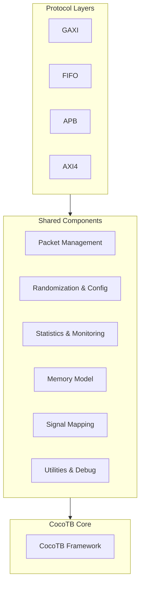

<!-- RTL Design Sherpa Documentation Header -->
<table>
<tr>
<td width="80">
  <a href="https://github.com/sean-galloway/RTLDesignSherpa-DV">
    
  </a>
</td>
<td>
  <strong>CocoTB Framework</strong> · <em>Verification Infrastructure for RTL Testing</em><br>
  <sub>
    <a href="https://github.com/sean-galloway/RTLDesignSherpa-DV">GitHub</a> ·
    <a href="https://github.com/sean-galloway/RTLDesignSherpa/blob/main/docs/DOCUMENTATION_INDEX.md">Documentation Index</a> ·
    <a href="https://github.com/sean-galloway/RTLDesignSherpa/blob/main/LICENSE">MIT License</a>
  </sub>
</td>
</tr>
</table>

---

<!-- End Header -->

# Shared Components Overview

Everything in this directory exists because every protocol family needed it. Packets, field configs, randomization, statistics, memory modeling, signal mapping — the protocol BFMs (GAXI, FIFO, APB, AXI4) are built on top of these pieces, and none of it knows which protocol it's serving. When you find yourself reaching for the same helper in two different testbenches, this is where it belongs.

## Architecture Overview

The shared components sit between the protocol layers and cocotb itself:



## Component Categories

### **Packet Management & Data Handling**
The core data structures and the fast paths that move field values in and out of them:

- **packet.py**: Thread-safe generic packet class with field caching
- **packet_factory.py**: Factory pattern for packet creation and management  
- **field_config.py**: Rich field configuration with validation and encoding
- **data_strategies.py**: High-performance data collection/driving with signal caching

**Key Features:**
- Protocol-agnostic packet handling
- Automatic field validation and masking
- Thread-safe operations for parallel testing
- Caching where the hot loops are
- FIFO packing/unpacking support

### **Randomization & Configuration**
Directed and constrained-random stimulus, from simple weighted bins to field dependencies:

- **flex_randomizer.py**: Multi-mode randomization engine (constrained, sequence, custom)
- **flex_config_gen.py**: Helper for creating weighted randomization profiles
- **randomization_config.py**: High-level randomization configuration framework

**Key Features:**
- Constrained random with weighted bins
- Sequence-based deterministic patterns
- Custom generator functions
- Object bin support (non-numeric values)
- Dependency management between fields
- Pre-defined timing profiles

### **Statistics & Monitoring**
The numbers that tell you what the test actually did:

- **master_statistics.py**: Statistics for master/slave components (latency, throughput, errors)
- **monitor_statistics.py**: Basic monitor statistics (transactions, violations)

**Key Features:**
- Real-time performance metrics
- Moving window averages
- Error categorization and tracking
- Protocol violation detection
- Reporting you can paste into a bug ticket

### **Memory & Storage**
The memory model your slave BFMs and scoreboards talk to:

- **memory_model.py**: NumPy-based memory with access tracking and region management

**Key Features:**
- NumPy backend for bulk operations
- Per-address access tracking
- Named region management
- Boundary checking and validation
- Coverage analysis
- Detailed memory dumps

### **Protocol Support**
Signal discovery and error injection — the infrastructure the protocol BFMs stand on:

- **signal_mapping_helper.py**: Automatic signal discovery and mapping for GAXI/FIFO
- **protocol_error_handler.py**: Generic error injection for testing error handling

**Key Features:**
- Pattern-based signal discovery
- Manual signal mapping override
- Prefix handling for cocotb compatibility
- Error region and transaction management
- Protocol violation simulation

### **Utilities & Debug**
The small tools that save debug time:

- **debug_object.py**: Object inspection and detailed logging utilities

## Design Principles

### 1. **Protocol Agnostic**
Nothing in the shared layer knows which protocol it's serving. GAXI, FIFO, APB, AXI4 — the same packet, randomizer, and memory model work for all of them unmodified.

### 2. **Performance Optimized**
The optimizations live where the cycles are:
- Thread-safe caching for parallel testing
- NumPy backend for memory operations  
- Pre-computed field validation rules
- Cached signal references in the per-cycle loops

### 3. **Flexible Configuration**
- Real configuration classes with validation, not bare dicts
- Multiple randomization modes
- Configurable statistics collection
- Field encoding and formatting hooks

### 4. **Comprehensive Error Handling**
- Error messages with caller context, not bare exceptions
- Graceful degradation for optional features
- Validation that tells you what's wrong and usually how to fix it

### 5. **Rich Debugging Support**
- Logging at multiple levels
- Object inspection utilities
- Performance statistics and cache hit rates
- Rich table formatting for configuration display

## Integration Patterns

### Typical Component Usage Flow

```python
# 1. Configure fields
field_config = FieldConfig()
field_config.add_field(FieldDefinition("addr", 32, format="hex"))
field_config.add_field(FieldDefinition("data", 32, format="hex"))

# 2. Create packet factory
factory = PacketFactory(MyPacket, field_config)

# 3. Set up randomization
randomizer = FlexRandomizer({
    'addr': ([(0x1000, 0x2000)], [1.0]),
    'data': ([(0, 0xFFFF)], [1.0])
})

# 4. Create memory model
memory = MemoryModel(num_lines=256, bytes_per_line=4, log=log)

# 5. Set up statistics
stats = MasterStatistics()

# 6. Resolve signals (automatic or manual)
resolver = SignalResolver('gaxi_master', dut, bus, log, 'MyMaster')
resolver.apply_to_component(component)
```

### Cross-Component Integration

The pieces are designed to fit together, and the seams are deliberate:

- **Packets** get their structure from **FieldConfig** and are built by **PacketFactory**
- **Randomization** components fill **Packet** fields with generated values
- **Statistics** components count what **Masters/Slaves/Monitors** do
- **MemoryModel** consumes **Packets** for transaction-based read/write
- **SignalResolver** bridges **CocoTB** signals to component attributes — the exact handles that **data_strategies** then caches

## Performance Characteristics

### Thread Safety
- Caching uses RLock throughout, so components are safe in parallel test environments
- Statistics collection is atomic and consistent

### Memory Efficiency  
- Field caching avoids repeated per-access computation
- NumPy backend for large memory operations
- Cached signal references instead of repeated lookups
- Moving-window statistics so history doesn't grow without bound

### Performance Gains
Measured against the naive implementations they replaced:
- 40% faster data collection through cached signal references
- 30% faster data driving through cached driving functions  
- No per-cycle `hasattr()`/`getattr()` calls
- Pre-computed field validation rules

## Testing & Validation

The shared components validate their own inputs:

- **Field validation** with specific error messages
- **Signal mapping validation** with detailed diagnostics
- **Memory boundary checking** with overflow protection
- **Randomization constraint validation** with type checking
- **Thread-safe cache verification** for parallel testing

## Future Extensions

The architecture leaves room to grow:

- New protocol support through signal mapping patterns
- Additional randomization modes in FlexRandomizer
- Custom metrics in the statistics classes
- Extended memory model features (compression, persistence)
- Additional debugging and profiling utilities

## Getting Started

Where to start depends on what you're building:

1. **For Packet Handling**: Start with `field_config.py` and `packet.py`
2. **For Randomization**: Begin with `flex_randomizer.py` and `flex_config_gen.py` 
3. **For Memory Testing**: Use `memory_model.py` with your protocol components
4. **For Signal Mapping**: Start with `signal_mapping_helper.py` for automatic discovery
5. **For Statistics**: Integrate `master_statistics.py` or `monitor_statistics.py`

Each component's page has the full API, examples, and the gotchas worth knowing before you wire it into a testbench.

---
