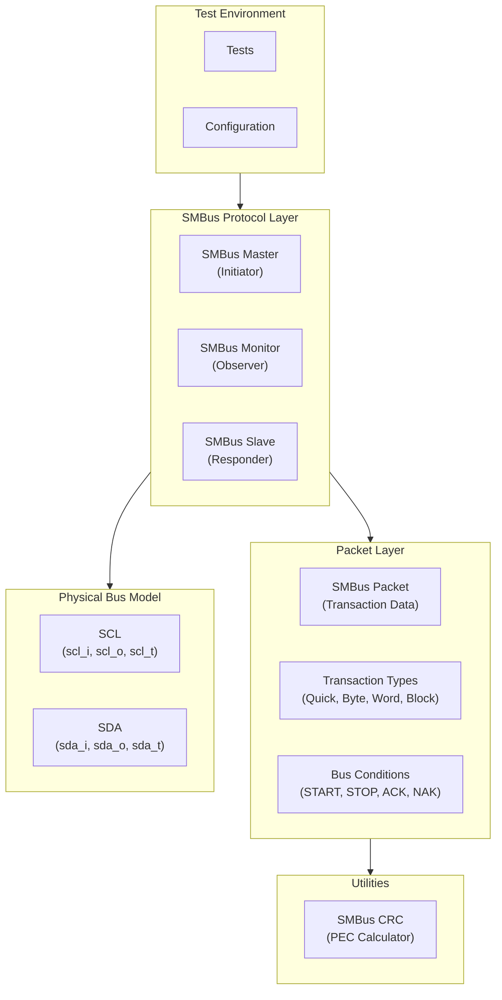

# SMBus Components Overview

The SMBus (System Management Bus) components provide a complete verification environment for the SMBus/I2C protocol. These components implement passive monitoring, active master emulation, and active slave emulation using tristate (open-drain) signal interfaces, supporting all SMBus 2.0 transaction types including Packet Error Checking (PEC).

## Architecture Overview

The SMBus components use a signal-level architecture that models the open-drain behavior of the physical SMBus/I2C interface:



## Component Categories

### Protocol Implementation
Core SMBus protocol components that handle signal-level communication:

- **SMBusMaster**: Initiates SMBus transactions with bit-level bus control
- **SMBusSlave**: Responds to SMBus transactions with memory-mapped register model
- **SMBusMonitor**: Passively observes and captures bus transactions

**Key Features:**
- Tristate (open-drain) signal interface for realistic bus modeling
- All SMBus 2.0 transaction types supported
- Bit-level bus control with configurable clock period
- START, STOP, and repeated START condition generation and detection
- ACK/NAK handling with proper bus release semantics
- Clock stretching support (slave)

### Packet & Transaction Management
Transaction representation and bus condition tracking:

- **SMBusPacket**: Complete transaction record with timing, data, and status
- **SMBusTransactionType**: Enumeration of all SMBus 2.0 transaction types
- **SMBusCondition**: Enumeration of bus conditions (START, STOP, ACK, NAK)

**Key Features:**
- Dataclass-based packet with all transaction fields
- Compact and detailed formatting for logging
- Status tracking (ACK, timeout, arbitration lost, PEC verification)
- Word data extraction with LSB-first byte ordering
- Deep copy support for transaction queuing

### CRC Utility
- **SMBusCRC**: CRC-8 calculator implementing the SMBus PEC polynomial

## SMBus Protocol Support

### Transaction Types

| Type | Enum Value | Description | Data Bytes |
|------|------------|-------------|------------|
| Quick Command | QUICK_CMD (0) | Address-only transaction | 0 |
| Send Byte | SEND_BYTE (1) | Master sends 1 byte, no command | 1 |
| Receive Byte | RECV_BYTE (2) | Master receives 1 byte, no command | 1 |
| Write Byte | WRITE_BYTE (3) | Command + 1 data byte | 1 cmd + 1 data |
| Read Byte | READ_BYTE (4) | Command + 1 data byte | 1 cmd + 1 data |
| Write Word | WRITE_WORD (5) | Command + 2 data bytes | 1 cmd + 2 data |
| Read Word | READ_WORD (6) | Command + 2 data bytes | 1 cmd + 2 data |
| Block Write | BLOCK_WRITE (7) | Command + count + N data bytes | 1 cmd + 1 count + N data |
| Block Read | BLOCK_READ (8) | Command + count + N data bytes | 1 cmd + 1 count + N data |
| Block Process Call | BLOCK_PROC (9) | Block write followed by block read | Variable |

### Bus Conditions

| Condition | Value | Description |
|-----------|-------|-------------|
| IDLE | 0 | Bus is idle |
| START | 1 | START condition (SDA falls while SCL high) |
| STOP | 2 | STOP condition (SDA rises while SCL high) |
| REPEATED_START | 3 | Repeated START within a transaction |
| ACK | 4 | Acknowledge (SDA low during 9th clock) |
| NAK | 5 | Not Acknowledge (SDA high during 9th clock) |

### Tristate Signal Interface

The SMBus components use a tristate interface to model the open-drain behavior of the physical bus:

| Signal | Type | Description |
|--------|------|-------------|
| `scl_i` | Input | SCL line state (read from bus) |
| `scl_o` | Output | SCL drive value (0 to pull low) |
| `scl_t` | Output | SCL tristate control (1=release/input, 0=drive) |
| `sda_i` | Input | SDA line state (read from bus) |
| `sda_o` | Output | SDA drive value (0 to pull low) |
| `sda_t` | Output | SDA tristate control (1=release/input, 0=drive) |

**Open-drain semantics:**
- To **release** a line (allow pull-up): set `_t=1`
- To **drive low**: set `_t=0` and `_o=0`
- The monitor uses only `_i` signals for passive observation

## Design Principles

### 1. **Accurate Bus Modeling**
- Tristate interface faithfully models open-drain behavior
- Proper START/STOP condition generation with correct timing
- ACK/NAK follows SMBus protocol with proper bus release
- Clock stretching support for slave-paced transactions

### 2. **Complete Protocol Coverage**
- All SMBus 2.0 transaction types implemented
- Repeated START for read-after-write operations
- PEC (Packet Error Checking) support via CRC-8 utility
- Transaction status tracking (ACK, timeout, arbitration loss)

### 3. **Flexible Configuration**
- Configurable slave address (7-bit)
- Configurable SCL clock period for master
- Configurable memory size for slave register model
- Configurable clock stretching delay
- Optional PEC support per component

### 4. **Ease of Use**
- High-level transaction methods (write_byte_data, read_byte_data, block_write, etc.)
- Automatic address byte construction with R/W bit
- Callback support for monitor notifications
- Start/stop lifecycle management for all components

## Usage Patterns

### Basic Master-Slave Communication

```python
import cocotb
from CocoTBFramework.components.smbus import SMBusMaster, SMBusSlave, SMBusMonitor

@cocotb.test()
async def basic_smbus_test(dut):
    # Create components
    master = SMBusMaster(
        entity=dut, title="Master",
        scl_i='smb_scl_i', scl_o='smb_scl_o', scl_t='smb_scl_t',
        sda_i='smb_sda_i', sda_o='smb_sda_o', sda_t='smb_sda_t',
        clock_period_ns=10000
    )

    slave = SMBusSlave(
        entity=dut, title="Slave",
        scl_i='smb_scl_i', scl_o='smb_scl_o', scl_t='smb_scl_t',
        sda_i='smb_sda_i', sda_o='smb_sda_o', sda_t='smb_sda_t',
        slave_addr=0x50,
        memory_size=256
    )

    monitor = SMBusMonitor(
        entity=dut, title="Monitor",
        scl_signal='smb_scl_i',
        sda_signal='smb_sda_i'
    )

    # Start slave and monitor
    slave.start()
    monitor.start()

    # Perform write
    result = await master.write_byte_data(
        slave_addr=0x50, command=0x10, data=0xAB
    )

    # Perform read
    result = await master.read_byte_data(
        slave_addr=0x50, command=0x10
    )
```

### Block Transfer Testing

```python
@cocotb.test()
async def block_transfer_test(dut):
    master = SMBusMaster(dut, "Master",
        clock_period_ns=5000)  # 200kHz
    slave = SMBusSlave(dut, "Slave", slave_addr=0x50)

    slave.start()

    # Block write
    data = [0x11, 0x22, 0x33, 0x44, 0x55]
    result = await master.block_write(
        slave_addr=0x50, command=0x00, data=data
    )

    # Block read
    result = await master.block_read(
        slave_addr=0x50, command=0x00, max_bytes=32
    )

    print(f"Read {len(result.data)} bytes: {result.data}")
```

### Pre-loading Slave Memory

```python
@cocotb.test()
async def preloaded_memory_test(dut):
    slave = SMBusSlave(dut, "Slave", slave_addr=0x50)

    # Pre-load register values
    slave.write_memory(0x00, [0xAA, 0xBB, 0xCC, 0xDD])
    slave.write_memory(0x10, [0x11, 0x22, 0x33])

    slave.start()

    # Master reads will return pre-loaded values
    master = SMBusMaster(dut, "Master")
    result = await master.read_byte_data(slave_addr=0x50, command=0x00)
    # result.data[0] == 0xAA
```

## Integration with Framework

### Standalone Components
Unlike the APB and AXI components, the SMBus components are standalone implementations that do not inherit from cocotb_bus base classes. They directly manage signal handles and cocotb coroutines for bus interaction.

### Packet System
- **SMBusPacket**: Dataclass-based (not derived from framework Packet base class)
- **Transaction Types**: IntEnum for type-safe transaction identification
- **Bus Conditions**: IntEnum for bus state tracking

### Statistics and Monitoring
Each component tracks operational statistics:
- **Monitor**: `transaction_count`, `recv_queue`
- **Slave**: `transaction_count`, `ack_count`, `nak_count`
- **Master**: `transaction_count`

## Key Features

### Transaction Management
- **High-level API**: Methods for each SMBus transaction type
- **Automatic Protocol**: START, address, command, data, STOP handled internally
- **Repeated START**: Automatic for read transactions requiring command phase
- **Status Tracking**: ACK/NAK, timeout, arbitration, PEC results

### Memory Integration
- **Slave Memory Model**: Dictionary-based memory with configurable size
- **Address Auto-increment**: Automatic address advancement during transfers
- **Pre-loading**: Write data into slave memory before test starts
- **Memory Access**: Read/write/clear methods for verification

### Verification Support
- **Passive Monitor**: Non-interfering transaction capture
- **Callback Support**: Monitor notifies on transaction completion
- **Packet Formatting**: Compact and detailed display formats
- **Transaction Parsing**: Automatic type detection from byte patterns

## Getting Started

### Quick Setup
1. **Import Components**: `from CocoTBFramework.components.smbus import *`
2. **Create Slave**: Configure address and memory, call `start()`
3. **Create Monitor**: Connect to input signals, call `start()`
4. **Create Master**: Configure clock period
5. **Run Transactions**: Use high-level methods (write_byte_data, read_byte_data, etc.)

### Advanced Usage
1. **PEC Support**: Enable `support_pec=True` and use SMBusCRC for verification
2. **Clock Stretching**: Configure `clock_stretch_cycles` on the slave
3. **Custom Signal Names**: Override default signal names to match your DUT
4. **Memory Pre-loading**: Use `slave.write_memory()` to set initial register state
5. **Transaction Monitoring**: Register callbacks on the monitor for real-time observation

Each component provides start/stop lifecycle management, allowing dynamic activation during different test phases.
