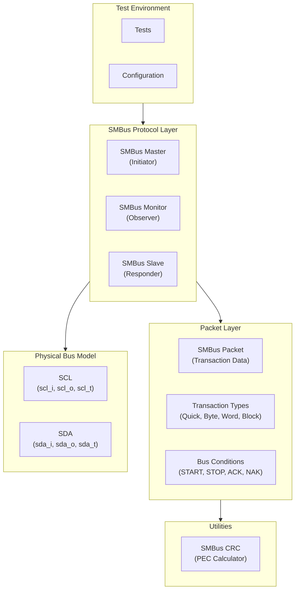

# SMBus Components Overview

The SMBus (System Management Bus) components give you everything that sits on an SMBus/I2C bus except the DUT: a passive monitor, an active master, and an active slave, all working over tristate (open-drain) signal interfaces. All SMBus 2.0 transaction types are supported, Packet Error Checking (PEC) included.

## Architecture Overview

Everything is built on a signal-level model of the open-drain bus — the same wired-AND behavior your PCB has, reproduced in coroutines:


```mermaid
graph TB
    subgraph TestEnv["Test Environment"]
        Tests[Tests]
        Config[Configuration]
    end

    subgraph SMBusLayer["SMBus Protocol Layer"]
        Master["SMBus Master<br/>(Initiator)"]
        Monitor["SMBus Monitor<br/>(Observer)"]
        Slave["SMBus Slave<br/>(Responder)"]
    end

    subgraph PacketLayer["Packet Layer"]
        Packet["SMBus Packet<br/>(Transaction Data)"]
        TransType["Transaction Types<br/>(Quick, Byte, Word, Block)"]
        Condition["Bus Conditions<br/>(START, STOP, ACK, NAK)"]
    end

    subgraph Utility["Utilities"]
        CRC["SMBus CRC<br/>(PEC Calculator)"]
    end

    subgraph Bus["Physical Bus Model"]
        SCL["SCL<br/>(scl_i, scl_o, scl_t)"]
        SDA["SDA<br/>(sda_i, sda_o, sda_t)"]
    end

    TestEnv --> SMBusLayer
    SMBusLayer --> PacketLayer
    SMBusLayer --> Bus
    PacketLayer --> Utility
```

## Component Categories

### Protocol Implementation
The pieces that touch wires:

- **SMBusMaster**: initiates transactions, bit-banging the bus itself
- **SMBusSlave**: answers transactions out of a memory-mapped register model
- **SMBusMonitor**: observes the bus and captures transactions without driving anything

What that buys you:
- Tristate (open-drain) signal interface, so releases and contention behave like real hardware
- All SMBus 2.0 transaction types supported
- Bit-level bus control with a configurable clock period
- START, STOP, and repeated START generation and detection
- ACK/NAK handling with proper bus release
- Clock stretching on the slave side

### Packet & Transaction Management
What a transaction looks like once it's off the wire:

- **SMBusPacket**: the complete record of a transaction — timing, data, and status
- **SMBusTransactionType**: enumeration of the SMBus 2.0 transaction types
- **SMBusCondition**: enumeration of bus conditions (START, STOP, ACK, NAK)

Packets are dataclasses with compact and detailed string formats for logging, status fields covering ACK, timeout, arbitration loss, and PEC verification, word-data extraction with LSB-first byte ordering, and deep-copy support so you can queue packets without aliasing surprises.

### CRC Utility
- **SMBusCRC**: the CRC-8 calculator behind PEC. One polynomial, one static method — nothing to configure.

## SMBus Protocol Support

### Transaction Types

All ten SMBus 2.0 transaction types are represented:

| Type | Enum Value | Description | Data Bytes |
|------|------------|-------------|------------|
| Quick Command | QUICK_CMD (0) | Address-only transaction | 0 |
| Send Byte | SEND_BYTE (1) | Master sends 1 byte, no command | 1 |
| Receive Byte | RECV_BYTE (2) | Master receives 1 byte, no command | 1 |
| Write Byte | WRITE_BYTE (3) | Command + 1 data byte | 1 cmd + 1 data |
| Read Byte | READ_BYTE (4) | Command + 1 data byte | 1 cmd + 1 data |
| Write Word | WRITE_WORD (5) | Command + 2 data bytes | 1 cmd + 2 data |
| Read Word | READ_WORD (6) | Command + 2 data bytes | 1 cmd + 2 data |
| Block Write | BLOCK_WRITE (7) | Command + count + N data bytes | 1 cmd + 1 count + N data |
| Block Read | BLOCK_READ (8) | Command + count + N data bytes | 1 cmd + 1 count + N data |
| Block Process Call | BLOCK_PROC (9) | Block write followed by block read | Variable |

### Bus Conditions

The conditions tracked on the wire:

| Condition | Value | Description |
|-----------|-------|-------------|
| IDLE | 0 | Bus is idle |
| START | 1 | START condition (SDA falls while SCL high) |
| STOP | 2 | STOP condition (SDA rises while SCL high) |
| REPEATED_START | 3 | Repeated START within a transaction |
| ACK | 4 | Acknowledge (SDA low during 9th clock) |
| NAK | 5 | Not Acknowledge (SDA high during 9th clock) |

### Tristate Signal Interface

The components talk to the bus through a tristate interface that mirrors open-drain hardware:

| Signal | Type | Description |
|--------|------|-------------|
| `scl_i` | Input | SCL line state (read from bus) |
| `scl_o` | Output | SCL drive value (0 to pull low) |
| `scl_t` | Output | SCL tristate control (1=release/input, 0=drive) |
| `sda_i` | Input | SDA line state (read from bus) |
| `sda_o` | Output | SDA drive value (0 to pull low) |
| `sda_t` | Output | SDA tristate control (1=release/input, 0=drive) |

Open-drain semantics — and yes, the `_t` polarity trips everyone up the first time:
- To **release** a line (let the pull-up take it): set `_t=1`
- To **drive low**: set `_t=0` and `_o=0`
- The monitor uses only the `_i` signals, so it physically cannot disturb the bus

`_t` reads like an output-enable but works backwards from one: 1 means *released*. Get that inverted and you'll be holding a line low while wondering why nobody ACKs.

## Design Principles

### 1. Model the bus like the hardware
The tristate interface reproduces open-drain behavior rather than approximating it: START/STOP conditions are generated with correct timing, ACK/NAK includes the bus release, and slaves can stretch the clock. The point is that a DUT bug which depends on real bus behavior shows up here too, instead of being papered over by an idealized model.

### 2. Cover the whole protocol
All SMBus 2.0 transaction types are implemented, reads use repeated START for read-after-write, PEC is available through the CRC-8 utility, and every transaction records its status — ACK, timeout, arbitration loss.

### 3. Configure what matters
Slave address, SCL period, register-file size, clock-stretch delay, PEC on or off — each component takes its own settings, so a fast master and a stretching slave can share one bus without special-casing anything.

### 4. Keep the API out of the way
There's a high-level method per transaction type (`write_byte_data`, `read_byte_data`, `block_write`, and so on), the address byte with its R/W bit is built for you, the monitor takes a callback, and every component has start/stop lifecycle control. You write the test; the components do the wiggling.

## Usage Patterns

### Basic Master-Slave Communication

The standard lineup — master, slave, and monitor on the same six signals:

```python
import cocotb
from CocoTBFramework.components.smbus import SMBusMaster, SMBusSlave, SMBusMonitor

@cocotb.test()
async def basic_smbus_test(dut):
    # Create components
    master = SMBusMaster(
        entity=dut, title="Master",
        scl_i='smb_scl_i', scl_o='smb_scl_o', scl_t='smb_scl_t',
        sda_i='smb_sda_i', sda_o='smb_sda_o', sda_t='smb_sda_t',
        clock_period_ns=10000
    )

    slave = SMBusSlave(
        entity=dut, title="Slave",
        scl_i='smb_scl_i', scl_o='smb_scl_o', scl_t='smb_scl_t',
        sda_i='smb_sda_i', sda_o='smb_sda_o', sda_t='smb_sda_t',
        slave_addr=0x50,
        memory_size=256
    )

    monitor = SMBusMonitor(
        entity=dut, title="Monitor",
        scl_signal='smb_scl_i',
        sda_signal='smb_sda_i'
    )

    # Start slave and monitor
    slave.start()
    monitor.start()

    # Perform write
    result = await master.write_byte_data(
        slave_addr=0x50, command=0x10, data=0xAB
    )

    # Perform read
    result = await master.read_byte_data(
        slave_addr=0x50, command=0x10
    )
```

### Block Transfer Testing

Block transfers at a brisker 200 kHz:

```python
@cocotb.test()
async def block_transfer_test(dut):
    master = SMBusMaster(dut, "Master",
        clock_period_ns=5000)  # 200kHz
    slave = SMBusSlave(dut, "Slave", slave_addr=0x50)

    slave.start()

    # Block write
    data = [0x11, 0x22, 0x33, 0x44, 0x55]
    result = await master.block_write(
        slave_addr=0x50, command=0x00, data=data
    )

    # Block read
    result = await master.block_read(
        slave_addr=0x50, command=0x00, max_bytes=32
    )

    print(f"Read {len(result.data)} bytes: {result.data}")
```

### Pre-loading Slave Memory

Stock the slave's registers before the master starts asking questions:

```python
@cocotb.test()
async def preloaded_memory_test(dut):
    slave = SMBusSlave(dut, "Slave", slave_addr=0x50)

    # Pre-load register values
    slave.write_memory(0x00, [0xAA, 0xBB, 0xCC, 0xDD])
    slave.write_memory(0x10, [0x11, 0x22, 0x33])

    slave.start()

    # Master reads will return pre-loaded values
    master = SMBusMaster(dut, "Master")
    result = await master.read_byte_data(slave_addr=0x50, command=0x00)
    # result.data[0] == 0xAA
```

## Integration with Framework

### Standalone Components
A departure from the APB and AXI families: the SMBus components don't inherit from cocotb_bus base classes. They manage their own signal handles and cocotb coroutines directly. In practice that means fewer layers between your test and the pins — and no inherited behavior to surprise you mid-debug.

### Packet System
- **SMBusPacket**: a plain dataclass, not derived from the framework's Packet base class
- **Transaction Types**: an IntEnum, so transaction identification is type-safe
- **Bus Conditions**: an IntEnum for bus state tracking

### Statistics and Monitoring
Each component keeps its own score:
- **Monitor**: `transaction_count`, `recv_queue`
- **Slave**: `transaction_count`, `ack_count`, `nak_count`
- **Master**: `transaction_count`

## Key Features

### Transaction Management
Each transaction type gets its own method, with START, address, command, data, and STOP handled inside it. Reads that need a command phase get their repeated START automatically. When the call returns, the packet carries the outcome: ACK/NAK, timeout, arbitration, PEC result.

### Memory Integration
The slave's register file is a plain dictionary with a configurable size. Addresses auto-increment during transfers the way real register interfaces do, you can pre-load contents before the test starts, and read/write/clear helpers are there for the scoreboard side.

### Verification Support
The monitor captures without interfering, classifies each transaction from its byte pattern, and fires a callback on completion. Packets print in compact or detailed form, so the same object serves a one-line log and a full protocol dump.

## Getting Started

### Quick Setup
1. **Import Components**: `from CocoTBFramework.components.smbus import *`
2. **Create the slave**: pick an address and memory size, then `start()` it
3. **Create the monitor**: point it at the input signals, `start()` it too
4. **Create the master**: pick an SCL period
5. **Talk**: `write_byte_data`, `read_byte_data`, and friends

### Advanced Usage
1. **PEC**: enable `support_pec=True` and verify with `SMBusCRC`
2. **Clock stretching**: give the slave `clock_stretch_cycles` to hold SCL low and pace the transfer
3. **Custom signal names**: override the defaults to match your DUT's port names
4. **Memory pre-loading**: `slave.write_memory()` sets the initial register state
5. **Monitor callbacks**: register one for real-time notification as each transaction completes

Everything runs under start/stop lifecycle control, so you can bring components up and down between test phases instead of rebuilding the world.
