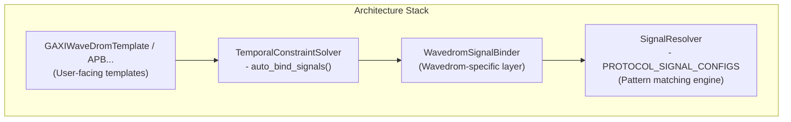

<!-- RTL Design Sherpa Documentation Header -->
<table>
<tr>
<td width="80">
  <a href="https://github.com/sean-galloway/RTLDesignSherpa-DV">
    
  </a>
</td>
<td>
  <strong>CocoTB Framework</strong> · <em>Verification Infrastructure for RTL Testing</em><br>
  <sub>
    <a href="https://github.com/sean-galloway/RTLDesignSherpa-DV">GitHub</a> ·
    <a href="https://github.com/sean-galloway/RTLDesignSherpa/blob/main/docs/DOCUMENTATION_INDEX.md">Documentation Index</a> ·
    <a href="https://github.com/sean-galloway/RTLDesignSherpa/blob/main/LICENSE">MIT License</a>
  </sub>
</td>
</tr>
</table>

---

<!-- End Header -->

# WaveDrom Automatic Signal Binding Guide

**Version:** 2.0 (SignalResolver Integration)
**Last Updated:** 2025-10-04
**Status:** Production Ready

---

## Overview

WaveDrom signal binding runs through SignalResolver, the same pattern-matching layer the BFMs use. Hand it a prefix and it finds the signals on your DUT; if your naming is unusual, `signal_map` gives you exact control. When discovery fails, the error message tells you which patterns it tried and which candidate signals it actually found on the DUT — you spend your time fixing the name, not hunting through hierarchy.

### What You Get

- **Automatic discovery** — each logical signal is matched against a list of naming patterns until one sticks
- **Manual override** — `signal_map` binds exactly what you say, no guessing
- **A printed mapping table** — you can see what got bound before the test runs
- **Errors that help** — failures list the valid-like signals present on the DUT and show the override syntax
- **Protocol coverage** — GAXI, APB, AXIS today, more as presets land

---

## Quick Start

!!! note "Wavedrom User Examples"
    The protocol-specific wavedrom user examples (`GAXIWaveDromTemplate`, `APBWaveDromTemplate`, etc.) are located in the [RTLDesignSherpa](https://github.com/sean-galloway/RTLDesignSherpa) repository under `tbclasses/wavedrom_user/`.

### GAXI WaveDrom (Simplest Case)

If your signals share a prefix, the whole setup is one constructor:

```python
# Import from the RTLDesignSherpa main repo (tbclasses/wavedrom_user/gaxi.py)
from CocoTBFramework.tbclasses.wavedrom_user.gaxi import GAXIWaveDromTemplate

@cocotb.test()
async def my_test(dut):
    # ONE LINE setup - automatic signal discovery!
    gaxi_wave = GAXIWaveDromTemplate(
        dut=dut,
        signal_prefix="wr_",       # Finds: wr_valid, wr_ready, wr_data
        data_width=32
    )

    await gaxi_wave.start_sampling()

    # Run your test...
    # ...

    results = await gaxi_wave.stop_sampling()
    gaxi_wave.get_status()
```

Discovery, binding, constraint setup, and the WaveJSON generator are all wired up behind that call.

### APB WaveDrom

Same shape, APB signals:

```python
# Import from the RTLDesignSherpa main repo (tbclasses/wavedrom_user/apb.py)
from CocoTBFramework.tbclasses.wavedrom_user.apb import APBWaveDromTemplate

@cocotb.test()
async def my_apb_test(dut):
    # ONE LINE setup - automatic APB signal discovery!
    apb_wave = APBWaveDromTemplate(
        dut=dut,
        signal_prefix="apb_",      # Finds: apb_psel, apb_penable, etc.
        data_width=32,
        addr_width=32
    )

    await apb_wave.start_sampling()

    # Run APB transactions...
    # ...

    results = await apb_wave.stop_sampling()
```

---

## How Automatic Discovery Works

### Pattern Matching

SignalResolver doesn't take one guess and give up — it walks a list of patterns per logical signal and uses the first that exists on the DUT:

#### GAXI Example (prefix='wr_'):
- `valid` signal: tries `wr_valid`, `wr_gaxi_valid`, `wr_m2s_valid`, etc.
- `ready` signal: tries `wr_ready`, `wr_gaxi_ready`, `wr_s2m_ready`, etc.
- `data` signal: tries `wr_data`, `wr_pkt`, `wr_packet`, etc.

#### APB Example (prefix='apb_'):
- `psel` signal: tries `apb_psel`, `apb_PSEL`, `s_apb_psel`, etc.
- `penable` signal: tries `apb_penable`, `apb_PENABLE`, etc.
- `paddr` signal: tries `apb_paddr`, `apb_PADDR`, `apb_addr`, etc.

### The Mapping Table

Discovery prints what it bound. Read this table once when you bring up a new bench — a wrong match here explains every strange waveform downstream:

| Logical Signal | Matched Signal | Cocotb Signal | Status |
|----------------|----------------|---------------|--------|
| valid | wr_valid | valid | Found |
| ready | wr_ready | ready | Found |
| data_sig | wr_data | data | Found (Optional) |

*Signal mapping for GAXI WaveDrom (gaxi_wavedrom), automatic discovery*

---

## Template Classes

### GAXIWaveDromTemplate

```python
class GAXIWaveDromTemplate:
    def __init__(self,
                 dut,
                 signal_prefix: str = "gaxi_",
                 data_width: int = 32,
                 addr_width: int = 0,
                 ctrl_width: int = 0,
                 num_data_fields: int = 1,
                 preset: str = "comprehensive",
                 bus_name: str = '',
                 pkt_prefix: str = '',
                 signal_map: Optional[Dict[str, str]] = None,
                 clock_signal = None)
```

**Parameters:**
- `signal_prefix`: prefix prepended to discovered names (`'wr_'`, `'cmd_'`, `'s_'`, ...)
- `data_width`: data field width
- `preset`: which constraint set to load:
  - `'comprehensive'`: all handshake patterns (default)
  - `'basic_handshake'`: plain valid/ready
  - `'performance'`: throughput analysis
  - `'debug'`: debug patterns
- `signal_map`: manual override (see below)
- `clock_signal`: auto-detected when None (tries `axi_aclk`, `i_clk`, `clk`)

### APBWaveDromTemplate

```python
class APBWaveDromTemplate:
    def __init__(self,
                 dut,
                 signal_prefix: str = "apb_",
                 data_width: int = 32,
                 addr_width: int = 32,
                 preset: str = "comprehensive",
                 bus_name: str = '',
                 signal_map: Optional[Dict[str, str]] = None,
                 clock_signal = None)
```

**Parameters:**
- `signal_prefix`: prefix prepended to discovered names (`'apb_'`, `'s_apb_'`, `''`)
- `preset`: which constraint set to load:
  - `'comprehensive'`: full APB protocol analysis (default)
  - `'basic_rw'`: read/write transactions only
  - `'timing'`: timing and wait state analysis
  - `'debug'`: debug patterns
  - `'error'`: error-focused
- `signal_map`: manual override
- `clock_signal`: auto-detected (tries `pclk`, `apb_pclk`, `i_clk`, `clk`)

---

## Manual Signal Override

### When You Need It

Reach for `signal_map` when you have:

- Non-standard signal naming
- A prefix the pattern lists don't cover
- Legacy RTL you can't rename
- Or when you just want one signal pinned without touching anything else

### GAXI Manual Override

```python
gaxi_wave = GAXIWaveDromTemplate(
    dut,
    signal_prefix="",  # Empty - using manual map
    data_width=32,
    signal_map={
        'valid': 'weird_valid_name',
        'ready': 'custom_ready_sig',
        'data': 'pkt_data_field'
    }
)
```

### APB Manual Override

```python
apb_wave = APBWaveDromTemplate(
    dut,
    signal_prefix="",
    data_width=32,
    addr_width=32,
    signal_map={
        'psel': 'chip_select',
        'penable': 'enable_sig',
        'pwrite': 'wr_en',
        'pready': 'slave_ready',
        'paddr': 'address_bus',
        'pwdata': 'write_data',
        'prdata': 'read_data'
    }
)
```

---

## Multi-Field Protocols

### Multiple Data Fields (GAXI)

For packet-style interfaces, describe the fields once and discovery looks for one signal per field:

```python
from CocoTBFramework.components.shared.field_config import FieldConfig, FieldDefinition

# Create field configuration
field_config = FieldConfig()
field_config.add_field(FieldDefinition('addr', bits=32))
field_config.add_field(FieldDefinition('data', bits=64))
field_config.add_field(FieldDefinition('ctrl', bits=8))

gaxi_wave = GAXIWaveDromTemplate(
    dut,
    signal_prefix="wr_",
    data_width=0,  # Not used when field_config provided
    field_config=field_config  # Signal discovery will find: wr_addr, wr_data, wr_ctrl
)
```

---

## Error Handling

### When a Signal Isn't Found

Setup fails loudly, and the message is long on purpose: it shows the patterns tried, the valid-like signals that do exist on the DUT, and the `signal_map` line that would fix it.

```
🚨 CRITICAL: No valid signal found for GAXI WaveDrom!

Component: GAXI WaveDrom
Protocol: gaxi_wavedrom
Mode: single-signal (multi_sig=False)
Bus name: '' (empty means no bus prefix)

This component REQUIRES a valid signal for proper operation.

💡 TROUBLESHOOTING:
1. Check signal naming - expected patterns:
   - valid (current prefix + 'valid')
   - wr_valid (for write-side)
   - m2s_valid (master-to-slave)

2. Available valid-like signals found on DUT:
   DATA_VALID, cmd_valid, wr_v

3. Use manual signal_map to specify correct signal:
   signal_map={'valid': 'cmd_valid'}

4. Check signal_prefix parameter - currently: 'wr_'
   If your signals have a different prefix, update signal_prefix
```

---

## Architecture Overview

### Component Stack



### Signal Flow

1. **Template init** — you create `GAXIWaveDromTemplate(dut, signal_prefix='wr_')`
2. **Auto-bind** — the template calls `wave_solver.auto_bind_signals('gaxi', signal_prefix='wr_')`
3. **Wavedrom binder** — builds a `WavedromSignalBinder` with protocol='gaxi_wavedrom'
4. **Signal resolver** — pulls its patterns from `PROTOCOL_SIGNAL_CONFIGS['gaxi_wavedrom']`
5. **Pattern match** — tries each combination in turn: `wr_valid`, `wr_gaxi_valid`, ...
6. **Binding** — matched signals are bound to the solver via `add_signal_binding()`
7. **Display** — the mapping table is printed

---

## Configuration Files

### Adding New Protocols

Teaching discovery a new protocol takes three edits:

**1. Add patterns to `signal_mapping_helper.py`:**

```python
PROTOCOL_SIGNAL_CONFIGS = {
    # ... existing configs ...

    'myprotocol_wavedrom': {
        'signal_map': {
            'req': ['{prefix}{bus_name}req', '{prefix}{bus_name}request'],
            'ack': ['{prefix}{bus_name}ack', '{prefix}{bus_name}acknowledge'],
        },
        'optional_signal_map': {
            'multi_sig_false': ['{prefix}{bus_name}data'],
            'multi_sig_true': ['{prefix}{bus_name}{field_name}']
        }
    }
}
```

**2. Add protocol type handling in `signal_mapping_helper.py`:**

```python
# In _resolve_optional_signals() method:
elif self.protocol_type in ['myprotocol_master', 'myprotocol_slave', 'myprotocol_wavedrom']:
    signal_obj = self._find_signal_match('data_sig', patterns, required=False)
    self.resolved_signals['data_sig'] = signal_obj
```

**3. Create template class** (similar to `GAXIWaveDromTemplate`)

---

## Testing

### Test Your Wavedrom Setup

```python
@cocotb.test()
async def test_wavedrom(dut):
    # Setup wavedrom
    wave = GAXIWaveDromTemplate(dut, signal_prefix="wr_", data_width=32)

    await wave.start_sampling()

    # Generate transactions
    for i in range(5):
        dut.wr_valid.value = 1
        dut.wr_data.value = 0xA000 + i
        await RisingEdge(dut.clk)
        dut.wr_valid.value = 0
        await RisingEdge(dut.clk)

    # Get results
    results = await wave.stop_sampling()

    # Verify
    assert len(results['solutions']) > 0, "Should find patterns"
    assert 'wr_handshake' in results['satisfied_constraints']

    wave.get_status()  # Print summary
```

### View Generated WaveJSON

One WaveJSON file per matched scenario lands next to the sim output:

- `wr_handshake_001.json`
- `wr_back2back_001.json`
- `wr_stall_001.json`
- etc.

View at: https://wavedrom.com/editor.html

---

## Advanced Usage

### Custom Constraints with Auto-Binding

You can drive the solver directly, write your own constraints, and still get discovery for the signals:

```python
# Create solver with auto-binding
wave_solver = TemporalConstraintSolver(dut=dut, log=dut._log)
wave_solver.add_clock_group('default', dut.clk)

# Auto-bind signals
# Note: providing signal_map bypasses automatic discovery entirely,
# so list ALL required signals when using it
num_signals = wave_solver.auto_bind_signals(
    protocol_type='gaxi',
    signal_prefix='',
    signal_map={
        'valid': 'custom_valid',
        'ready': 'wr_ready',
        'data': 'wr_data'
    }
)

# Add custom constraints
custom_constraint = TemporalConstraint(
    name="my_pattern",
    events=[...],
    ...
)
wave_solver.add_constraint(custom_constraint)

# Run
await wave_solver.start_sampling()
# ...
await wave_solver.stop_sampling()
```

Note the comment in the code — it trips people up: passing `signal_map` bypasses discovery entirely, so the map has to list every required signal, not just the one with the odd name.

### Debugging Signal Resolution

If discovery is being mysterious, ask it to narrate:

```python
wave_solver.auto_bind_signals(
    protocol_type='gaxi',
    signal_prefix='wr_',
    super_debug=True  # Verbose signal resolution logging
)
```

---

## Migration Guide

### From Manual Binding

Manual binding still works — auto-binding is just shorter:

**Old approach:**
```python
# Manual binding (still supported, but verbose)
wave_solver.add_signal_binding('wr_valid', 'wr_valid')
wave_solver.add_signal_binding('wr_ready', 'wr_ready')
wave_solver.add_signal_binding('wr_data', 'wr_data')
```

**New approach:**
```python
# Automatic binding (recommended)
wave_solver.auto_bind_signals('gaxi', signal_prefix='wr_')
```

### From Old Template

**Old:**
```python
# Old GAXIWaveDrom class with manual setup
wave = GAXIWaveDrom(dut, ...)
# ... complex setup code ...
```

**New:**
```python
# New GAXIWaveDromTemplate - one line!
wave = GAXIWaveDromTemplate(dut, signal_prefix='wr_', data_width=32)
```

---

## Troubleshooting

### Signal Not Found

**Symptom:** "No valid signal found"

**Fixes:**
1. Look at the actual hierarchy — `print(dir(dut))` is your friend here
2. Check that `signal_prefix` matches your naming
3. Pin the signal manually:
   ```python
   signal_map={'valid': 'actual_signal_name'}
   ```

### Clock Not Auto-Detected

**Symptom:** "Could not auto-detect clock signal"

**Fix:** hand it the clock explicitly.

```python
wave = GAXIWaveDromTemplate(
    dut,
    signal_prefix='wr_',
    clock_signal=dut.my_custom_clk  # Explicit clock
)
```

### No Patterns Found

**Symptom:** sampling runs to completion, but nothing matches

**Fixes:**
1. The constraint windows may not fit your traffic — try `preset='debug'`
2. Confirm the signals are actually toggling with `wave.get_status()`
3. Widen the window — `max_cycles=50` or more for slow patterns

---

## Best Practices

### Do

- Use discovery with `signal_prefix` — it's the path everything else is tested against
- Let the clock auto-detect when your naming is standard
- Pick the preset that matches what you're actually looking for
- Call `wave.get_status()` after sampling; it tells you what happened, not what you hoped happened

### Don't

- Reach for `signal_map` when a prefix would do the job
- Hardcode signal handles into tests
- Skim past the error messages — they usually name the fix

---

## See Also

- **SignalResolver Documentation**: `src/CocoTBFramework/components/shared/signal_mapping_helper.py` (this repo)
- **Constraint Solver**: `src/CocoTBFramework/components/wavedrom/constraint_solver.py` (this repo)
- **GAXI Constraints**: Located in the [RTLDesignSherpa](https://github.com/sean-galloway/RTLDesignSherpa) repo under `tbclasses/wavedrom_user/gaxi.py`
- **APB Constraints**: Located in the [RTLDesignSherpa](https://github.com/sean-galloway/RTLDesignSherpa) repo under `tbclasses/wavedrom_user/apb.py`

---

**Version History:**
- v2.0 (2025-10-04): SignalResolver integration, auto-binding
- v1.0 (2025-09-15): Initial manual binding version

**Maintained By:** RTL Design Sherpa Project
