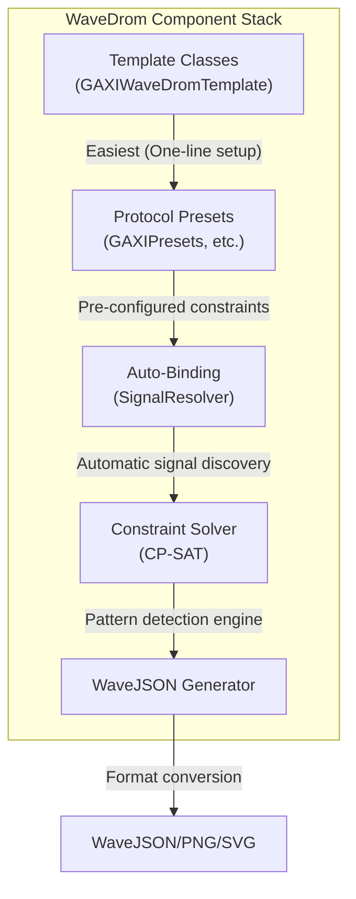

<!-- RTL Design Sherpa Documentation Header -->
<table>
<tr>
<td width="80">
  <a href="https://github.com/sean-galloway/RTLDesignSherpa-DV">
    
  </a>
</td>
<td>
  <strong>CocoTB Framework</strong> · <em>Verification Infrastructure for RTL Testing</em><br>
  <sub>
    <a href="https://github.com/sean-galloway/RTLDesignSherpa-DV">GitHub</a> ·
    <a href="https://github.com/sean-galloway/RTLDesignSherpa/blob/main/docs/DOCUMENTATION_INDEX.md">Documentation Index</a> ·
    <a href="https://github.com/sean-galloway/RTLDesignSherpa/blob/main/LICENSE">MIT License</a>
  </sub>
</td>
</tr>
</table>

---

<!-- End Header -->

# WaveDrom Timing Diagram Generation

**Version:** 3.1 (Enforced Boundaries + Configurable Idle Filter)
**Status:** Production Ready
**Last Updated:** 2026-07-21

---

## Overview

This component turns simulation runs into timing diagrams. It samples signals during a cocotb test, uses a CP-SAT constraint solver to find the protocol behaviors you described, and emits WaveDrom JSON that renders to PNG or SVG. The diagrams show what the RTL actually did — which is what makes them worth putting in front of a design review, and what makes them useful at 2 AM when the read channel is stalled and you don't know why yet.

### Key Features

- **Automatic signal discovery** — SignalResolver finds signals from a prefix; no manual binding in the common case
- **Protocol presets** — pre-built constraint sets for GAXI, APB, AXI4, AXI4-Lite, and AXI-Stream
- **Segmented capture** — isolate each scenario so matches can't bleed across tests
- **Field-aware formatting** — hex/dec/bin chosen from the signal's field type
- **Arrow annotations** — mark causal relationships and data flow between signals
- **Labeled groups** — signals organized into interface groups instead of one flat list

---

## Documentation Structure

### Getting Started
- **[Quick Start Guide](wavedrom_quick_start.md)** - Get running in 5 minutes
- **[Protocol Presets](wavedrom_protocol_presets.md)** - GAXI, APB, AXI4, AXIL4, AXIS examples
- **Wavedrom GAXI Example *(see TestTutorial)*** - Complete walkthrough with 6 scenarios

### Core Concepts
- **[Auto-Binding Guide](wavedrom_auto_binding.md)** - SignalResolver integration
- **[Segmented Capture](wavedrom_segmented_capture.md)** - Isolation pattern for clean waveforms
- **[Requirements & Best Practices](wavedrom_requirements.md)** - Design rules for quality diagrams

### Advanced Topics
- **Wavedrom Troubleshooting *(documentation planned)*** - Common issues and solutions
- **vcd2wavedrom2 Script *(see Scripts)*** - Convert VCD files to WaveJSON

---

## Quick Example

```python
# Import from the RTLDesignSherpa main repo (tbclasses/wavedrom_user/gaxi.py)
from CocoTBFramework.tbclasses.wavedrom_user.gaxi import GAXIWaveDromTemplate

@cocotb.test()
async def my_test(dut):
    # One-line setup with automatic signal discovery
    gaxi_wave = GAXIWaveDromTemplate(
        dut=dut,
        signal_prefix="wr_",     # Finds: wr_valid, wr_ready, wr_data
        data_width=32,
        preset="comprehensive"    # Detects: handshake, back2back, stall, idle
    )

    await gaxi_wave.start_sampling()

    # Run your test transactions...
    # ...

    results = await gaxi_wave.stop_sampling()
    # WaveJSON files automatically generated in sim_build/
```

**Output:** one WaveJSON file per matched scenario, ready to render to PNG or SVG with `wavedrom-cli`.

---

## Supported Protocols

| Protocol | Template Class | Status | Presets Available |
|----------|---------------|--------|-------------------|
| **GAXI** | `GAXIWaveDromTemplate` | Production | basic_handshake, comprehensive, performance, debug |
| **APB** | `APBWaveDromTemplate` | Production | basic_rw, comprehensive, debug, timing, error |
| **AXI4** | `AXI4Presets` (manual setup) | Ready | write_basic, read_basic, comprehensive, debug |
| **AXI4-Lite** | `AXIL4Presets` (manual setup) | Ready | write_basic, read_basic, comprehensive, debug |
| **AXI-Stream** | `AXISPresets` (manual setup) | Ready | basic_handshake, comprehensive, performance, debug |

*AXI4, AXIL4, and AXIS don't have template classes yet — they use the same solver through `setup_*_constraints_with_boundaries()`. The pattern is identical; there's just no one-line wrapper.*

!!! note "Wavedrom User Examples"
    The protocol-specific wavedrom user examples (gaxi.py, apb.py, etc.) are located in the [RTLDesignSherpa](https://github.com/sean-galloway/RTLDesignSherpa) repository under `tbclasses/wavedrom_user/`.

---

## Architecture

### Component Stack



### Workflow

1. **Setup** — template class, or manual solver configuration
2. **Signal binding** — automatic via SignalResolver, or manual
3. **Constraint definition** — presets, or hand-written temporal patterns
4. **Capture** — segmented sampling, one window per scenario
5. **Solve** — CP-SAT searches the captured windows for matches
6. **Generate** — WaveJSON with formatting, arrows, and groups
7. **Render** — `wavedrom-cli` to PNG/SVG

---

## Transaction Boundaries & Scenario Isolation

Two mechanisms keep a match pinned to a single transaction: boundary constraints and an idle-cycle filter. Both are enforced inside the CP-SAT solve — they're not post-processing, so a match that would cross a transaction simply doesn't happen.

### Boundary Constraints (enforced in the solver)

Boundaries declared with `add_transaction_boundary()` (manual, by cycle) or
`auto_detect_boundaries()` (signal transition, e.g. `valid` 1→0) are translated
into real CP-SAT constraints: **a match may not straddle a boundary** — all of a
constraint's events must fall entirely before the boundary cycle or entirely
at/after it.

```python
# Manual boundary at window cycle 25
wave_solver.add_transaction_boundary("write_handshake", boundary_cycle=25)

# Auto-detected boundary: two cycles after every wr_valid 1->0 transition
wave_solver.auto_detect_boundaries("write_handshake",
                                   transition_signal="wr_valid",
                                   transition_value=(1, 0))
```

Per-constraint boundary handling can be disabled with
`TemporalConstraint(skip_boundary_detection=True)` (skips the boundary
detect/solve/flush cycle during sampling for that constraint).

### Idle-Cycle Filter (`boundary_min_idle_cycles`)

When `TemporalConstraint.boundary_min_idle_cycles > 0`, matches are only kept if
the N cycles before the match start are idle. What "idle" means is configurable
per constraint — only you know which signals matter on your DUT:

```python
constraint = TemporalConstraint(
    name="isolated_write",
    events=[...],
    boundary_min_idle_cycles=3,
    # Explicit idle definition: signal_name -> value when idle
    idle_signals={"wr_valid": 0, "rd_ready": 0},
)
```

Resolution order:

1. **`idle_signals` set** — used as-is (configured signals missing from the
   captured data are ignored with a warning).
2. **`idle_signals` empty** — the solver derives an idle set from the
   constraint's own events: control/handshake signals (names containing
   `valid`, `ready`, `req`, `ack`, `gnt`, `psel`, `penable`, `enable`) are
   assumed idle at 0.
3. **Nothing derivable** — filtering is skipped with an explicit log message
   (it never passes vacuously). Set `idle_signals` to enable it.

> **Migration note:** earlier versions hardcoded idle as
> `wr_valid == 0 AND rd_ready == 0`. If you relied on those exact names on a
> constraint whose events do not reference them, set
> `idle_signals={"wr_valid": 0, "rd_ready": 0}` explicitly.

### Post-Match Window Extension

`TemporalConstraint(post_match_cycles=N)` extends the rendered window by N
cycles after the matched sequence (in addition to `context_cycles_after`).
Handy when the interesting part of the story is what happens right after the
handshake.

---

## File Locations

### Source Code
- **Constraint Solver**: `src/CocoTBFramework/components/wavedrom/constraint_solver.py` (this repo)
- **WaveJSON Generator**: `src/CocoTBFramework/components/wavedrom/wavejson_gen.py` (this repo)
- **Signal Binder**: `src/CocoTBFramework/components/wavedrom/signal_binder.py` (this repo)
- **Protocol Presets** (located in the [RTLDesignSherpa](https://github.com/sean-galloway/RTLDesignSherpa) repo):
  - `tbclasses/wavedrom_user/gaxi.py`
  - `tbclasses/wavedrom_user/apb.py`
  - `tbclasses/wavedrom_user/axi4.py`
  - `tbclasses/wavedrom_user/axil4.py`
  - `tbclasses/wavedrom_user/axis.py`

### Example Tests
- **GAXI Comprehensive**: `val/amba/test_gaxi_wavedrom_example.py`
- **Script for PNG/SVG generation**: `val/amba/wd_cmd.sh`

### Documentation
- **This directory**: `docs/components/wavedrom/`
- **Assets**: generated PNG/SVG files (in the [RTLDesignSherpa](https://github.com/sean-galloway/RTLDesignSherpa) repo under `docs/markdown/assets/WAVES/`)

---

## Next Steps

1. **New Users**: Start with [Quick Start Guide](wavedrom_quick_start.md)
2. **GAXI Users**: Follow Wavedrom GAXI Example *(see TestTutorial)*
3. **Other Protocols**: See [Protocol Presets](wavedrom_protocol_presets.md)
4. **Troubleshooting**: Check Wavedrom Troubleshooting *(documentation planned)*

---

## Version History

- **v3.1 (2026-07)**: Boundary constraints are now enforced in CP-SAT solving, so a match cannot straddle a transaction boundary; `boundary_min_idle_cycles` filtering gained configurable `idle_signals` (auto-derived from constraint events when unset, explicitly skipped when nothing can be derived); `skip_boundary_detection` and `post_match_cycles` promoted to proper `TemporalConstraint` fields; signals bound after `add_constraint()` no longer kill sampling; sampling errors are logged with tracebacks; switched to the non-deprecated `enumerate_all_solutions` CP-SAT API
- **v3.0 (2025-10-06)**: Added AXI4/AXIL4/AXIS protocol presets, arrow annotations, labeled groups
- **v2.0 (2025-10-04)**: SignalResolver auto-binding integration
- **v1.5 (2025-10-05)**: Segmented capture implementation
- **v1.0 (2025-09)**: Initial constraint-based WaveDrom generation

---

## Related Documentation

- [CocoTB Framework Overview](../components_overview.md)
- [Field Configuration](../shared/components_shared_field_config.md)
- [Signal Mapping Helper](../shared/components_shared_signal_mapping_helper.md)
- TestTutorial Index *(documentation planned)*
