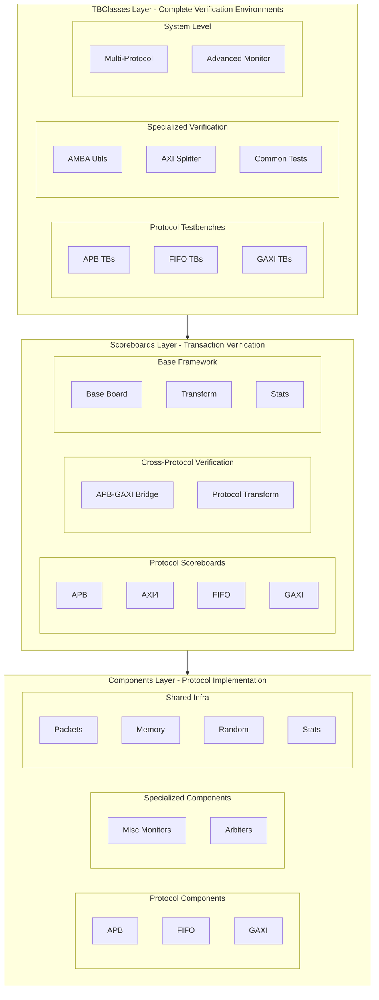

<!-- RTL Design Sherpa Documentation Header -->
<table>
<tr>
<td width="80">
  <a href="https://github.com/sean-galloway/RTLDesignSherpa-DV">
    
  </a>
</td>
<td>
  <strong>CocoTB Framework</strong> · <em>Verification Infrastructure for RTL Testing</em><br>
  <sub>
    <a href="https://github.com/sean-galloway/RTLDesignSherpa-DV">GitHub</a> ·
    <a href="https://github.com/sean-galloway/RTLDesignSherpa/blob/main/docs/DOCUMENTATION_INDEX.md">Documentation Index</a> ·
    <a href="https://github.com/sean-galloway/RTLDesignSherpa/blob/main/LICENSE">MIT License</a>
  </sub>
</td>
</tr>
</table>

---

<!-- End Header -->

**[CocoTBFramework Overview](overview.md)**

# CocoTBFramework Index

Welcome to the CocoTBFramework — a verification framework built on cocotb, with protocol-specific BFMs, transaction scoreboards, and complete testbench environments for digital design verification.

## Overview
- [**Framework Overview**](overview.md) - The architecture, and the reasoning behind it

## Core Directories

### Verification Components
- [**Components**](components/components_index.md) - Protocol BFMs: masters, slaves, monitors, and the utilities around them
  - **AXI4 / AXI5 / AXI4-Lite**: full AMBA memory-mapped BFMs with compliance checking
  - **APB / APB5**: Advanced Peripheral Bus components
  - **AXI-Stream (AXIS4 / AXIS5)**: unidirectional streaming components
  - **DFI**: DDR PHY Interface (v2.1-v5.x) memory-controller and PHY BFMs
  - **FIFO**: First-In-First-Out buffer components  
  - **GAXI**: the generic valid/ready layer under the AXI-family BFMs — also usable standalone on small internal blocks
  - **SMBus / UART**: serial protocol components
  - **Wavedrom**: WaveJSON timing-diagram generation
  - **Misc**: specialized monitoring components
  - **Shared**: the common infrastructure every protocol uses

### Transaction Verification
- [**Scoreboards**](scoreboards/scoreboards_index.md) - Transaction checking and comparison infrastructure
  - **Protocol Scoreboards**: APB, AXI4, FIFO, and GAXI transaction verification
  - **Cross-Protocol**: APB-GAXI bridge verification with protocol transformation
  - **Base Framework**: shared scoreboard machinery and transformer support

### Testbench Classes (in RTLDesignSherpa repo)
- **TBClasses** — RTL-specific testbench classes remain in the [RTLDesignSherpa](https://github.com/sean-galloway/RTLDesignSherpa) repository

## Quick Start

### Creating Components and Sending Traffic
```python
# Create protocol components
from CocoTBFramework.components.gaxi.gaxi_factories import create_gaxi_master, create_gaxi_slave
from CocoTBFramework.components.shared.field_config import FieldConfig, FieldDefinition

# Set up field configuration
field_config = FieldConfig()
field_config.add_field(FieldDefinition("addr", 32, format="hex"))
field_config.add_field(FieldDefinition("data", 32, format="hex"))

# Create components
master = create_gaxi_master(dut, "Master", "", dut.clk, field_config)
slave = create_gaxi_slave(dut, "Slave", "", dut.clk, field_config)

# Send transaction
packet = master.create_packet(addr=0x1000, data=0xDEADBEEF)
await master.send(packet)
```

### Hooking Up a Scoreboard
```python
# Create scoreboard for verification
from CocoTBFramework.scoreboards.gaxi_scoreboard import GAXIScoreboard

scoreboard = GAXIScoreboard("TestSB", field_config, log=logger)

# Connect to monitors
master_monitor.add_callback(scoreboard.add_expected)
slave_monitor.add_callback(scoreboard.add_actual)

# Generate report
error_count = scoreboard.report()
assert error_count == 0, f"Verification failed with {error_count} errors"
```

### A Complete Testbench
```python
# High-level testbench classes (TBClasses) live in the RTLDesignSherpa
# main repo, not in this package
from TBClasses.gaxi.gaxi_buffer import GaxiBufferTB

@cocotb.test()
async def test_gaxi_buffer(dut):
    # Environment configuration
    os.environ['TEST_DEPTH'] = '16'
    os.environ['TEST_DATA_WIDTH'] = '32'
    
    # Create and run testbench
    tb = GaxiBufferTB(dut, wr_clk=dut.clk, wr_rstn=dut.rstn)
    await tb.initialize()
    await tb.basic_test(num_packets=100)
```

## Architecture Overview

### Three-Layer Framework Architecture



Components do the pin work, scoreboards do the checking, TBClasses wire it all into a runnable environment. Each layer only depends on the one beneath it.

## Key Features

### Protocol Coverage
- **APB**: multi-slave support and register testing
- **FIFO**: buffer protocols with flow control and multi-field packets
- **GAXI**: the shared valid/ready substrate — and the lightweight option for small internal blocks
- **AXI4**: full AXI4 with ID tracking and channel separation
- **Cross-Protocol**: bridge verification and protocol transformation

### Randomization
- **FlexRandomizer**: constrained, sequence, and custom modes in one engine
- **FlexConfigGen**: profile-based randomization with weighted constraints
- **Pattern Generation**: burst, stress, corner-case, and custom patterns
- **Constraint Management**: field dependencies and validation rules

### Checking and Measurement
- **Transaction Matching**: automatic expected-vs-actual comparison
- **Protocol Compliance**: signal timing and handshake checks
- **Memory Modeling**: NumPy-backed memory simulation
- **Statistics**: performance metrics, error analysis, coverage reporting

### Performance
- **Signal Caching**: 40% faster data collection through cached references
- **Thread-Safe Operations**: parallel test execution
- **Memory Efficiency**: optimized data structures and cleanup
- **Scale**: handles large test suites without falling over

### Quality of Life
- **Factory Functions**: one-line component creation with sensible defaults
- **Environment Configuration**: extensive environment variable support
- **Monitoring**: real-time performance profiling when you need it
- **Logging**: structured logs with configurable verbosity

## Usage Patterns

### Component-Level Testing
```python
# Direct component usage for specific protocol testing
from CocoTBFramework.components.apb.apb_factories import create_apb4_master, create_apb4_sequence

master = create_apb4_master(dut, "APB_Master", "apb_", dut.clk)
sequence = create_apb4_sequence(pattern="stress", num_regs=100)

for packet in sequence:
    await master.send(packet)
```

### System-Level Verification
```python
# Complete system verification with multiple protocols
# TBBase is located in the RTLDesignSherpa main repo (bin/TBClasses/shared/tbbase.py)
from TBClasses.shared.tbbase import TBBase
from CocoTBFramework.scoreboards.apb_gaxi_scoreboard import APBGAXIScoreboard

class SystemTestbench(TBBase):
    def __init__(self, dut):
        super().__init__(dut, "SystemTest")
        self.setup_protocols()
        self.setup_scoreboards()
        self.setup_monitoring()
    
    async def run_system_test(self):
        await self.run_cross_protocol_verification()
        self.analyze_system_performance()
```

### Cross-Protocol Bridge Testing
```python
# Verify protocol bridges with transformation
from CocoTBFramework.scoreboards.apb_gaxi_scoreboard import APBGAXIScoreboard

bridge_sb = APBGAXIScoreboard("Bridge_Verification", log=logger)

# Monitor both sides of the bridge — add_gaxi_transaction auto-detects
# whether a packet is a command or a response
apb_monitor.add_callback(bridge_sb.add_apb_transaction)
gaxi_cmd_monitor.add_callback(bridge_sb.add_gaxi_transaction)
gaxi_rsp_monitor.add_callback(bridge_sb.add_gaxi_transaction)

# Verify bridge functionality
error_count = bridge_sb.report()
```

## Getting Started

### Installation

Install from PyPI:

```bash
pip install cocotb-framework
```

With all optional dependencies:

```bash
pip install cocotb-framework[all]
```

For development:

```bash
git clone https://github.com/sean-galloway/RTLDesignSherpa-DV.git
cd RTLDesignSherpa-DV
pip install -e ".[dev,all]"
```

### Setup
1. **Set Environment**: configure PYTHONPATH and your simulator
2. **Run Examples**: execute the provided example tests to confirm everything's wired up

### Basic Workflow
1. **Choose Components**: pick the protocol components that match your design
2. **Configure Tests**: field configurations and test parameters
3. **Create Testbench**: factory functions for a quick setup, TBClasses for a full environment
4. **Add Verification**: scoreboards for transaction checking
5. **Run and Analyze**: execute, then read the reports

### Advanced Features
1. **Custom Protocols**: extend the framework for proprietary interfaces
2. **Complex Scenarios**: TBClasses for multi-protocol system verification
3. **Performance Analysis**: turn on the monitoring when you need to optimize
4. **Continuous Integration**: wire the tests into your CI flow

## Support and Documentation

Each directory carries its own documentation:
- **API References**: class and method details
- **Usage Examples**: real patterns, not toy snippets
- **Integration Guides**: fitting the framework into an existing flow
- **Performance Tips**: what to do when the test suite gets big

Start with the page for your protocol, and work outward from there.

---
