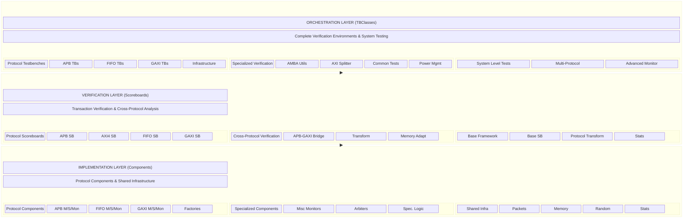

<!-- RTL Design Sherpa Documentation Header -->
<table>
<tr>
<td width="80">
  
</td>
<td>
  <strong>CocoTB Framework</strong> · <em>Verification Infrastructure for RTL Testing</em> 
  
    <a href="https://github.com/sean-galloway/RTLDesignSherpa-DV">GitHub</a> ·
    <a href="https://github.com/sean-galloway/RTLDesignSherpa/blob/main/docs/DOCUMENTATION_INDEX.md">Documentation Index</a> ·
    <a href="https://github.com/sean-galloway/RTLDesignSherpa/blob/main/LICENSE">MIT License</a>
  
</td>
</tr>
</table>

---

<!-- End Header -->

**[CocoTBFramework Index](index.md)**

# CocoTBFramework Overview

The CocoTBFramework is a verification framework built on top of cocotb. It gives you protocol BFMs, transaction scoreboards, and complete testbench environments in one package — and it scales from a single FIFO test to multi-protocol system verification without changing idioms on you halfway up.

## Framework Vision and Philosophy

One bet underlies the whole design: verification code is expensive to write and cheap to reuse, so the framework makes reuse the default. What that means in practice:

**Unified Architecture**: every component speaks the same packet and field-config idioms, so moving between protocols doesn't mean relearning the API
**Performance by Design**: signal caching and thread safety are built in from the start — you shouldn't have to choose between thorough and fast
**Extensible Foundation**: custom protocols and custom checking plug into the same base classes the built-in ones use
**Comprehensive Coverage**: from signal-level pin work up through system-level scenarios
**Developer Experience**: factories, sensible defaults, and real documentation — using the framework should be easier than writing your own BFM, or what's the point

## Architectural Foundation

### Three-Layer Architecture

Three layers, with a strict dependency direction:

### Cross-Layer Integration

The layers are built to compose, but the boundaries stay clean:

**Orchestration → Verification**: TBClasses create and wire their own scoreboards
**Verification → Implementation**: scoreboards consume the transactions the protocol components capture
**Implementation → Shared**: every protocol component uses the same packets, memory model, and statistics

## Core Framework Capabilities

### 1. Protocol Coverage and Implementation

The framework covers the common industry buses plus the internal interfaces that usually get hand-rolled BFMs:

#### Standard Protocol Support
- **APB (Advanced Peripheral Bus)**: complete ARM AMBA APB implementation with multi-slave support
- **AXI4**: full AXI4 with ID tracking, channel separation, and out-of-order support
- **GAXI (Generic AXI)**: the generic valid/ready layer the AXI-family BFMs are built on — standalone, it covers small internal blocks with packed-field or multi-signal interfaces
- **FIFO**: buffer and queue protocols with flow control and multi-field support

#### Protocol Features
- **Signal-Level Accuracy**: precise timing and signal-relationship modeling
- **Protocol Compliance**: built-in checks against the protocol spec
- **Error Injection**: configurable error scenarios for robustness testing
- **Performance Monitoring**: metrics and analysis as you run

#### Extensibility
- **Custom Protocol Support**: a defined path for adding proprietary protocols
- **Protocol Variants**: straightforward adaptation for protocol flavors
- **Bridge Verification**: cross-protocol bridge testing
- **Multi-Protocol Systems**: mixed-protocol designs without duct tape

### 2. Verification Infrastructure

The checking side goes well past "did the bytes match":

#### Transaction Verification
- **Automated Comparison**: expected-vs-actual transaction matching, done for you
- **Field-Level Analysis**: field-by-field comparison with configurable precedence
- **Timing Verification**: signal timing and protocol relationship checks
- **Error Categorization**: classified errors, so triage starts from data

#### Cross-Protocol Verification
- **Protocol Transformation**: automatic conversion between protocol formats
- **Bridge Verification**: dedicated testing for bridge implementations
- **Memory Model Integration**: shared memory models for cross-protocol data checking
- **System-Level Analysis**: end-to-end verification across protocol domains

#### Analysis
- **Statistical Analysis**: performance and error trends over time
- **Coverage Integration**: functional and code coverage tracking
- **Regression Detection**: flags performance and functional regressions automatically
- **Visualization**: dashboards and reports when you need to show your work

### 3. Performance and Scalability

Built to stay fast when the test suite gets big:

#### Performance Optimizations
- **Signal Caching**: 40% faster data collection through cached signal references
- **Thread-Safe Operations**: parallel test execution with proper synchronization
- **Memory Efficiency**: optimized data structures and automatic cleanup
- **Lazy Evaluation**: expensive work deferred until someone actually needs the result

#### Scalability Features
- **Large Test Suites**: thousands of test cases without falling over
- **Memory Management**: bounded growth with configurable limits
- **Resource Monitoring**: live tracking of CPU and memory usage
- **Distributed Testing**: support for spreading verification across machines

#### Resource Management
- **Automatic Cleanup**: completed transactions and resources get reaped
- **Configurable Limits**: memory, time, and resource limits with graceful degradation
- **Progress Monitoring**: detection of hung tests and infinite loops
- **Performance Profiling**: data you can act on when something's slow

### 4. Usability

The framework only earns its keep if it's easier than the alternative:

#### Simplified APIs
- **Factory Functions**: one-line component creation with sensible defaults
- **Automatic Configuration**: environment-based configuration with intelligent defaults
- **Consistent Interfaces**: the same API shape across every protocol
- **Documentation**: examples and API references that were checked against the code

#### Development Support
- **IDE Integration**: works with modern IDEs — completion and debugging included
- **Logging**: structured logs with configurable verbosity
- **Error Reporting**: error messages with context, not just a stack trace
- **Debugging Tools**: built-in utilities and waveform integration

#### Configuration Management
- **Environment Variables**: extensive configuration through the environment
- **Dynamic Configuration**: runtime configuration based on DUT capabilities
- **Profile-Based Setup**: predefined profiles for common scenarios
- **Custom Configuration**: room for specialized requirements

## Shared Infrastructure

### Packet Management Framework

One packet system for every protocol:

**Generic Packet Class**: protocol-agnostic packets with per-field validation
**Field Configuration**: rich field definitions with encoding and validation
**Packet Factory**: consistent packet construction across protocols
**Data Strategies**: optimized data collection and drive paths

### Randomization

**FlexRandomizer**: one engine with constrained, sequence, and custom modes
**FlexConfigGen**: builds weighted randomization profiles
**Pattern Generation**: burst, stress, corner-case, and custom patterns
**Dependency Management**: field dependencies and cross-field constraints

### Memory Modeling

**NumPy Backend**: stays fast with large maps and long runs
**Access Tracking**: every read and write recorded
**Region Management**: logical regions with boundary checking
**Coverage Analysis**: memory access coverage reporting

### Statistics and Monitoring

**Performance Metrics**: transaction rates, latency distribution, throughput
**Error Tracking**: categorized errors and their trends
**Resource Monitoring**: CPU, memory, and simulation resource tracking
**Trend Analysis**: regression detection across runs

## Integration and Ecosystem

### Tool Integration

Plays well with the rest of the flow:

**Simulator Support**: works with the major simulators (VCS, Questa, Xcelium)
**Waveform Viewers**: GTKWave, Verdi, and the usual suspects
**Build Systems**: Make, CMake, or your own flow
**CI/CD Integration**: slots into continuous-integration testing

### Development Workflow

**Version Control**: Git-based project structure discovery and management
**Collaborative Development**: shared configuration and result management
**Documentation Generation**: docs derived from code and configuration
**Test Management**: test case management and execution tracking

### Custom Extensions

**Plugin Architecture**: custom verification logic and analysis hooks
**Protocol Extensions**: a defined path for proprietary protocols
**Custom Analysis**: integration points for specialized analysis tools
**Third-Party Integration**: APIs for external verification tools

## Real-World Applications

### Unit Testing
- **Component Verification**: single-IP testing with protocol compliance checks
- **Interface Testing**: signal-level verification with timing analysis
- **Error Scenario Testing**: error injection and recovery

### Integration Testing
- **Multi-Component Systems**: verifying how components interact
- **Protocol Bridge Testing**: cross-protocol communication
- **System-Level Scenarios**: end-to-end verification across components

### System Verification
- **Complete SoC Testing**: full system-on-chip environments
- **Performance Verification**: system-level performance analysis
- **Power Management**: power-aware verification with clock gating and power domains

### Regression Testing
- **Automated Test Suites**: regression runs with result comparison
- **Performance Regression**: automatic detection of performance degradation
- **Coverage Tracking**: continuous monitoring of verification coverage

## Future Evolution

### Planned Enhancements
- **Machine Learning Integration**: ML-assisted test generation and analysis
- **Formal Verification**: hooks into formal tools and methodologies
- **Cloud Verification**: cloud-based runs with automatic scaling
- **Advanced Visualization**: interactive analysis tooling

### Community and Ecosystem
- **Open Source Components**: the core framework is open for community contribution
- **Plugin Ecosystem**: third-party plugins and extensions
- **Industry Collaboration**: alignment with standards and common practice
- **Educational Support**: resources for academic use

That's the shape of it. The component docs go deep on each protocol, the scoreboard docs cover the checking side — pick whichever matches the problem in front of you.

---
