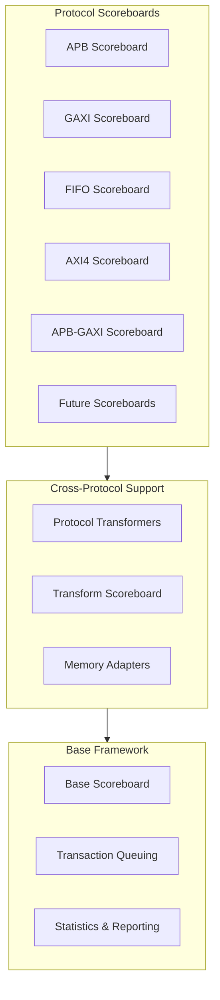

<!-- RTL Design Sherpa Documentation Header -->
<table>
<tr>
<td width="80">
  <a href="https://github.com/sean-galloway/RTLDesignSherpa-DV">
    
  </a>
</td>
<td>
  <strong>CocoTB Framework</strong> · <em>Verification Infrastructure for RTL Testing</em><br>
  <sub>
    <a href="https://github.com/sean-galloway/RTLDesignSherpa-DV">GitHub</a> ·
    <a href="https://github.com/sean-galloway/RTLDesignSherpa/blob/main/docs/DOCUMENTATION_INDEX.md">Documentation Index</a> ·
    <a href="https://github.com/sean-galloway/RTLDesignSherpa/blob/main/LICENSE">MIT License</a>
  </sub>
</td>
</tr>
</table>

---

<!-- End Header -->

# Scoreboards Index

Scoreboards are where checking happens: expected versus actual, matched as transactions arrive, with the accounting at the end. This directory holds one scoreboard per protocol family plus the pieces that make cross-protocol verification possible.

## Overview
- [**Overview**](scoreboards_overview.md) - the directory tour: what lives here and how the pieces fit together

## Core Documentation

### Base Framework
- [**base_scoreboard.py**](scoreboards_base_scoreboard.md) - the queue-and-compare machinery every scoreboard inherits, plus the protocol transformer base class

### Protocol-Specific Scoreboards
- [**apb_scoreboard.py**](scoreboards_apb_scoreboard.md) - APB verification, from a single slave up to a full crossbar
- [**axi4_scoreboard.py**](scoreboards_axi4_scoreboard.md) - AXI4 verification with per-ID tracking and read/write channel separation
- [**fifo_scoreboard.py**](scoreboards_fifo_scoreboard.md) - FIFO verification with memory-model integration
- [**gaxi_scoreboard.py**](scoreboards_gaxi_scoreboard.md) - GAXI verification built on FieldConfig—the one most protocol checks funnel through

### Cross-Protocol Verification
- [**apb_gaxi_scoreboard.py**](scoreboards_apb_gaxi_scoreboard.md) - APB-GAXI bridge checking with three-phase matching
- [**apb_gaxi_transformer.py**](scoreboards_apb_gaxi_transformer.md) - bidirectional conversion between APB and GAXI

### Additional Scoreboards (source only, docs pending)
- **dfi_scoreboard.py** - DFI semantic-shift event counting and assertion (`DFIScoreboard`)
- **axi4/axi4_dwidth_converter_scoreboard.py** - AXI4 data width converter validation (`AXI4DWidthConverterScoreboard`)

## Quick Start

### Basic Scoreboard Usage

The minimal loop, GAXI flavor:

```python
from CocoTBFramework.scoreboards.gaxi_scoreboard import GAXIScoreboard

# Create scoreboard
scoreboard = GAXIScoreboard("TestScoreboard", field_config, log=logger)

# Add expected and actual transactions
scoreboard.add_expected(expected_packet)
scoreboard.add_actual(actual_packet)

# Generate report
error_count = scoreboard.report()
success_rate = scoreboard.result()
```

### Cross-Protocol Verification

Bridge checking—note the single GAXI entry point for both commands and responses:

```python
from CocoTBFramework.scoreboards.apb_gaxi_scoreboard import APBGAXIScoreboard

# Create cross-protocol scoreboard
scoreboard = APBGAXIScoreboard("APB_GAXI_Bridge", log=logger)

# Add transactions from both protocols — add_gaxi_transaction auto-detects
# whether a packet is a command or a response
scoreboard.add_apb_transaction(apb_transaction)
scoreboard.add_gaxi_transaction(gaxi_command)
scoreboard.add_gaxi_transaction(gaxi_response)

# Generate comprehensive report
report = scoreboard.report()
stats = scoreboard.get_stats()
```

### Multi-Slave APB Verification

Address routing you configure once and forget:

```python
from CocoTBFramework.scoreboards.apb_scoreboard import APBCrossbarScoreboard

# Create multi-slave scoreboard
scoreboard = APBCrossbarScoreboard("MultiSlave", num_slaves=4, log=logger)

# Set custom address mapping
addr_map = [
    (0x0000, 0x0FFF),  # Slave 0
    (0x1000, 0x1FFF),  # Slave 1
    (0x2000, 0x2FFF),  # Slave 2
    (0x3000, 0x3FFF),  # Slave 3
]
scoreboard.set_address_map(addr_map)

# Route transactions automatically
scoreboard.add_master_transaction(transaction, master_id=0)
```

## Architecture Overview

### Scoreboard Hierarchy



## Key Features

### Base Scoreboard Framework
- **Transaction Queuing**: expected and actual matched automatically as they arrive
- **Error Tracking**: counts, plus the failing pairs themselves for inspection
- **Protocol Transformers**: hooks for cross-protocol conversion
- **Statistics Reporting**: pass/fail rates and the numbers behind them

### Protocol-Specific Features

#### APB Scoreboard
- **Multi-slave Support**: transactions routed to per-slave scoreboards by address range
- **Address Mapping**: configurable ranges drive slave selection
- **Direction Handling**: reads and writes processed separately
- **Enhanced Logging**: field-by-field mismatch detail

#### AXI4 Scoreboard
- **ID-based Tracking**: a queue per AXI4 ID
- **Read/Write Separation**: channels tracked independently
- **Protocol Compliance**: AXI4 rule and timing checks
- **Monitor Integration**: connects straight to AXI4 monitor components

#### FIFO Scoreboard
- **Memory Integration**: built-in memory model adapter for data verification
- **Field Configuration**: comparison driven by FieldConfig
- **Packet Format Support**: native FIFO packet handling

#### GAXI Scoreboard
- **Field-based Comparison**: FieldConfig defines the packet structure
- **Memory Adaptation**: memory models in the verification loop
- **Transform Support**: cross-protocol conversion capabilities

### Cross-Protocol Support
- **APB-GAXI Bridge**: three-phase matching purpose-built for protocol bridges
- **Bidirectional Transformation**: APB ↔ GAXI with timing preserved
- **Timing Analysis**: transformation latency tracked
- **Response Matching**: read and write responses both handled

## Advanced Usage

### Custom Protocol Transformers

One method to implement, and the scoreboard does the rest:

```python
from CocoTBFramework.scoreboards.base_scoreboard import ProtocolTransformer

class CustomTransformer(ProtocolTransformer):
    def __init__(self, source_type, target_type, log=None):
        super().__init__(source_type, target_type, log)
    
    def transform(self, transaction):
        # Implement custom transformation logic
        return [transformed_transaction]

# Use with scoreboard
scoreboard.set_transformer(CustomTransformer("Protocol1", "Protocol2"))
```

### Memory Model Integration

Mirror packets into a memory model and check against it:

```python
from CocoTBFramework.scoreboards.fifo_scoreboard import MemoryAdapter
from CocoTBFramework.components.shared.memory_model import MemoryModel

# Create memory model and adapter
memory = MemoryModel(num_lines=1024, bytes_per_line=4, log=logger)
adapter = MemoryAdapter(memory, field_map={'addr': 'addr', 'data': 'data'})

# Use the adapter to mirror packets into memory for verification
adapter.write_to_memory(write_packet)
read_data = adapter.read_from_memory(read_packet)
```

### Statistics and Reporting

```python
# APBGAXIScoreboard statistics
stats = scoreboard.get_stats()
print(f"Matched Pairs: {stats['matched_pairs']}")
print(f"APB Transactions: {stats['apb_transactions']}")
print(f"Unmatched APB: {stats['unmatched_apb']}")

# Text report (also logs the summary)
report = scoreboard.report()
print(report)
```

## Integration Patterns

### With Monitor Components

Wire monitor callbacks straight into the scoreboard and checking happens as traffic flows:

```python
# Connect monitors to scoreboards automatically
master_monitor.add_callback(scoreboard.add_expected)
slave_monitor.add_callback(scoreboard.add_actual)

# Or manually add transactions
for packet in master_transactions:
    scoreboard.add_expected(packet)

for packet in slave_responses:
    scoreboard.add_actual(packet)
```

### With Test Frameworks

```python
@cocotb.test()
async def test_with_scoreboard(dut):
    # Create scoreboard
    scoreboard = GAXIScoreboard("TestSB", field_config, log=logger)
    
    # Run test with automatic transaction capture
    await run_test_sequence(dut, scoreboard)
    
    # Verify results
    error_count = scoreboard.report()
    assert error_count == 0, f"Scoreboard reported {error_count} errors"
    
    # Get pass/fail status
    success = scoreboard.result()
    assert success > 0.95, f"Pass rate too low: {success}"
```

## Best Practices

### Scoreboard Setup
1. **Pick the scoreboard that matches your protocol**—the protocol-specific ones know things the base never will
2. **Configure field mappings** so comparison knows the packet shape
3. **Set up memory adapters** when the interface is memory-mapped
4. **Configure timeout values** that reflect real latency, not wishful thinking

### Error Handling
- Always pass a logger; a silent scoreboard debugs poorly
- Use `clear()` to reset scoreboards between test phases
- Read both `report()` and `result()`—one tells you what failed, the other how much
- Start debugging at the field-by-field mismatch output

### Performance Optimization
- Configure transformers properly for cross-protocol work
- Retire transaction queues periodically in long-running tests
- Watch memory usage at high transaction volume
- Timeouts: tight enough to fail fast, loose enough for real latency

### Debugging Support
- Detailed logging on while chasing mismatches
- Formatted packet output beats raw reprs
- The built-in statistics are your performance baseline
- Read `report()` for the text summary and error count when you need the long-form view

## Navigation
- [**Back to CocoTBFramework**](../index.md) - Return to main framework index
