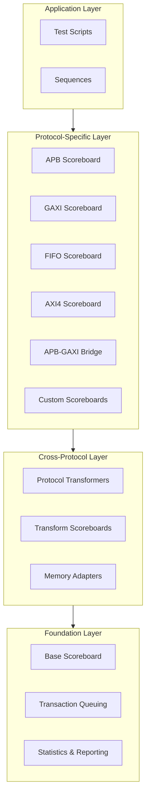

<!-- RTL Design Sherpa Documentation Header -->
<table>
<tr>
<td width="80">
  <a href="https://github.com/sean-galloway/RTLDesignSherpa-DV">
    
  </a>
</td>
<td>
  <strong>CocoTB Framework</strong> · <em>Verification Infrastructure for RTL Testing</em><br>
  <sub>
    <a href="https://github.com/sean-galloway/RTLDesignSherpa-DV">GitHub</a> ·
    <a href="https://github.com/sean-galloway/RTLDesignSherpa/blob/main/docs/DOCUMENTATION_INDEX.md">Documentation Index</a> ·
    <a href="https://github.com/sean-galloway/RTLDesignSherpa/blob/main/LICENSE">MIT License</a>
  </sub>
</td>
</tr>
</table>

---

<!-- End Header -->

# Scoreboards Overview

This directory is the framework's checking layer. Every protocol scoreboard, every transformer, every memory adapter lives here, and they all share one idea: say what you expect, report what you saw, and let the machinery do the comparison. That machinery has to hold up for a lone APB peripheral just as well as for a protocol bridge in the middle of a multi-bus SoC.

## Framework Philosophy

A few commitments shaped the design:

**Automated Transaction Matching**: expected and actual transactions queue and compare as they arrive—no end-of-test diff scripts
**Protocol Abstraction**: one interface across bus protocols; switching protocols shouldn't mean relearning the scoreboard API
**Cross-Protocol Verification**: bridges and mixed-protocol systems are first-class citizens, not special cases
**Comprehensive Reporting**: when something fails, you get the field, the values, and the count—not just a red X
**Extensible Architecture**: new protocols slot into the same base classes instead of forking the framework

## Architecture Overview

### Layered Verification Architecture

Four layers, each talking only to the one below it. Protocol-specific logic stays out of the common machinery—which is exactly why adding a protocol doesn't mean rewriting anything shared:



## Core Framework Components

### BaseScoreboard - Foundation Infrastructure

`BaseScoreboard` carries the load for everything else:

**Core Capabilities**:
- **Transaction Queuing**: expected/actual deques, managed for you
- **Comparison Engine**: matching machinery with field-level validation hooks
- **Error Tracking**: counting, categorizing, and reporting mismatches
- **Statistics Generation**: pass/fail rates, timing analysis, performance numbers
- **Timeout Management**: configurable limits on how long a match may wait

**Advanced Features**:
- **Transformer Integration**: the cross-protocol hook
- **Memory Model Support**: memory adapters for memory-mapped checking
- **Flexible Matching**: FIFO, ID-based, or your own strategy
- **Rich Reporting**: text reports, with HTML output available

### ProtocolTransformer - Cross-Protocol Support

For when expected and actual don't speak the same protocol:

**Transformation Engine**:
- **Bidirectional Conversion**: both directions supported
- **Field Mapping**: protocol fields mapped once, not by hand per test
- **Timing Preservation**: timestamps survive the conversion
- **Error Handling**: failures counted and logged, not thrown into your test

**Extensibility**:
- **Custom Transformers**: subclass and implement one method
- **Chaining Support**: multi-hop conversions when one step isn't enough
- **Validation**: transformation correctness checked
- **Performance Tracking**: conversion overhead measured

## Protocol-Specific Scoreboards

### APB Scoreboard - Advanced Peripheral Bus

APB is the simple end of the AMBA family, and the scoreboard keeps it that way:

**Single Slave Support (`APBScoreboard`)**:
- **Transaction Verification**: full read/write checking
- **Field Validation**: address, data, control signals
- **Protocol Compliance**: APB timing and signal relationships
- **Error Categorization**: failure types sorted for you

**Multi-Slave Support (`APBCrossbarScoreboard`)**:
- **Address-Based Routing**: transactions forwarded to the right slave scoreboard automatically
- **Configurable Address Maps**: per-slave ranges, your choice
- **Aggregate Reporting**: the system-level rollup
- **Slave-Specific Analysis**: per-slave numbers when you need to zoom in

### AXI4 Scoreboard - Advanced eXtensible Interface

AXI4 earns its complexity budget, and the scoreboard matches it:

**Advanced Transaction Management**:
- **ID-Based Tracking**: a queue per AXI4 ID
- **Channel Separation**: read (AR/R) and write (AW/W/B) channels handled independently
- **Out-of-Order Support**: completion order doesn't have to match issue order—that's the whole point of IDs
- **Protocol Compliance**: AXI4 spec checking built in

**Performance Analysis**:
- **Throughput Measurement**: bandwidth as the test runs
- **Latency Tracking**: per-transaction and statistical
- **Outstanding Transaction Monitoring**: inflight transactions and resource usage
- **Channel Utilization**: per-channel efficiency

### GAXI Scoreboard - Generic AXI-like Protocol

GAXI is the framework's generic AXI substrate—the layer the other AXI-family pieces build on—so this scoreboard sits at the center of most protocol checks:

**Modern Architecture**:
- **FieldConfig Integration**: native support for the framework's field configuration system
- **Flexible Packet Handling**: legacy and modern packet formats
- **Memory Model Integration**: memory checking built in
- **Transform Support**: cross-protocol conversion ready

**Advanced Comparison**:
- **Field-by-Field Analysis**: configurable field precedence
- **Intelligent Matching**: correlation that understands protocol semantics
- **Performance Optimization**: comparison paths that hold up at high throughput

### FIFO Scoreboard - Buffer Verification

For buffers and queues:

**Memory Integration**:
- **Built-in Memory Adapter**: direct tie-in to the framework's memory models
- **Data Integrity Checking**: consistency verified automatically
- **Access Pattern Analysis**: read/write patterns tracked for anomalies

**FIFO-Specific Features**:
- **Order Verification**: FIFO ordering semantics enforced
- **Depth Monitoring**: utilization, overflow, and underflow watched
- **Flow Control**: handshaking and backpressure checked

## Cross-Protocol Verification

### APB-GAXI Bridge Scoreboard

Bridges get their own scoreboard because they fail in ways single-protocol scoreboards can't see:

**Three-Phase Verification**:
1. **APB Transaction Receipt**: the master transaction arrived intact
2. **GAXI Command Generation**: the conversion produced the right command
3. **GAXI Response Processing**: the response made it back correctly

**Bridge-Specific Features**:
- **Latency Analysis**: bridge overhead measured
- **Error Propagation**: errors must cross the protocol boundary correctly
- **Resource Utilization**: bridge internals tracked
- **Protocol Compliance**: both protocols stay legal through the bridge

### APB-GAXI Transformer

Bidirectional conversion between the two protocols:

**Transformation Features**:
- **Field Mapping**: APB ↔ GAXI field structures
- **Timing Preservation**: timing relationships carried across
- **Error Handling**: detection and recovery
- **Adapter Classes**: drop-in integration with existing components

## Advanced Verification Capabilities

### Memory Model Integration

Scoreboards plug into the framework's memory models:

**Memory Adapters**:
- **Automatic Memory Operations**: reads and writes applied during verification
- **Field Mapping Configuration**: packet fields to memory addresses, with your naming
- **Data Integrity Verification**: expected versus actual memory contents
- **Access Pattern Tracking**: coverage of how memory gets used

### Statistical Analysis

Numbers worth keeping:

**Real-Time Metrics**:
- **Transaction Throughput**: rate and bandwidth
- **Error Rates**: tracked live, with trends
- **Latency Distribution**: histograms, not just averages
- **Resource Utilization**: memory and processing overhead

**Trend Analysis**:
- **Performance Regression**: slowdowns caught across runs
- **Error Trend Tracking**: systematic patterns surfaced
- **Coverage Metrics**: functional and code coverage tie-in
- **Comparative Analysis**: this run against the last

### Custom Verification Logic

When the built-ins aren't enough:

**Custom Comparators**:
- **Field-Specific Logic**: special comparison per field type
- **Protocol Extensions**: proprietary fields and behaviors
- **Application-Specific Checks**: your domain's rules
- **Performance Optimizations**: tuned paths for high-frequency tests

## Integration and Usage Patterns

### Monitor Integration

Monitors feed scoreboards directly, so transactions get checked as they happen—not in a cleanup pass afterward:

```python
# Automatic transaction capture from monitors
master_monitor.add_callback(scoreboard.add_expected)
slave_monitor.add_callback(scoreboard.add_actual)

# Real-time verification during test execution
# Scoreboard automatically processes transactions as they arrive
```

### Test Framework Integration

In a cocotb test, the scoreboard is just another object you create, wire up, and interrogate at the end:

```python
@cocotb.test()
async def comprehensive_verification_test(dut):
    # Create scoreboard with appropriate configuration
    scoreboard = create_protocol_scoreboard(protocol_type, configuration)
    
    # Connect to system under test
    connect_monitors_to_scoreboard(dut, scoreboard)
    
    # Execute test scenarios
    await run_test_scenarios(dut, test_configuration)
    
    # Analyze results
    results = scoreboard.generate_comprehensive_report()
    verify_test_success(results)
```

### Performance Optimization

Built to survive high-traffic tests:

**Efficient Data Structures**:
- **Deque-Based Queues**: O(1) insertion and removal at both ends
- **Hash-Based Lookup**: fast correlation for ID-based protocols
- **Memory-Mapped Storage**: large transaction volumes handled
- **Lazy Evaluation**: expensive analysis deferred until asked

**Parallel Processing**:
- **Thread-Safe Operations**: concurrent access to scoreboard structures is safe
- **Asynchronous Processing**: transaction handling doesn't block
- **Pipeline Optimization**: comparison and analysis overlapped
- **Resource Pooling**: comparison resources reused

## Future Extensibility

The architecture is built to grow:

### New Protocol Support
- **Template-Based Creation**: a standard skeleton for new protocol scoreboards
- **Inheritance Patterns**: the same base classes every time
- **Configuration Standards**: consistent config patterns across protocols
- **Integration Guidelines**: a documented path into the framework

### Advanced Features
Further out—more whiteboard than roadmap at this point:
- **Machine Learning Integration**: error-pattern recognition
- **Formal Verification**: hooks into formal tools
- **Cloud-Based Analysis**: distributed verification and analysis
- **Real-Time Visualization**: live dashboards

Start with the protocol scoreboard that matches your DUT, add a transformer if it's a bridge, add a memory adapter if it's memory-mapped. The base classes carry the rest.
